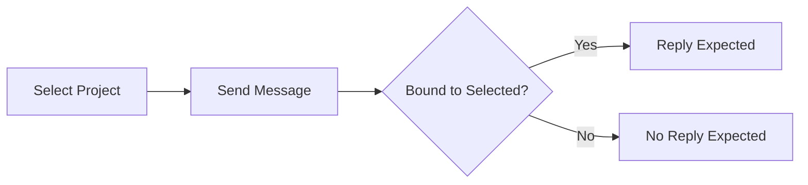

# E2E P1 Run Sheet

## Purpose
Fast operator checklist for running all P1 end-to-end scenarios with scope-gated routing.

## Scope Rule
Selected project scope is the activation flag.
Only messages bound to the selected project should be processed.

## Pre-Run
- [ ] App launched and stable
- [ ] Relay running and Discord bot online
- [ ] WeChat online if running WeChat cases
- [ ] Target bindings confirmed
- [ ] Selected project visible in app badge

## Run Order
1. P1-CH-001 Channel exclusivity
2. P1-DIS-001 Discord first-time setup and reply
3. P1-DIS-002 Discord restart persistence
4. P1-WC-001 WeChat room project assistant routing
5. P1-XCH-001 Cross-channel scope consistency
6. P1-DIS-003 Discord ask-questions roundtrip
7. P1-WC-002 WeChat direct assistant routing

## Case Checklist
### P1-CH-001
- [ ] WeChat on -> Discord disabled
- [ ] Discord on -> WeChat disabled

### P1-DIS-001
- [ ] Wire channel to project
- [ ] Select matching project scope
- [ ] 2+2 reply posted in same channel
- [ ] README-style prompt returns project-grounded output
- [ ] Mismatched scope produces no reply

### P1-DIS-002
- [ ] Restart app
- [ ] Binding restored
- [ ] Matching scope replies
- [ ] No scope or mismatched scope does not reply

### P1-DIS-003
- [ ] Question appears in Discord
- [ ] Answer sent from Discord is consumed
- [ ] Final response posted back

### P1-WC-001
- [ ] Selected room-bound project replies
- [ ] Non-selected direct project is ignored

### P1-WC-002
- [ ] Selected direct-bound project replies
- [ ] Non-selected room project is ignored

### P1-XCH-001
- [ ] Same scope gate behavior on Discord and WeChat
- [ ] Selected passes, non-selected blocks on both

## Evidence Capture
- [ ] Relay log excerpts saved
- [ ] AppAgent snapshots for selected scope and key transitions
- [ ] Channel transcript snippets saved
- [ ] Case outcomes marked Pass or Fail

## Sign-Off
- [ ] All required P1 cases passed
- [ ] Failures linked to issue tracker
- [ ] Next rerun owner and date recorded