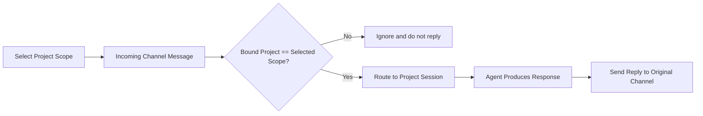

# P1 E2E User Stories

## Activation Rule
Selected project scope is the activation flag.
Only messages bound to the selected project are routed.

## P1 Matrix
| ID | Title | Channel | Scope Gate | Positive Path | Negative Path | Status |
|---|---|---|---|---|---|---|
| P1-CH-001 | Exclusive channel mode toggle | Global | Required | One channel enabled at a time | Disabled channel cannot route | Ready |
| P1-DIS-001 | Discord first-time setup and reply | Discord | Required | Bound selected project replies | Unselected project ignored | Ready |
| P1-DIS-002 | Discord restart persistence | Discord | Required | Restart preserves binding and reply loop | Wrong selected scope ignored | Ready |
| P1-DIS-003 | Discord ask-questions roundtrip | Discord | Required | Questions posted and answers routed back | Answers in wrong scope ignored | Planned |
| P1-WC-001 | WeChat room project assistant routing | WeChat | Required | Selected room project replies | Other project contact ignored | Ready |
| P1-WC-002 | WeChat direct assistant routing | WeChat | Required | Selected direct project replies | Other project contact ignored | Planned |
| P1-XCH-001 | Cross-channel scope consistency | Discord + WeChat | Required | Same gating semantics on both | Any non-selected project blocked | Ready |

## P1-CH-001 Exclusive Channel Mode Toggle
### Preconditions
1. App installed and launched.
2. Both channel configs available.

### User Journey
1. Enable WeChat channel.
2. Confirm Discord channel is disabled.
3. Enable Discord channel.
4. Confirm WeChat channel is disabled.

### Assertions
1. Exactly one channel type is active at any time.
2. Inactive channel cannot route inbound messages.

### Evidence
1. Settings UI state screenshots.
2. Relay logs confirming only active channel traffic.

## P1-DIS-001 Discord First-Time Setup and Reply
### Preconditions
1. Discord bot online in relay.
2. Project exists.
3. Discord channel type enabled.

### User Journey
1. Set Discord server ID.
2. Open Projects and wire a project to a Discord channel.
3. Select that same project in chat scope.
4. Send message in wired Discord channel: 2+2.
5. Send message in wired Discord channel: read project README.

### Assertions
1. Inbound Discord message reaches app routing path.
2. Agent reply is posted back to the same Discord channel.
3. README request returns project-grounded content.

### Negative Assertion
1. If a different project is selected, no reply is posted.

### Evidence
1. Relay lines for Message in channel and discord.send result ok.
2. AppAgent snapshot proving selected project badge.

## P1-DIS-002 Discord Restart Persistence
### Preconditions
1. P1-DIS-001 completed.
2. App can be restarted from device tooling.

### User Journey
1. Stop app.
2. Start app.
3. Re-select bound project scope.
4. Send Discord message in wired channel.

### Assertions
1. Channel binding remains valid after restart.
2. Reply loop works without rewiring.

### Negative Assertion
1. With no selected scope, message is ignored.

### Evidence
1. Relay registration lines after reconnect.
2. discord.send result ok.

## P1-DIS-003 Discord Ask-Questions Roundtrip
### Preconditions
1. P1-DIS-001 completed.
2. Bound project selected.

### User Journey
1. Send prompt that triggers ask-questions.
2. Verify question appears in Discord.
3. Answer in Discord.
4. Verify answer is routed back and final response is posted.

### Assertions
1. Question dispatch and answer routing both succeed.
2. Final response posted to same channel.

### Evidence
1. Relay logs for question/answer handoff.
2. Channel transcript capture.

## P1-WC-001 WeChat Room Project Assistant Routing
### Preconditions
1. WeChat channel enabled and online.
2. Room bound to test-room-assistant.
3. Selected scope is test-room-assistant.

### User Journey
1. Simulate or receive room message in bound room.
2. Observe routing and response.

### Assertions
1. Message routes to room-bound selected project.
2. Reply is sent to same room.

### Negative Assertion
1. Direct contact bound to another project is ignored while room project is selected.

### Evidence
1. wechat_router_status response log entry for selected project.
2. No response log entry for non-selected project message.

## P1-WC-002 WeChat Direct Assistant Routing
### Preconditions
1. WeChat direct contact bound to test-direct-assistant.
2. Selected scope is test-direct-assistant.

### User Journey
1. Send direct WeChat message from bound contact.
2. Observe assistant response.

### Assertions
1. Message routes to direct bound selected project.
2. Reply is sent to same contact.

### Negative Assertion
1. Room-bound project messages are ignored when direct project is selected.

### Evidence
1. wechat_router_status response log and destination contact id.

## P1-XCH-001 Cross-Channel Scope Consistency
### Preconditions
1. Discord and WeChat both configured with different project bindings.
2. Any one project selected in scope.

### User Journey
1. Send one Discord message for selected project.
2. Send one WeChat message for non-selected project.
3. Switch selected scope.
4. Repeat in opposite direction.

### Assertions
1. Selected project messages pass.
2. Non-selected project messages are ignored.
3. Behavior is identical across channels.

### Evidence
1. Relay discord.send lines for selected scope only.
2. wechat_router_status entries for selected scope only.

## Failure Catalog
1. Scope mismatch: inbound message arrives but no reply expected.
2. Channel disconnected: no routing until reconnect.
3. ask-questions pending: response waits for answer resolution.

## Run Order
1. P1-CH-001
2. P1-DIS-001
3. P1-DIS-002
4. P1-WC-001
5. P1-XCH-001
6. P1-DIS-003
7. P1-WC-002

## Manual Execution Checklist
### Test Run Metadata
- [ ] Date recorded
- [ ] Tester recorded
- [ ] App build hash recorded
- [ ] Relay log window archived

### Pre-Run Health
- [ ] App launched and stable
- [ ] Relay running and Discord bot online
- [ ] WeChat online when running WeChat cases
- [ ] Target bindings confirmed
- [ ] Selected project badge confirmed

### P1-CH-001 Exclusive Channel Mode Toggle
- [ ] WeChat enabled and Discord disabled
- [ ] Discord enabled and WeChat disabled
- [ ] Inactive channel produced no routed reply

### P1-DIS-001 Discord First-Time Setup and Reply
- [ ] Server ID and wiring completed
- [ ] Selected scope equals wired project
- [ ] Message 2+2 produced Discord reply
- [ ] README prompt produced project-grounded reply
- [ ] Mismatched scope produced no reply

### P1-DIS-002 Discord Restart Persistence
- [ ] Restart completed
- [ ] Binding auto-restored
- [ ] Selected scope reply loop works
- [ ] No selected scope gives no reply

### P1-DIS-003 Discord Ask-Questions Roundtrip
- [ ] Ask-questions prompt posted question
- [ ] Discord answer routed back
- [ ] Final response posted to same channel

### P1-WC-001 WeChat Room Project Assistant Routing
- [ ] Room-bound selected project replied
- [ ] Non-selected direct contact message ignored
- [ ] Router status evidence captured

### P1-WC-002 WeChat Direct Assistant Routing
- [ ] Direct-bound selected project replied
- [ ] Non-selected room message ignored
- [ ] Router status evidence captured

### P1-XCH-001 Cross-Channel Scope Consistency
- [ ] Selected project passed on Discord
- [ ] Non-selected project blocked on Discord
- [ ] Selected project passed on WeChat
- [ ] Non-selected project blocked on WeChat

### Sign-Off
- [ ] All required P1 cases passed
- [ ] Open failures linked to issue tracker
- [ ] Next rerun owner assigned
