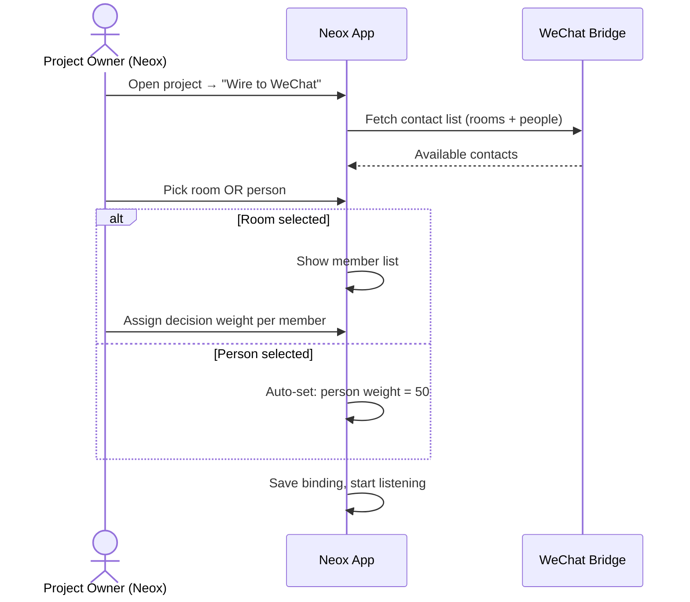
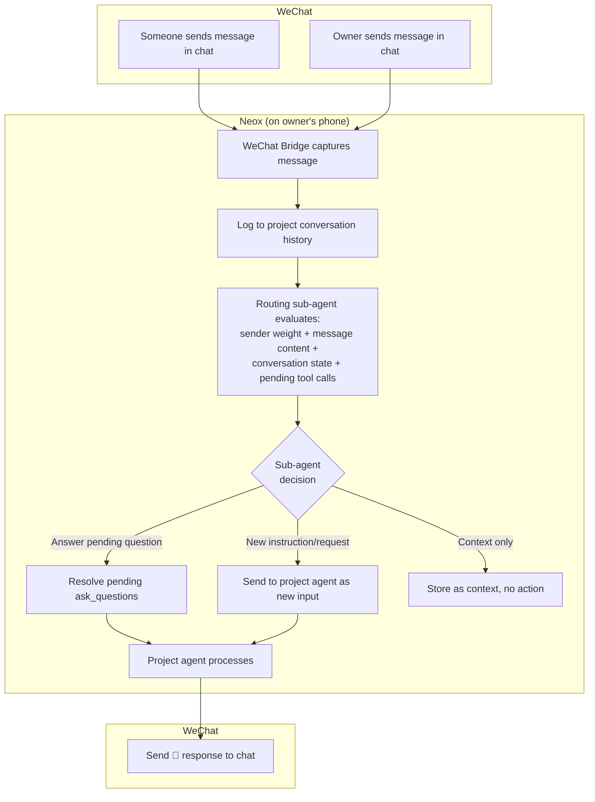
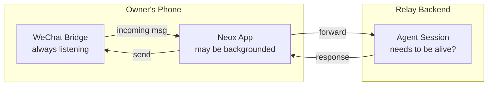
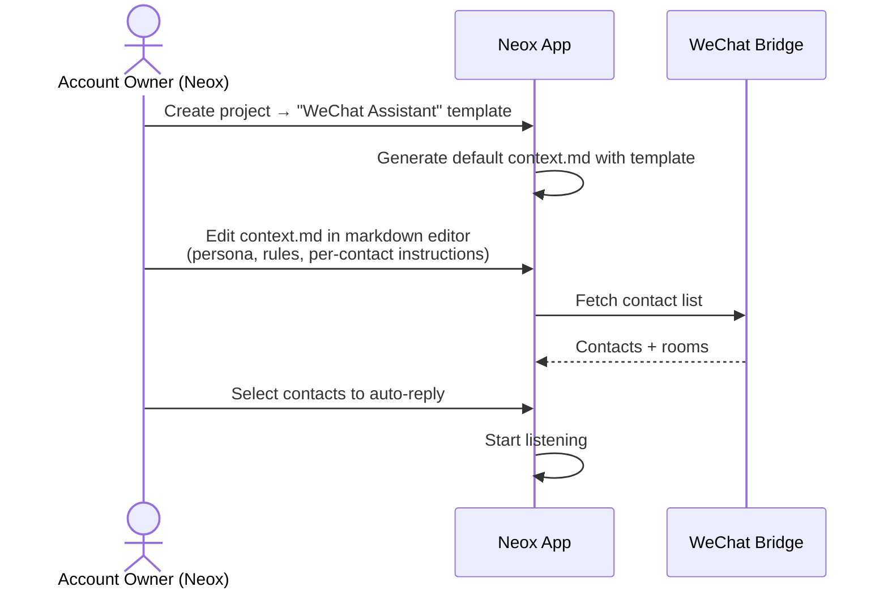
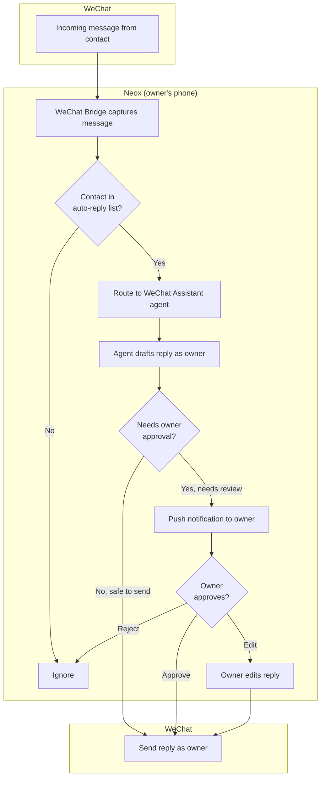
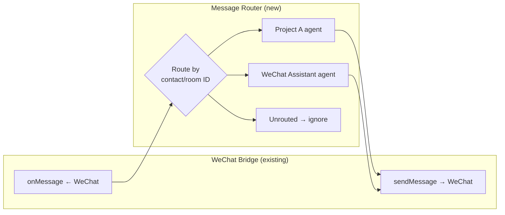
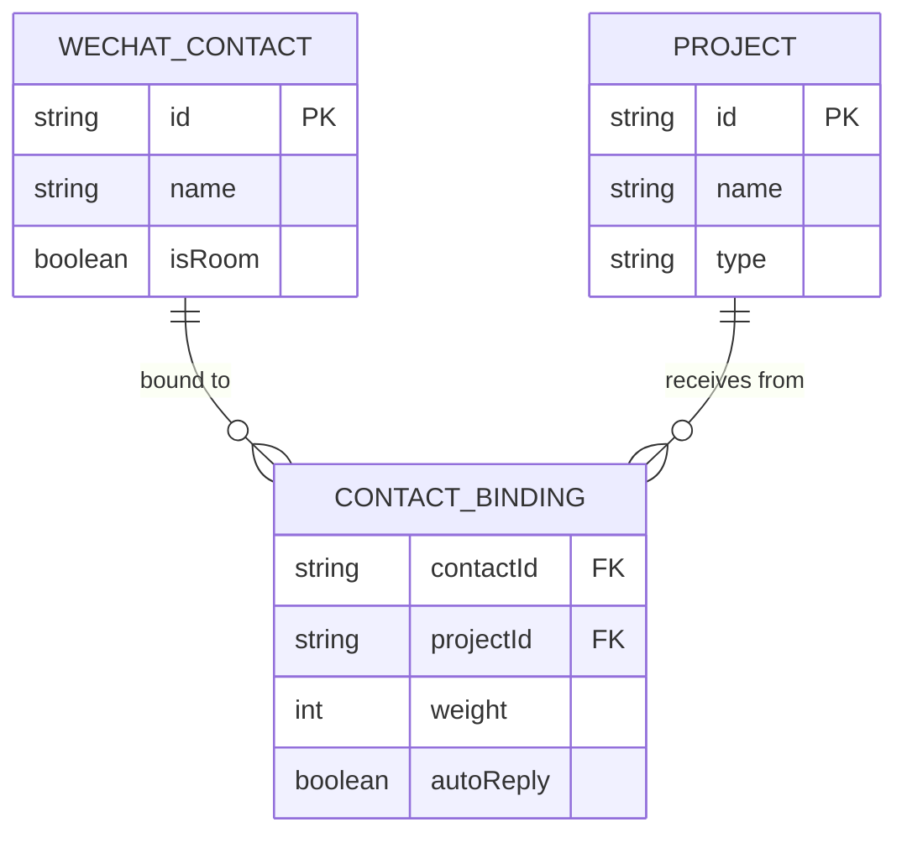
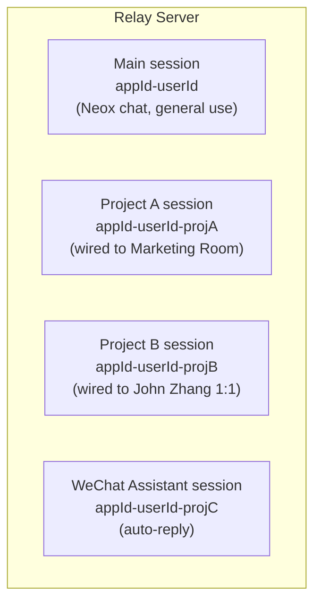
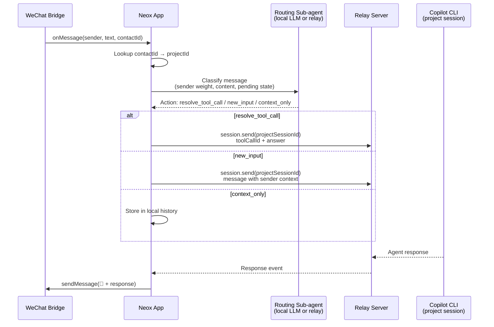

# WeChat Bidirectional Integration Design

> **Date**: 2026-04-10  
> **Status**: Draft  
> **Goal**: Two scenarios — project assistant via WeChat, and auto-reply as account owner

---

## Overview

Two new WeChat integration modes for Neox:

1. **Project Assistant** — Wire a project to a WeChat conversation (room or 1:1). The agent is a project assistant for everyone in the chat.
2. **WeChat Assistant** — A template project type where the agent auto-replies to personal and group messages on behalf of the account owner.

Both build on the existing one-way bridge (agent → WeChat) by adding the **incoming direction** (WeChat → agent).

---

## Scenario 1: Project Assistant

### Concept

A Neox project is wired to a WeChat conversation — either a **group room** or a **1:1 chat**. The agent's role is always the same: **project assistant** — executing tasks, answering questions, recording decisions, tracking action items, and driving the project forward.

The workflow is identical regardless of room or 1:1. The only difference is **who carries decision weight**. In a room, each member has a weight that determines how much authority their input carries (approve tool calls, steer direction, resolve `ask_questions`). In 1:1, the other person defaults to weight 50 — a strong voice but not full authority (owner retains final say from Neox).

### Setup Flow



### Message Flow



A lightweight **routing sub-agent** decides how to handle each incoming message, instead of hard-coded threshold rules. It considers:

- **Sender weight** — who said it (PM vs intern)
- **Message content** — is it a question, instruction, casual chat, or answer to a pending question?
- **Conversation state** — is there a pending `ask_questions`? What was the agent working on?
- **Project context** — does this message change direction or just add info?

The sub-agent outputs one of three actions:
1. **Resolve pending tool call** — message answers a pending `ask_questions`  
2. **New agent input** — message is a new instruction or request for the project agent
3. **Context only** — store in history, no immediate action needed

### Session Lifecycle for Wired Projects

**Question: does the agent session stay alive on the relay backend to listen for WeChat messages?**

Current relay architecture: sessions are on-demand (created when client connects, go on-hold or available when client disconnects). But wired projects need to respond to incoming WeChat messages at any time.



**The phone is the bottleneck, not the relay.** WeChat Bridge runs inside WKWebView on the phone — if the phone sleeps or Neox is killed, the bridge stops. So the relay session doesn't need to be "always alive" independently — it only needs to be alive when the phone is awake and the bridge is running.

**Proposed lifecycle:**
1. When Neox launches and WeChat bridge connects → create/resume agent sessions for all wired projects
2. Sessions stay alive as long as the phone is active
3. When phone sleeps / Neox backgrounds → sessions go on-hold (relay keeps the CLI process, stashes incoming tool calls)
4. When phone wakes → sessions resume, replay stashed state
5. If a WeChat message arrives while session is on-hold → stash it, process when session resumes

This aligns with the existing on-hold/resume mechanism. No need for a persistent always-on session — the phone's WeChat Bridge is the constraint.

**Open question:** Could the bridge be moved server-side (run WeChat in headless browser on VPS)? This would enable true 24/7 listening but adds significant complexity and WeChat detection risk. Parked for v2.

### No Chat UI for Wired Projects

Wired projects have **no chat interface** in the Neox app. WeChat is the only input channel — there is no owner steering from Neox (removed for v1 simplicity).

In Neox, a wired project shows:
- **Status view** — session state, message count, last activity
- **Config view** — wechat.json contacts, weight assignments
- **History view** (read-only) — conversation log from WeChat
- **context.md editor** — for Scenario 2 (WeChat Assistant) persona/rules

The owner interacts with the project through WeChat like everyone else (with weight 100).

### Agent Identity in WeChat

WeChat has no bot accounts — the agent sends messages using the **owner's identity**. To distinguish agent messages from the owner's own messages:

- **Prefix all agent messages** with a bot emoji: `🤖 ` (configurable)
- Example: `🤖 Based on the discussion, here are the action items...`
- The existing `wechat-bro.js` AI watermark (invisible Unicode marker) is also applied for programmatic detection via `isFromAI()`
- Owner's own manual messages have no prefix

This applies to both scenarios (project assistant and auto-reply).

---

### Decision Weight

Weight is a **signal** the routing sub-agent uses, not a hard threshold. Every participant has a weight (0–100) set by the project owner:

| Weight | Signal to sub-agent |
|--------|---------------------|
| **100** | Treat as authoritative — likely resolves questions, approves actions |
| **50–99** | Strong voice — worth acting on, especially if no higher-weight response |
| **1–49** | Contributor — valuable context, unlikely to be the final word |
| **0** | Muted — ignore entirely (only hard rule) |

**Owner** always has weight 100 (from Neox app, not through WeChat).

In **1:1 mode**, the other person defaults to weight 50.

In **room mode**, the project owner assigns weights when wiring. Example:
- Product manager: 100 (decision-maker)
- Lead engineer: 80 (strong voice)  
- Designer: 50 (can contribute meaningfully)
- Intern: 20 (context contributor)

The sub-agent uses weight alongside message content to make routing decisions. A weight-20 intern saying "the server is down" is still actionable. A weight-100 PM saying "lol nice" is just context. The AI handles nuance better than code thresholds.

### UI Elements

**Project card badge:**
```
┌─────────────────────────────┐
│ 📱 My App Project           │
│ 💬 Wired: Marketing Room    │
│ 👥 3 members (2 decision)   │
└─────────────────────────────┘

┌─────────────────────────────┐
│ 📱 Sales Proposal           │
│ 💬 Wired: John Zhang (1:1)  │
│ 🤝 Project assistant mode   │
└─────────────────────────────┘
```

**Wiring sheet (in project settings):**
```
┌─ Wire to WeChat ───────────────┐
│ Contact: [Marketing Room ▼]    │
│    or    [John Zhang ▼]        │
│                                │
│ If room selected:              │
│ Members:               Weight  │
│ 🟢 John Zhang    [━━━━━━ 100] │
│ 🔵 Alice Wang    [━━━━━░░ 80] │
│ ⚫ Bob Li        [━░░░░░░ 20] │
│                                │
│ If person selected:            │
│ John Zhang — weight 50         │
│ (strong voice, you keep final say)│
│                                │
│ [Start Listening]  [Cancel]    │
└────────────────────────────────┘
```

---

## Scenario 2: WeChat Assistant (Auto-Reply)

### Concept

A template project type. When the user creates a "WeChat Assistant" project, the agent monitors selected WeChat conversations and replies on behalf of the account owner — based on the owner's persona, context, and relationship with each contact.

### Setup Flow



### Message Flow



### Agent Context (Markdown File)

Instead of a structured settings UI, the agent context is a **markdown file** that the user edits with Neox's existing markdown editor. This is the system prompt / instruction set for the assistant agent.

The file lives in the project workspace and is passed to the agent session as context. Sections are conventions, not enforced schema — the user can structure it however they want.

**Default template** (created when user picks "WeChat Assistant" project):

```markdown
# WeChat Assistant

## My Persona
Tech lead at ABC Corp. Keep replies brief and professional.
Friendly but not too casual. Use English with Chinese contacts 
unless they write in Chinese first.

## Behavior Rules
- Routine questions (directions, availability, greetings) → auto-reply
- Match the other person's language
- Keep replies under 3 sentences unless explaining something technical

### Guardrails
- Never schedule meetings or commit to deadlines on my behalf
- Escalate anything about money, legal, or contracts
- If unsure about my position on something, ask me first
- Don't share internal project details with external contacts

## Contacts

### John Zhang
- Relationship: colleague, same team
- Tone: casual, direct
- He often asks about project status — answer from project context

### Marketing Room
- I'm the tech representative in this group
- Only reply when someone asks a tech question
- Don't volunteer information unless asked

### Default
- For anyone not listed: polite, brief, escalate if unsure
```

The user edits this file directly in Neox's markdown editor — no special UI needed.

### Guardrails

Guardrails live as a `### Guardrails` sub-section under `## Behavior Rules`. The routing sub-agent treats these as hard boundaries that trigger escalation:

| Sub-agent decision | Action |
|-------------------|--------|
| Safe to auto-reply (matches persona + rules) | Send reply as owner |
| Needs owner review (escalation rule triggered) | Push notification → owner approves/edits/rejects |
| Contact not in list and no default rule | Ignore |

---

## Shared Infrastructure

### Bidirectional Bridge



The existing `WeChatChannel.onMessage` callback is already wired but unused. The new **Message Router** maps incoming messages to the correct agent session.

### Contact-to-Project Mapping



A contact can be bound to at most one project. A project can have multiple bound contacts. The binding config lives in each project's `package.json` under the `wechat` key.

### Data Model

Routing config lives **inside the project's `package.json`** under a `wechat` key, alongside other project config. The message router scans all projects at startup to build a contact→project lookup.

**Scenario 1** — `<project>/package.json`:

```json
{
  "name": "my-app-project",
  "wechat": {
    "contacts": [
      {
        "contactId": "@@abc123",
        "contactName": "Marketing Room",
        "isRoom": true,
        "members": {
          "john-id": { "name": "John Zhang", "weight": 100 },
          "alice-id": { "name": "Alice Wang", "weight": 80 },
          "bob-id":   { "name": "Bob Li",     "weight": 20 }
        }
      },
      {
        "contactId": "@colleague456",
        "contactName": "John Zhang",
        "isRoom": false,
        "weight": 50
      }
    ]
  }
}
```

**Scenario 2** — `<project>/package.json`:

```json
{
  "name": "wechat-assistant",
  "wechat": {
    "contacts": [
      {
        "contactId": "@friend123",
        "contactName": "Alice Wang",
        "isRoom": false,
        "autoReply": true
      },
      {
        "contactId": "@@marketing",
        "contactName": "Marketing Room",
        "isRoom": true,
        "autoReply": true
      }
    ]
  }
}
```

The context.md file lives alongside package.json in the project workspace. Project type (project-assistant vs auto-reply) is determined by the project template.

**Message Router lookup:** On startup and when config changes, the router builds an in-memory map: `contactId → projectId`. Since a contact can only be bound to one project, conflicts are detected at wiring time.

### What Needs Building

| Component | Description | Touches |
|-----------|-------------|---------|
| **WeChatRouter** | Routes incoming messages to correct agent session | New Swift file |
| **WeChatService** (update) | Manage bidirectional bridge, routing config | Existing service |
| **RoomWiringView** | Room selector + member weight assignment UI | New SwiftUI view |
| **AssistantSetupView** | Contact selector + link to edit context.md | New SwiftUI view (lightweight) |
| **Contact binding persistence** | Read/write `wechat` key in project package.json | New model |
| **Agent session integration** | Map incoming message → session.send with sender context | Update AgentCoordinator |

### Agent Session Integration Detail

Each wired project gets its own **dedicated agent session** on the relay. This is separate from the main workspace session — one session per project, so WeChat conversations from different projects don't mix contexts.

Session ID pattern: `appId-userId-projectId`





**Key points:**

- Each wired project has its **own session** (`appId-userId-projectId`) — separate from the main workspace session and from other projects
- The project session is created when the project is first wired to WeChat, and persists across app restarts (relay resume)
- When the relay receives `session.send` for a project session, it includes sender metadata: `{ sender: "John Zhang", weight: 80, source: "wechat", contactName: "Marketing Room" }`
- The Copilot CLI sees this as a regular user message with context about who said it — it doesn't know about WeChat specifically
- The agent's response comes back through the normal relay event stream. Neox intercepts responses for project sessions and routes them to WeChat via `sendMessage()`
- The project's `context.md` and `package.json` are loaded into the session as workspace context
| **Routing sub-agent** | Lightweight LLM call to classify incoming messages | New component |
| **Decision weight resolution** | Sub-agent uses weight as signal for routing decisions | Part of routing sub-agent |
| **Owner approval flow** | Push notification + approve/edit/reject for sensitive replies | Update push handling |

### What Already Exists (no changes needed)

- `wechat-bro.js` — already captures all incoming messages with sender info
- `WeChatChannel` — has `onMessage` callback, `sendMessage()`, contact list
- `WeChatBridge` — JS evaluation, script loading
- Agent sessions via relay — `session.send` works for routing messages
- APNs push — already working for notifications

---

## Non-Goals (v1)

- Cross-device: WeChat bridge only works on the phone where Neox is running
- Voice messages: Text only in v1
- Image/file handling: Text messages only in v1
- Multi-language detection: Agent uses whatever language the contact writes in
- WeChat Pay or mini-program integration
