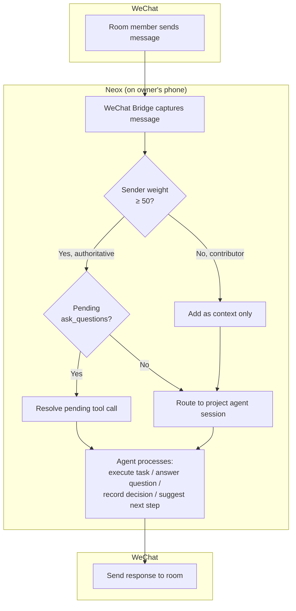
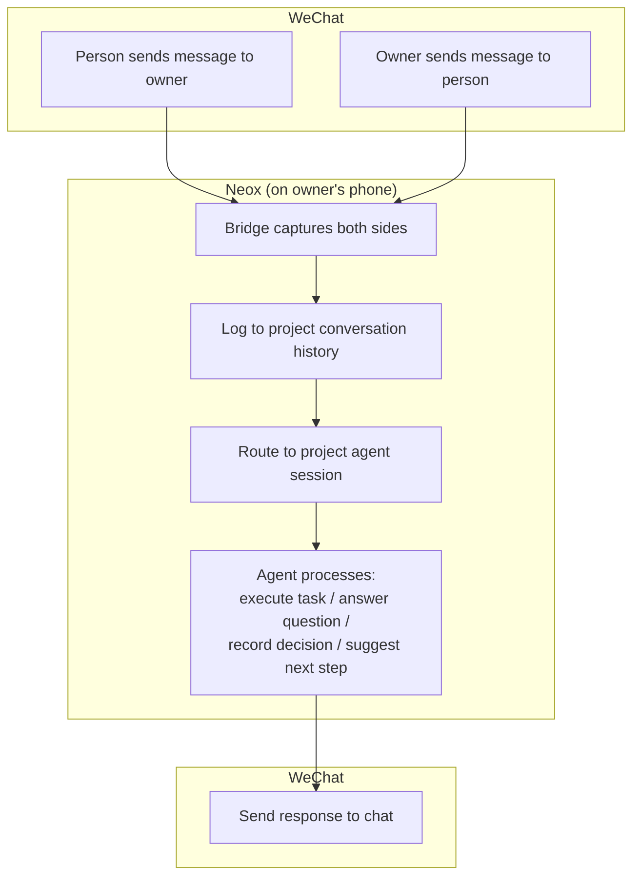
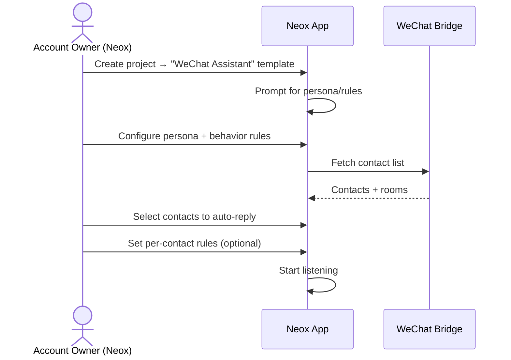
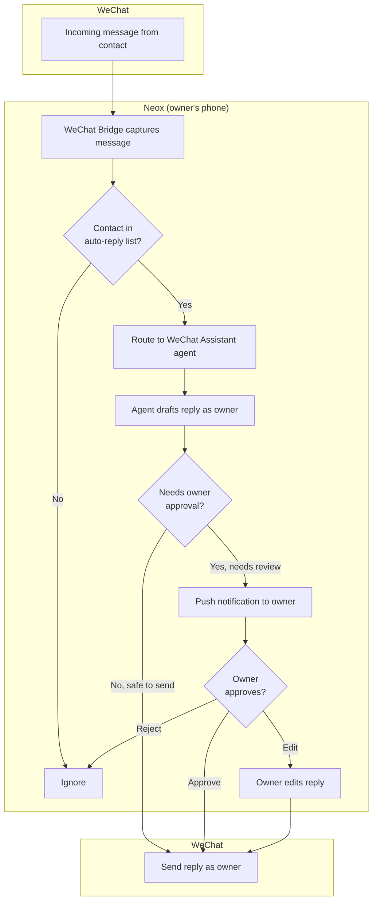
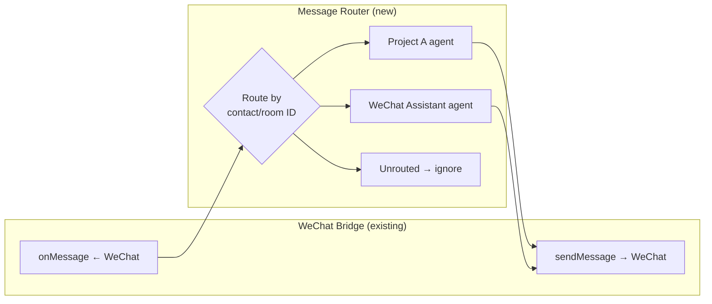
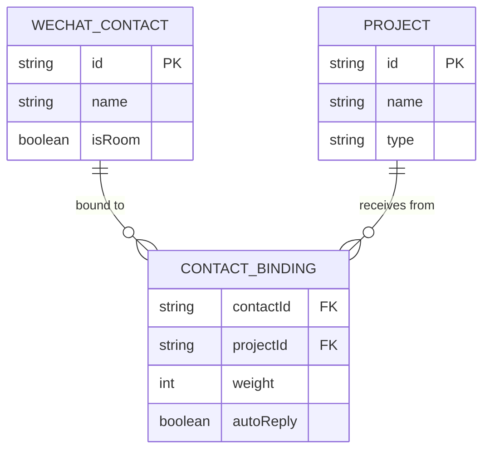

# WeChat Bidirectional Integration Design

> **Date**: 2026-04-10  
> **Status**: Draft  
> **Goal**: Two scenarios — wire project discussions to WeChat rooms, and auto-reply as account owner

---

## Overview

Two new WeChat integration modes for Neox:

1. **Project Discussion Room** — Link a project to a WeChat group. Room members interact with the AI agent directly through WeChat.
2. **WeChat Assistant** — A template project type where the agent auto-replies to personal and group messages on behalf of the account owner.

Both build on the existing one-way bridge (agent → WeChat) by adding the **incoming direction** (WeChat → agent).

---

## Scenario 1: Project Discussion Room

### Concept

A Neox project is wired to a WeChat conversation — either a **group room** or a **1:1 chat**. The agent's role is always the same: **project assistant** — executing tasks, answering questions, recording decisions, tracking action items, and driving the project forward.

The workflow is identical regardless of room or 1:1. The only difference is **who carries decision weight**. In a room, each member has a weight that determines how much authority their input carries (approve tool calls, steer direction, resolve `ask_questions`). In 1:1, the other person is the sole counterpart with full weight.

### Setup Flow


### Message Flow

#### Room Mode (multi-party)



#### 1:1 Mode (project assistant)



In 1:1 mode, the agent is a **project assistant**:
- Records the full conversation as project context
- Executes tasks when asked ("@AI create a doc for this")
- Answers questions from project knowledge ("what was our deadline?")
- Records decisions and action items
- Proactively suggests next steps or flags issues

### Agent Identity in WeChat

WeChat has no bot accounts — the agent sends messages using the **owner's identity**. To distinguish agent messages from the owner's own messages:

- **Prefix all agent messages** with a bot emoji: `🤖 ` (configurable)
- Example: `🤖 Based on the discussion, here are the action items...`
- The existing `wechat-bro.js` AI watermark (invisible Unicode marker) is also applied for programmatic detection via `isFromAI()`
- Owner's own manual messages have no prefix

This applies to all three modes (discussion-room, silent-assistant, auto-reply).

---

### Decision Weight

Every participant in a wired conversation has a **weight** (0–100) that determines their authority level:

| Weight | Meaning | Capabilities |
|--------|---------|-------------|
| **100** | Full authority | Approve/reject tool calls, answer `ask_questions`, override agent direction |
| **50–99** | Strong voice | Input treated as guidance, can answer `ask_questions` when no higher-weight member responds |
| **1–49** | Contributor | Messages become context for the agent, don't resolve tool calls |
| **0** | Muted | Messages ignored entirely |

**Owner** always has weight 100 (from Neox app, not through WeChat).

In **1:1 mode**, the other person defaults to weight 100 — equal authority with owner.

In **room mode**, the project owner assigns weights when wiring. Example:
- Product manager: 100 (decision-maker)
- Lead engineer: 80 (strong voice)
- Designer: 50 (can answer when PM is absent)
- Intern: 20 (context contributor)

When multiple people with weight ≥ 50 respond to an `ask_questions`, the agent uses the **highest-weight response**. If weights are equal, first response wins.

### UI Elements

**Project card badge:**
```
┌─────────────────────────────┐
│ 📱 My App Project           │
│ 💬 Wired: Marketing Room    │
│ 👥 3 members (2 decision)   │
└─────────────────────────────┘

┌─────────────────────────────┐
│ 📱 Sales Proposal           │
│ 💬 Wired: John Zhang (1:1)  │
│ 🤝 Project assistant mode   │
└─────────────────────────────┘
```

**Wiring sheet (in project settings):**
```
┌─ Wire to WeChat ───────────────┐
│ Contact: [Marketing Room ▼]    │
│    or    [John Zhang ▼]        │
│                                │
│ If room selected:              │
│ Members:               Weight  │
│ 🟢 John Zhang    [━━━━━━ 100] │
│ 🔵 Alice Wang    [━━━━━░░ 80] │
│ ⚫ Bob Li        [━░░░░░░ 20] │
│                                │
│ If person selected:            │
│ John Zhang — weight 100        │
│ (equal authority with you)     │
│                                │
│ [Start Listening]  [Cancel]    │
└────────────────────────────────┘
```

---

## Scenario 2: WeChat Assistant (Auto-Reply)

### Concept

A template project type. When the user creates a "WeChat Assistant" project, the agent monitors selected WeChat conversations and replies on behalf of the account owner — based on the owner's persona, context, and relationship with each contact.

### Setup Flow



### Message Flow



### Agent Context

The WeChat Assistant agent session receives:

- **Owner persona**: Role description, communication style, background
- **Contact context**: Relationship to contact, conversation history
- **Behavior rules**: What to commit to, what to escalate, tone preferences
- **Owner's role in rooms**: Whether owner is an admin, member, what topics owner leads

### Configuration UI

```
┌─ WeChat Assistant Setup ───────┐
│                                │
│ Your Persona:                  │
│ ┌──────────────────────────┐   │
│ │ Tech lead at ABC Corp.   │   │
│ │ Keep replies brief and   │   │
│ │ professional.            │   │
│ └──────────────────────────┘   │
│                                │
│ Behavior Rules:                │
│ ☑ Never schedule meetings      │
│ ☑ Don't commit to deadlines    │
│ ☑ Escalate money topics        │
│ ☐ Custom: ________________     │
│                                │
│ Auto-Reply Contacts:           │
│ [✓] John Zhang                 │
│ [✓] Marketing Room  (20 members) │
│ [ ] Alice Wang                 │
│                                │
│ [Start Auto-Reply]             │
└────────────────────────────────┘
```

### Guardrails

| Trigger | Action |
|---------|--------|
| Agent wants to make a promise or commitment | Push notification → owner approves/edits |
| Agent unsure about owner's position | Push notification → owner provides input |
| Contact asks about money, legal, scheduling | Escalate to owner |
| Routine question matching owner's persona | Auto-reply directly |

---

## Shared Infrastructure

### Bidirectional Bridge



The existing `WeChatChannel.onMessage` callback is already wired but unused. The new **Message Router** maps incoming messages to the correct agent session.

### Contact-to-Project Mapping



A contact can be bound to at most one project. A project can have multiple bound contacts. The binding includes the weight (for Scenario 1) and auto-reply flag (for Scenario 2).

### Data Model

```
~/.neo/wechat-routing.json
{
  "bindings": [
    {
      "contactId": "@@abc123",
      "contactName": "Marketing Room",
      "isRoom": true,
      "projectId": "proj-uuid-1",
      "mode": "discussion-room",
      "members": {
        "john-id": { "name": "John Zhang", "weight": 100 },
        "alice-id": { "name": "Alice Wang", "weight": 80 },
        "bob-id":   { "name": "Bob Li",     "weight": 20 }
      }
    },
    {
      "contactId": "@colleague456",
      "contactName": "John Zhang",
      "isRoom": false,
      "projectId": "proj-uuid-1",
      "mode": "project-assistant",
      "weight": 100
    },
    {
      "contactId": "@friend123",
      "contactName": "Alice Wang",
      "isRoom": false,
      "projectId": "proj-uuid-2",
      "mode": "auto-reply"
    }
  ]
}
```

Three binding modes:
- `discussion-room` — Scenario 1 room: multi-party with per-member weights, agent is project assistant
- `project-assistant` — Scenario 1 person: 1:1, agent is project assistant with full access
- `auto-reply` — Scenario 2: agent replies as the account owner

### What Needs Building

| Component | Description | Touches |
|-----------|-------------|---------|
| **WeChatRouter** | Routes incoming messages to correct agent session | New Swift file |
| **WeChatService** (update) | Manage bidirectional bridge, routing config | Existing service |
| **RoomWiringView** | Room selector + member weight assignment UI | New SwiftUI view |
| **AssistantSetupView** | Persona, rules, contact selector for auto-reply | New SwiftUI view |
| **Contact binding persistence** | Load/save wechat-routing.json | New model |
| **Agent session integration** | Map incoming message → session.send with sender context | Update AgentCoordinator |
| **Decision weight resolution** | Higher-weight members resolve ask_questions first | Update tool call handling |
| **Owner approval flow** | Push notification + approve/edit/reject for sensitive replies | Update push handling |

### What Already Exists (no changes needed)

- `wechat-bro.js` — already captures all incoming messages with sender info
- `WeChatChannel` — has `onMessage` callback, `sendMessage()`, contact list
- `WeChatBridge` — JS evaluation, script loading
- Agent sessions via relay — `session.send` works for routing messages
- APNs push — already working for notifications

---

## Non-Goals (v1)

- Cross-device: WeChat bridge only works on the phone where Neox is running
- Voice messages: Text only in v1
- Image/file handling: Text messages only in v1
- Multi-language detection: Agent uses whatever language the contact writes in
- WeChat Pay or mini-program integration
