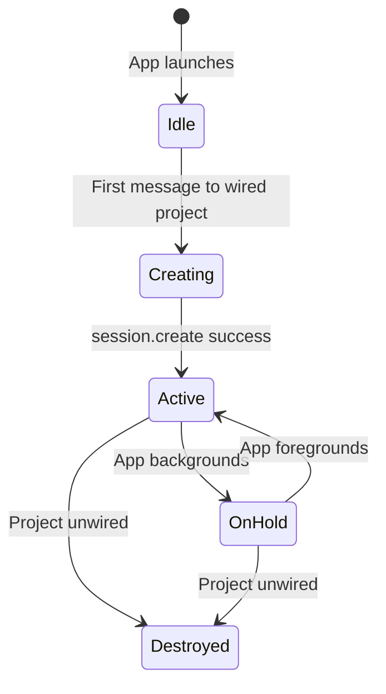
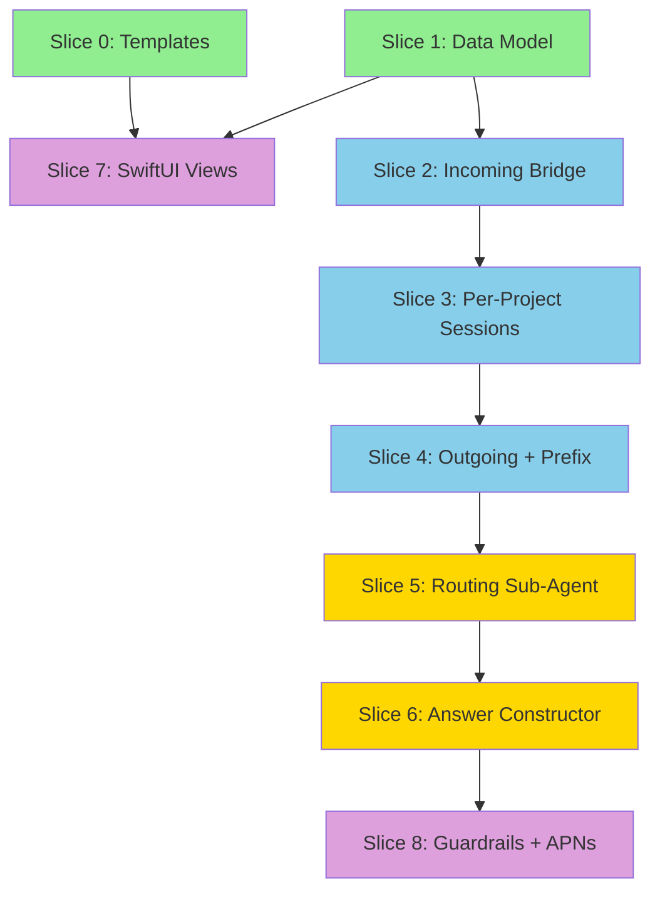

# WeChat Bidirectional Implementation Plan

> **Date**: 2026-04-11  
> **Status**: Awaiting Review  
> **Prereqs**: Design doc + architecture doc finalized  
> **Testing**: E2E on iPhone 12 mini via AppAgent — no manual user involvement

---

## Implementation Slices

Eight slices, ordered by dependency. Each slice is independently testable. Slices 0–4 form the **minimum viable loop** (a WeChat message reaches the agent and gets a reply). Slices 5–7 add intelligence. Slice 8 is polish.

```mermaid
gantt
    title Implementation Dependency Order
    dateFormat X
    axisFormat %s
    section Foundation
        Slice 0 - Templates           :s0, 0, 1
        Slice 1 - Data Model          :s1, 0, 1
    section Core Loop
        Slice 2 - Incoming Bridge     :s2, after s1, 1
        Slice 3 - Per-Project Sessions :s3, after s2, 2
        Slice 4 - Outgoing + Prefix   :s4, after s3, 1
    section Intelligence
        Slice 5 - Routing Sub-Agent   :s5, after s4, 1
        Slice 6 - Answer Constructor  :s6, after s5, 1
    section UI + Guardrails
        Slice 7 - SwiftUI Views       :s7, after s1, 2
        Slice 8 - Guardrails + APNs   :s8, after s6, 1
```



---

## Slice 0: Project Templates

**Goal**: Scaffold both template directories so `create_project` can use them.

### 0A: `project-assistant` template (NEW)

Create `neox/workspace/.templates/projects/project-assistant/` with:

| File | Content |
|------|---------|
| `README.md` | Onboarding guide: project assistant wired to WeChat, how it works, decision weights |
| `package.json` | `{ "name": "", "projectType": "project-assistant", "wechat": { "contacts": [] } }` |
| `docs/` | Empty directory (project docs go here) |
| `progress/` | Empty directory (plans, todos, reports) |

### 0B: `wechat-assistant` template (POPULATE existing stub)

Populate `neox/workspace/.templates/projects/wechat-assistant/` with:

| File | Content |
|------|---------|
| `README.md` | Onboarding guide: auto-reply assistant, context.md editing, guardrails |
| `package.json` | `{ "name": "", "projectType": "wechat-assistant", "wechat": { "contacts": [] } }` |
| `context.md` | Default template from design doc (persona, behavior rules, guardrails, per-contact sections) |
| `docs/` | Empty directory |

**Test**: Verify `create_project` with `projectType: "project-assistant"` and `"wechat-assistant"` scaffolds correct files. (AppAgent: create project → check file tree)

---

## Slice 1: Data Model Foundation

**Goal**: Extend `WeChatContactBindings` to match the design doc data model. Build contact→project lookup.

### Files to modify

| File | Change |
|------|--------|
| `Neox/Services/WeChatService.swift` | Extend `BoundContact` with `weight`, `members`, `autoReply` fields. Add `contactToProjectLookup()` method. |
| `Neox/Models/WeChatModels.swift` (NEW) | New file for `WeChatRoutingConfig`, `WeChatMember`, `ContactProjectMapping` types |

### Data Model Changes

**Current** `BoundContact`:
```swift
struct BoundContact: Codable, Identifiable, Equatable {
    let id: String        // contactUserName
    let name: String
    let isRoom: Bool
}
```

**New** `BoundContact`:
```swift
struct BoundContact: Codable, Identifiable, Equatable {
    let id: String              // contactUserName (e.g. @@abc123)
    let name: String            // display name
    let isRoom: Bool
    var weight: Int?            // 1:1 weight (default 50), nil for rooms
    var autoReply: Bool?        // Scenario 2 flag
    var members: [String: WeChatMember]?  // Room member weights (room only)
}

struct WeChatMember: Codable, Equatable {
    let name: String
    var weight: Int             // 0–100
}
```

### Contact→Project Lookup

New method on `WeChatService`:
```swift
/// Scans all project package.json files, builds contactId → projectId map.
/// Called on startup and when bindings change.
func buildContactLookup() -> [String: String]
```

This reads every project's `package.json` `wechat.contacts` array and builds an in-memory dictionary. A contact can only map to one project — conflicts detected at wiring time.

### Persistence Change

Currently bindings are in `.neo/wechat-bindings.json` (per-project key). The design says config lives in `package.json` under `wechat` key. **Decision needed**:

- **Option A**: Keep `.neo/wechat-bindings.json` as single source of truth (simpler, current pattern)
- **Option B**: Move to `package.json` per project (matches design doc, but requires changes to ProjectTaskHandler)

**Recommendation**: Option A for now — the lookup method reads from bindings file. Migrate to package.json later when project creation flow is updated.

**Test**: Unit test — create bindings, verify lookup returns correct contactId→projectId mapping.

---

## Slice 2: Incoming Bridge Wiring

**Goal**: Wire `WeChatChannel.onMessage` → `WeChatService` → router. When a message arrives, look up the bound project and log it.

### Files to modify

| File | Change |
|------|--------|
| `Neox/Services/WeChatService.swift` | Add `onIncomingMessage` handler. Wire `channel.onMessage` in `enable()`. |
| `Neox/Agent/WeChatMessageRouter.swift` (NEW) | New class: receives incoming messages, looks up project, dispatches |

### WeChatService changes

In `enable()`, wire the callback:
```swift
channel.onMessage = { [weak self] message in
    Task { @MainActor in
        self?.handleIncoming(message)
    }
}
```

`handleIncoming()`:
1. Check `message.isText` (v1: text only)
2. Look up `message.fromUserName` (or room ID if `isRoom`) in contact lookup
3. If no match → ignore
4. If match → pass to `WeChatMessageRouter.route(message:, projectId:)`

### WeChatMessageRouter

```swift
@MainActor
final class WeChatMessageRouter {
    private let weChatService: WeChatService
    private weak var coordinator: AgentCoordinator?
    
    /// Route an incoming WeChat message to the correct project session
    func route(_ message: WeChatMessage, projectId: String) {
        // 1. Log to conversation history
        // 2. Look up project session (Slice 3 adds this)
        // 3. Forward to session (Slice 3 adds this)
    }
}
```

In Slice 2, the router only **logs** messages — it cannot forward yet (no per-project sessions). This validates the incoming pipeline independently.

**Test (AppAgent)**:
1. Build & run Neox on 12 mini
2. WeChat bridge is online (pre-authenticated)
3. Send a text message to a bound contact from another device
4. Verify log output shows the message was captured and routed to correct projectId

---

## Slice 3: Per-Project Sessions

**Goal**: Create dedicated relay sessions for wired projects. Each wired project gets its own `ChatViewModel` with session key `appId-userId-projectId`.

### Files to modify

| File | Change |
|------|--------|
| `Neox/Agent/AgentCoordinator.swift` | Add `projectSessions: [String: ChatViewModel]` dictionary. Add `createProjectSession(projectId:)` and `destroyProjectSession(projectId:)`. |
| `Neox/Agent/WeChatMessageRouter.swift` | Wire `route()` to create/get session and `session.send()` with sender metadata |
| `Neox/Services/WeChatService.swift` | On enable, iterate wired projects and create sessions |

### Session Lifecycle



**Key decisions**:
- Sessions created **lazily** on first incoming message (not eagerly on app launch)
- Session key: `{appId}-{userId}-{projectId}`
- Each project session uses the project's workspace files as context (instructions include project README, package.json)
- Session tools: same as main session (file, memory, terminal, etc.) — project agent is a full Copilot CLI session

### Sender Metadata

When forwarding a WeChat message to the relay, include sender context in the prompt:

```
[WeChat message from John Zhang (weight: 80) in Marketing Room]
Let's use React for the frontend.
```

The Copilot CLI doesn't need to know about WeChat — it just sees a user message with attribution.

### Response Handling

When a project session emits a response:
1. Intercept via `ChatViewModel.onResponse` callback
2. Route back to WeChat via `weChatService.forward(message:project:watermark:)`
3. Apply 🤖 prefix (Scenario 1) or no prefix (Scenario 2) based on `projectType`

**Test (AppAgent)**:
1. Wire a project to a WeChat room
2. Send a message in that room
3. Verify: dedicated session created on relay, message forwarded, agent responds
4. Verify response appears in WeChat with 🤖 prefix

---

## Slice 4: Outgoing Pipeline + Bot Prefix

**Goal**: Agent responses flow back to WeChat with correct formatting.

### Files to modify

| File | Change |
|------|--------|
| `Neox/Agent/WeChatMessageRouter.swift` | Add response interception. Apply prefix logic based on projectType. |
| `Neox/Services/WeChatService.swift` | Add `forwardWithPrefix(message:project:scenario:)` method |

### Prefix Logic

```swift
func formatOutgoing(_ response: String, projectType: String) -> String {
    switch projectType {
    case "project-assistant":
        return "🤖 \(response)"     // Distinguish from owner
    case "wechat-assistant":
        return response               // Seamless as owner
    default:
        return "🤖 \(response)"
    }
}
```

Both scenarios apply invisible AI watermark via `sendMessage(..., watermark: true)` — this already exists.

**Test (AppAgent)**:
1. Project-assistant wired → verify 🤖 prefix in WeChat
2. WeChat-assistant wired → verify no prefix in WeChat
3. Verify AI watermark is present (call `isFromAI()` in JS console)

---

## Slice 5: Routing Sub-Agent

**Goal**: Replace direct forwarding with intelligent message classification. The routing sub-agent decides: `resolve_tool_call`, `new_input`, or `context_only`.

### Architecture Decision

**Where does the sub-agent run?**

- **Option A**: On-device LLM (mlx) — fast, no network, but limited model quality
- **Option B**: Via relay — use existing Copilot session to evaluate (costs premium requests)
- **Option C**: Lightweight relay endpoint — dedicated classification endpoint

**Recommendation**: Option B initially — send classification request as a structured prompt to the **main session** (not the project session). The main session acts as the orchestrator. This reuses existing infrastructure. Optimize later if latency/cost is a problem.

### Implementation

New file: `Neox/Agent/WeChatRoutingAgent.swift`

```swift
struct RoutingDecision {
    enum Action {
        case resolveToolCall(toolCallId: String, answer: String)
        case newInput
        case contextOnly
    }
    let action: Action
    let reasoning: String
}

actor WeChatRoutingAgent {
    /// Classify an incoming message
    func classify(
        message: WeChatMessage,
        senderWeight: Int,
        pendingQuestion: PendingAskQuestion?,
        recentHistory: [ChatMessage],
        agentState: String
    ) async -> RoutingDecision
}
```

The classification prompt follows the `wechat-router.agent.md` definition: input all context, output one of three actions.

### Integration with Router

`WeChatMessageRouter.route()` becomes:
1. Get sender weight from bindings
2. Get pending ask_questions state from project session (if any)
3. Call `routingAgent.classify(...)` 
4. Switch on result:
   - `.resolveToolCall` → resolve the stashed tool call on relay
   - `.newInput` → forward to project session
   - `.contextOnly` → log only, no forwarding

### Stashed ask_questions Integration

The relay already stashes `ask_questions` tool calls. When the routing agent decides to resolve one:
1. Get the stashed tool call ID from the project session
2. Send the answer (formatted by answer constructor in Slice 6, or directly in Slice 5)
3. Relay replays the tool result to the CLI process

**Test (AppAgent)**:
1. Project agent asks a question via ask_questions → appears in WeChat as 🤖 message
2. Someone replies in WeChat
3. Verify routing agent classifies as `resolve_tool_call`
4. Verify agent continues work with the answer
5. Send an unrelated message → verify classified as `context_only`
6. Send a new instruction → verify classified as `new_input`

---

## Slice 6: Answer Constructor

**Goal**: For multi-party rooms, collect and synthesize responses to `ask_questions` before resolving.

### Files

| File | Purpose |
|------|---------|
| `Neox/Agent/WeChatAnswerConstructor.swift` (NEW) | Buffer responses, decide readiness, synthesize answer |

### Design

```swift
actor WeChatAnswerConstructor {
    struct PendingAnswer {
        let question: String
        let toolCallId: String
        var responses: [(sender: String, weight: Int, text: String, time: Date)]
        let startTime: Date
        let timeout: TimeInterval  // default 5 min
    }
    
    /// Add a response to a pending question
    func addResponse(sender: String, weight: Int, text: String, for projectId: String) async -> ConstructionResult
    
    /// Result: either ready with synthesized answer, or waiting
    enum ConstructionResult {
        case waiting(reason: String)
        case ready(answer: String)
        case timeout(bestAnswer: String)
    }
}
```

### Readiness Logic

Uses a lightweight LLM call (same approach as routing agent):
- Input: question, all responses so far (with weights), elapsed time
- Output: ready/not-ready + synthesized answer if ready

**Shortcut for 1:1**: Skip answer constructor entirely — single responder → resolve immediately.

### Timeout

- Configurable per-project (default 5 minutes)
- After timeout → synthesize best answer from available responses
- Timer managed by `WeChatMessageRouter` — fires and calls `constructor.forceResolve(projectId:)`

**Test (AppAgent)**:
1. Wire room with 3 members (PM weight 100, Dev weight 80, Intern weight 20)
2. Agent asks question
3. Intern responds → verify waiting
4. PM responds with clear answer → verify resolved immediately
5. Test timeout: only intern responds, wait 5 min → verify forced resolution

---

## Slice 7: SwiftUI Views

**Goal**: UI for wiring projects to WeChat contacts and monitoring status.

### Views to Build

| View | Context | Complexity |
|------|---------|------------|
| `WeChatWiringSheet` | Shown from project settings → "Wire to WeChat" | Moderate — contact picker + weight sliders |
| `WeChatStatusView` | Shown on wired project card | Simple — session state, message count |
| `WeChatHistoryView` | Read-only conversation log | Simple — list of messages |
| `ContextEditorView` | Markdown editor for context.md | Simple — reuse existing markdown editor |

### WeChatWiringSheet

```
┌─ Wire to WeChat ───────────────┐
│ Select contact:                │
│ ┌─────────────────────────────┐│
│ │ 🏠 Marketing Room          ││
│ │ 👤 John Zhang              ││
│ │ 👤 Alice Wang              ││
│ └─────────────────────────────┘│
│                                │
│ ── Room Members ──             │
│ John Zhang    [━━━━━━━━ 100]  │
│ Alice Wang    [━━━━━░░░  80]  │
│ Bob Li        [━░░░░░░░  20]  │
│                                │
│ [Start Listening]  [Cancel]    │
└────────────────────────────────┘
```

- Fetches contacts from `WeChatChannel.getContacts()`
- For rooms: fetches member list, shows weight sliders
- For 1:1: auto-sets weight = 50
- On confirm: saves bindings, starts listening

### Integration Points

- `ProjectDetailView` → add "Wire to WeChat" button (if WeChat online)
- `ProjectCardView` → show wired status badge (💬 Wired: Room Name)
- Navigation: project card → status/history views

**Test (AppAgent)**:
1. Open project → tap "Wire to WeChat"
2. Verify contact list loads
3. Select room → verify member weights UI
4. Save → verify bindings persisted
5. Verify project card shows wired badge

---

## Slice 8: Guardrails + APNs Escalation (Scenario 2 only)

**Goal**: When the WeChat assistant agent triggers a guardrail, push notification to owner for approval.

### Files

| File | Change |
|------|--------|
| `Neox/Agent/WeChatMessageRouter.swift` | Detect guardrail trigger from agent response |
| `copilot-relay/lib/session-pool.js` | New APNs notification type: `wechat_approval_needed` |
| `Neox/Notifications/` | Handle approval notification → approve/edit/reject UI |

### Flow

1. Agent response includes `needsApproval: true` marker (via tool call or structured output)
2. Router intercepts → holds the response (does not send to WeChat)
3. Push notification to owner via APNs
4. Owner taps → sees draft reply + approve/edit/reject
5. Approved → send to WeChat. Edited → send edited version. Rejected → discard.

### Implementation Note

This requires the agent to signal guardrail triggers. Two approaches:
- **Structured output**: Agent returns JSON with `{ needsApproval, draft, reason }`
- **Tool call**: Agent calls `request_approval(draft:, reason:)` tool

**Recommendation**: Tool call — cleaner, works with existing tool pipeline.

**Test (AppAgent)**:
1. Set up wechat-assistant with guardrail: "never schedule meetings"
2. Someone asks to schedule a meeting
3. Verify push notification received
4. Tap approve → verify reply sent
5. Tap reject → verify no reply sent

---

## Dependency Graph



Green = Foundation (parallel) · Blue = Core Loop (serial) · Gold = Intelligence · Purple = UI + Polish

---

## MVP Milestone: Slices 0–4

After Slices 0–4, you have a **working end-to-end loop**:

1. ✅ Create a project-assistant or wechat-assistant project from template
2. ✅ Wire it to a WeChat contact  
3. ✅ Messages arrive → forwarded to dedicated agent session
4. ✅ Agent responds → sent back to WeChat with correct prefix
5. ❌ No intelligent routing (all messages forwarded as new_input)
6. ❌ No multi-party answer synthesis
7. ❌ No guardrails

This is testable and useful — the intelligence (Slices 5–8) layers on top.

---

## Open Questions for Review

1. **Binding storage**: Keep `.neo/wechat-bindings.json` (current) or migrate to `package.json` wechat key (design doc)? Recommend keeping current for MVP, migrate later.

2. **Routing sub-agent hosting**: Run via main relay session (simple, costs premium requests) or on-device LLM (fast, free, but limited)? Recommend relay for now.

3. **Lazy vs eager session creation**: Create project sessions on first message (lazy) or when app launches (eager)? Recommend lazy — faster startup, no wasted sessions.

4. **Slice 7 priority**: UI views could be built in parallel with Slices 2–4 since they only depend on Slice 1. Want them earlier or after core loop works?

5. **Testing scope**: Each slice has AppAgent E2E tests. Should we also add Swift unit tests for the data model and router logic?
