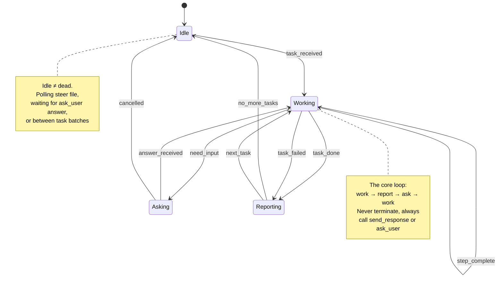

# Coding Agent Architecture — Infinite-Loop Project Delivery

## 1. Problem

LLM coding agents stop after one turn. They answer, then wait. To deliver a *project* — not just a single response — the agent needs to:
- Keep working across many tasks without human re-invocation
- Ask for input when blocked, then resume
- Report progress continuously
- Survive disconnections, crashes, and context loss
- Operate across two execution environments (local IDE + cloud CI)

This doc defines the architecture that makes that work.

---

## 2. What Already Exists

### 2.1 Local Infinite-Loop Agent (IMPLEMENTED)

The relay server (`copilot-relay/relay-server.js`) already implements this:

```
iOS/VS Code → WebSocket → relay-server.js → copilot CLI (pooled sessions)
```

**Key mechanisms:**
- **Agent loop injection** — system message forces agent to call `send_response` or `ask_user` before every turn end, preventing silent termination
- **Two control tools** — `send_response` (deliver output) + `ask_user` (request input), injected as MCP tools into every pooled session
- **Session pooling** — pre-warmed CLI sessions assigned on connect, returned to pool on disconnect
- **Hold state** — when agent calls `ask_user` and client disconnects, session enters on-hold with timeout + client pinning for reconnect
- **Context recovery** — workspace snapshots (tar.gz) + `events.jsonl` parsing restore conversation on session loss
- **Multi-workspace routing** — each app (`appId`) gets its own CLI process with isolated working directory

Agent instruction injection (relay-server.js L321):
```
IMPORTANT: You are an autonomous agent running in an infinite loop.
- Use the `send_response` tool to deliver your responses to the user.
- Use the `ask_user` tool when you need more information or when all tasks are done.
- Always use one of these tools before your turn ends.
```

### 2.2 VS Code Neverstop Agent (IMPLEMENTED)

`.github/agents/neverstop.agent.md` implements the same pattern for VS Code:
- `send_response` via MCP tool from relay
- `ask_questions` via VS Code built-in
- `user-steer.md` — async steering file the human can edit anytime
- `user-todo.md` — persistent priority queue
- Background subagent dispatch via `copilot CLI` in terminal

### 2.3 GitHub Cloud Coding Agent (AVAILABLE, NOT YET INTEGRATED)

GitHub's cloud coding agent runs in a VM, creates PRs from issues:
- Triggered by issue assignment or `@copilot` mention
- Reads `.github/copilot-instructions.md`, custom agents, skills
- Works in a disposable VM (Ubuntu runner)
- Can use MCP servers configured in repo settings
- **No built-in infinite-loop** — runs one issue, produces one PR, stops

---

## 3. Architecture

### 3.1 Two-Tier Agent System

```
┌──────────────────────────────────────────────────────────┐
│  Tier 1: Local Orchestrator (always-on)                  │
│  VS Code neverstop agent  OR  iOS relay session          │
│                                                          │
│  ┌──────────┐  ┌───────────┐  ┌───────────────────────┐ │
│  │ steer    │  │ todo      │  │ background subagents  │ │
│  │ file     │  │ tracker   │  │ (copilot CLI workers) │ │
│  └──────────┘  └───────────┘  └───────────────────────┘ │
│                                                          │
│  Capabilities:                                           │
│  - Full filesystem access                                │
│  - Browser automation (agent-browser, port 9222)         │
│  - iOS device control (AppAgent, port 9223)              │
│  - Terminal execution                                    │
│  - Git operations                                        │
│  - MCP tools (relay send_response, ask_user)             │
└─────────────────────┬────────────────────────────────────┘
                      │ dispatches issues
                      ▼
┌──────────────────────────────────────────────────────────┐
│  Tier 2: Cloud Workers (on-demand)                       │
│  GitHub coding agent sessions                            │
│                                                          │
│  ┌──────────┐  ┌──────────┐  ┌──────────┐              │
│  │ Issue #1 │  │ Issue #2 │  │ Issue #3 │   ...        │
│  │  → PR    │  │  → PR    │  │  → PR    │              │
│  └──────────┘  └──────────┘  └──────────┘              │
│                                                          │
│  Capabilities:                                           │
│  - Isolated VM per task                                  │
│  - Auto-PR with CI                                       │
│  - Repo instructions + skills + MCP                      │
│  - Steerable via @copilot PR comments                    │
└──────────────────────────────────────────────────────────┘
```

**Division of labor:**

| Concern | Tier 1 (Local) | Tier 2 (Cloud) |
|---------|---------------|----------------|
| Planning & decomposition | ✓ | — |
| Issue creation | ✓ | — |
| Code implementation | small/urgent | standard features |
| Testing on device | ✓ | — |
| PR review & merge | ✓ | — |
| Content creation | ✓ | — |
| Browser/device automation | ✓ | — |
| Parallel execution | sequential | up to 7 concurrent |

### 3.2 Infinite-Loop State Machine



**Transition table:**

| From | Event | To | Action |
|------|-------|----|--------|
| Idle | task from user / steer file / todo list | Working | Begin execution |
| Working | step completed, more remain | Working | Report progress, continue |
| Working | blocked on user input | Asking | Call `ask_user` / `ask_questions` |
| Working | task complete | Reporting | Call `send_response` with results |
| Working | unrecoverable error | Reporting | Call `send_response` with failure summary |
| Asking | user answers | Working | Incorporate answer, resume |
| Asking | user cancels / timeout | Idle | Clean up, wait |
| Reporting | user provides next task | Working | Begin next task |
| Reporting | no more tasks | Idle | Call `ask_questions` for next action |

### 3.3 Control Tools

Two tools maintain the infinite loop. Both already exist in the relay server.

**`send_response`** — Deliver output to user
```json
{ "name": "send_response", "parameters": { "message": "string (required)" } }
```

**`ask_user`** — Request input, hold session
```json
{ "name": "ask_user", "parameters": { "question": "string (required)" } }
```

That's it. No `task_id`, no `artifacts` schema, no `report_progress`. Progress is just a `send_response` with progress content. The agent uses natural language to structure output — rigid schemas add friction without value.

---

## 4. Project Delivery Flow

### 4.1 End-to-End

```
1. Human describes project goal (chat or steer file)
         ↓
2. Orchestrator (Tier 1) decomposes into milestones → issues
         ↓
3. For each issue:
   a. Create GitHub issue with spec
   b. Assign to coding agent (Tier 2) or implement locally
   c. Monitor (GitHub agents tab / CLI)
   d. Steer if needed (@copilot comment or steer file)
   e. Review PR
   f. Merge
         ↓
4. Validate integration (build, test, device check)
         ↓
5. Repeat 3-4 until milestone complete
         ↓
6. Release
```

### 4.2 Issue Spec

Every issue dispatched to the cloud agent:

```markdown
## Goal
[One sentence: what should change]

## Context
[Files/modules involved, current behavior]

## Spec
[Exact requirements]

## Constraints
- [No-go areas]
- [API/security limits]

## Validation
- [ ] Build passes
- [ ] Tests pass: `[specific command]`
- [ ] [Behavioral check]

## Out of Scope
[What NOT to touch]
```

**Rule: one issue = one reviewable PR. If you can't review the diff in 5 minutes, split it.**

### 4.3 Repo Configuration

| File | Purpose |
|------|---------|
| `.github/copilot-instructions.md` | Global agent behavior rules |
| `.github/agents/*.agent.md` | Specialized agent personas |
| `.github/skills/*/SKILL.md` | Reusable procedural instructions |
| `.github/workflows/copilot-setup-steps.yml` | VM environment setup |

Existing agents: `neverstop`, `content-writer`, `content-poster`, `test-loop`
Existing skills: `brainstorming`, `test-driven-development`, `executing-plans`, `background-subagent`, `writing-skills`, + 25 more

---

## 5. Resilience

### 5.1 Local Session Recovery (Implemented)

| Failure | Recovery |
|---------|----------|
| Client disconnect during `ask_user` | Session held with timer; client reconnects to same session via `clientId` pinning |
| Hold timeout (10 min) | Workspace snapshot saved; session recycled; context extracted from `events.jsonl` on next connect |
| CLI crash | Pool detects exit, respawns CLI, pre-warms sessions |
| Relay restart | Client reconnects, gets snapshot-restored context |

### 5.2 Cloud Agent Recovery

| Failure | Recovery |
|---------|----------|
| Bad PR | `@copilot fix: ...` comment → agent iterates |
| Scope drift | Close PR, refine issue, reassign |
| Agent stuck | Stop session, split issue smaller |
| Missing dependency | Update `copilot-setup-steps.yml`, retry |

### 5.3 Steering Channels

| Channel | Environment | Latency |
|---------|-------------|---------|
| `user-steer.md` edit | VS Code local | ~seconds |
| `@copilot ...` PR comment | GitHub cloud | ~minutes |
| `ask_user` tool answer | iOS relay | immediate |
| `ask_questions` answer | VS Code | immediate |

---

## 6. What Needs to Be Built

### 6.1 GitHub Issue Dispatch (Priority: High)

The orchestrator needs to create and manage GitHub issues programmatically:

1. **Create issue** with spec template from task description
2. **Assign to Copilot** (label or assignment)
3. **Poll for PR** creation and CI status
4. **Pull PR for review** or auto-merge if low-risk

Implementation options:
- `gh` CLI commands in a skill (`github-dispatch/SKILL.md`)
- GitHub MCP server (already exists as extension)
- Background subagent that monitors via polling

### 6.2 PR Auto-Review Pipeline (Priority: Medium)

For well-tested, low-risk PRs:
1. CI passes (build + tests)
2. Scope check: diff only touches files mentioned in issue
3. No security-sensitive changes
4. Auto-merge after configurable delay

Requires: GitHub Actions workflow + branch protection rules.

### 6.3 Project Dashboard (Priority: Low)

Aggregate view of:
- Active sessions (local + cloud)
- Issue → PR status mapping
- Build/test results
- Completion %

Currently manual (`progress/PROGRESS.md`). Could automate via GitHub API polling into a generated markdown file.

---

## 7. Decisions

| Decision | Choice | Why |
|----------|--------|-----|
| Loop mechanism | `send_response` + `ask_user` injection | Already working, two tools, minimal surface |
| Progress reporting | Natural language via `send_response` | No rigid schema; agent adapts output to context |
| Task tracking | `user-todo.md` + todo_list tool | File-first, human-readable, no database |
| Steering | File edits (local) + PR comments (cloud) | Async, non-blocking, auditable |
| Session persistence | Workspace snapshots + events.jsonl | Survives restart, portable |
| Cloud dispatch | GitHub issue assignment | Native flow, no custom infra |
| Concurrency | Sequential local, parallel cloud (≤7) | Orchestrator is serial; workers parallelize |
| Issue granularity | One PR per issue, ≤5 min review | Prevents drift, faster feedback |

---

## 8. Example: Delivering a Feature

**Goal:** Add `create_directory` tool to CopilotSDK file tools.

**Orchestrator actions:**
1. Assess scope → small, single-file change → implement locally (Tier 1)
2. Read existing `FileToolProvider.swift` for patterns
3. Implement `create_directory` with sandbox safety checks
4. Build on simulator → validate
5. Commit and push
6. `send_response` → report completion
7. `ask_questions` → what next?

**If this were a larger feature (e.g., full file management UI):**
1. Decompose: Issue #1 (backend tools), Issue #2 (UI components), Issue #3 (integration tests)
2. Dispatch #1, #2 to cloud agent (parallel)
3. Implement #3 locally after #1, #2 merge
4. Device test via AppAgent
5. Release

---

## Appendix A: File Map

```
copilot-relay/
  relay-server.js          # Infinite-loop relay (send_response, ask_user, pooling)
  DESIGN-v2.md             # Session lifecycle, hold state, multi-workspace

.github/
  agents/
    neverstop.agent.md     # VS Code infinite-loop persona
    content-writer.agent.md
    content-poster.agent.md
    test-loop.agent.md
  skills/
    brainstorming/          # Pre-implementation design
    test-driven-development/
    executing-plans/
    background-subagent/    # Dispatch copilot CLI workers
    writing-skills/
    ... (25+ more)
  user-steer.md            # Async human → agent steering
  user-todo.md             # Priority task queue

progress/
  PROGRESS.md              # Project tracking
  PLAN.md                  # Current execution plan
```
