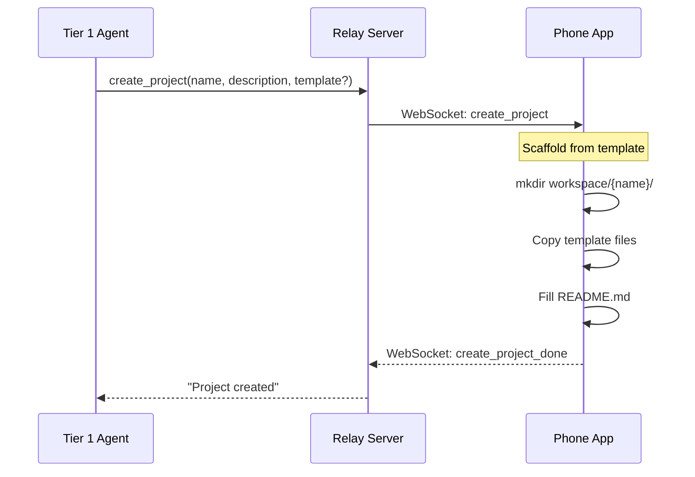

# create_project Tool Design

## Overview

`create_project` is a Tier 1 agent tool that scaffolds a project folder on the phone's local workspace. It runs entirely on-device — no GitHub, no relay server involvement.



## Tool Definition

```json
{
  "name": "create_project",
  "description": "Create a new project in the workspace. Steps: 1) Read .neo/templates/{template}/README.md to understand the structure 2) Follow the README to gather required info from the user 3) Call this tool with the gathered info. The client will scaffold the project folder.",
  "parameters": {
    "name": { "type": "string", "description": "Project name (e.g., 'Fitness Tracker')" },
    "description": { "type": "string", "description": "One-line project description" },
    "template": { "type": "string", "description": "Template name from .neo/templates/ (default: 'project')" },
    "goal": { "type": "string", "description": "Project goal (1-2 sentences)" },
    "features": {
      "type": "array",
      "items": { "type": "string" },
      "description": "List of MVP features"
    }
  },
  "required": ["name"]
}
```

## Templates

Templates live in `workspace/.neo/templates/`. Each folder is a template with a `README.md` that guides the agent on how to scaffold.

```
workspace/.neo/templates/
├── project/              # General project (default)
│   ├── README.md         # goal, features, strategy, phases, references
│   ├── docs/
│   └── progress/
├── expo-app/             # Future: Expo mobile app
├── web-app/              # Future: Web application
└── ...
```

### How the Agent Discovers Templates

The agent's `read_file` tool is intercepted by the relay and delegated to the phone. So the agent can directly read phone-local files:

1. List `.neo/templates/` to see available templates
2. Read `.neo/templates/{name}/README.md` to understand structure and required fields
3. Follow the README guidance to gather info from user
4. Call `create_project` with the gathered info

No hardcoded template listing needed in the system message — the agent reads templates dynamically from the device.

## What It Creates

Given `create_project(name: "Fitness Tracker", description: "Track daily workouts", goal: "...", features: [...])`:

```
workspace/
├── FitnessTracker/           # slugified name
│   ├── README.md             # filled from template + tool params
│   ├── docs/                 # empty, ready for specs/designs
│   └── progress/             # empty, ready for plans/todos
```

### README.md Content

```markdown
---
name: Fitness Tracker
description: Track daily workouts
---

# goal
Track daily workouts and visualize progress over time

# feature
- [ ] Log exercises with sets, reps, weight
- [ ] Daily workout summary
- [ ] Weekly progress charts

# strategy

# implementation phrases

# references
- **docs/**: project docs, detail requirements, design, knowledge, and etc
- **progress/**: project plan, todo, report, and etc
```

## When to Call

The agent calls `create_project` early in the guided flow — typically during Step 1 (Discover) or Step 2 (Define) — so that subsequent context files (specs, mockups, screen descriptions) have a folder to live in.

```
Step 1: Discover → agent calls create_project after understanding what user wants
Step 2: Define → agent writes docs/spec.md, user uploads mockups to docs/designs/
Step 3: Design → agent writes docs/screens.md
Step 4: Confirm → user reviews
Step 5: Create → agent calls create_task (pushes to GitHub, activates coding agent)
```

## Relationship to create_task

| Tool | Where | What |
|------|-------|------|
| `create_project` | On-device | Scaffolds local project folder from template |
| `stage_file` | On-device | Writes a file into the project folder |
| `create_task` | Relay → device → relay | Pushes project to GitHub, activates coding agent |

The local project folder becomes the source for `create_task` — files from `docs/` get uploaded to the GitHub repo.

## On-Device Implementation

```swift
// Neox workspace manager
func handleCreateProject(name: String, description: String?, template: String?, goal: String?, features: [String]?) {
    let slug = name.slugified()  // "Fitness Tracker" → "FitnessTracker"
    let projectDir = workspaceURL.appendingPathComponent(slug)
    
    // Copy template structure
    let templateName = template ?? "project"
    let templateDir = workspaceURL
        .appendingPathComponent(".neo/templates/\(templateName)")
    
    if FileManager.default.fileExists(atPath: templateDir.path) {
        try FileManager.default.copyItem(at: templateDir, to: projectDir)
    } else {
        try FileManager.default.createDirectory(at: projectDir, withIntermediateDirectories: true)
    }
    
    // Fill README.md
    var readme = """
    ---
    name: \(name)
    description: \(description ?? "")
    ---
    
    """
    
    if let templateReadme = try? String(contentsOf: templateDir.appendingPathComponent("README.md")) {
        // Use template readme as base, fill in goal/features
        readme += fillTemplate(templateReadme, goal: goal, features: features)
    }
    
    try readme.write(to: projectDir.appendingPathComponent("README.md"), atomically: true, encoding: .utf8)
}
```
