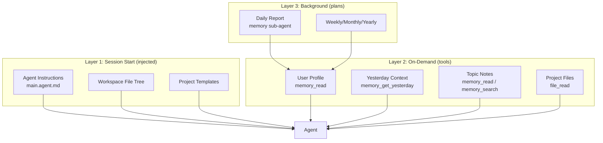
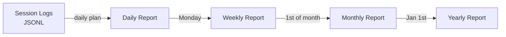
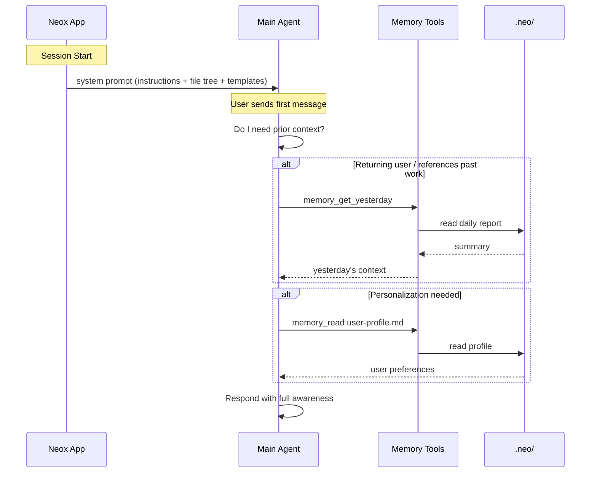

# Agent Content Awareness Design

## Overview

How the Neox agent builds awareness of its context — workspace files, user identity, past sessions, and available capabilities. Content awareness is layered: some context is injected at session start, some is loaded on demand via tools.

## Awareness Layers

## Layer 1: Session Start

Injected into the system prompt when `createChatViewModel()` runs. The agent always has this context.

| Content | Source | Injected By |
|---------|--------|-------------|
| Agent personality & rules | `.github/agents/main.agent.md` | `AgentProfileLoader` |
| Workspace file tree | Recursive scan of workspace | `buildWorkspaceTree()` |
| Available templates | `.templates/projects/*/README.md` | `buildTemplateInfo()` |
| Agent sections | Frontmatter sections from agent.md | `AgentProfileLoader` |

### What's NOT injected at start

- User profile (too large, may not be needed)
- Yesterday's summary (costs a tool call; not always relevant)
- Memory notes (agent pulls when needed)

## Layer 2: On-Demand (Tools)

The agent calls tools when context is needed. This keeps the system prompt small and costs low.

| Context | Tool | When to Use |
|---------|------|-------------|
| User profile | `memory_read .neo/memory/user-profile.md` | Personalization, first interaction |
| Yesterday's work | `memory_get_yesterday` | User references past work, session continuity |
| Topic notes | `memory_read .neo/memory/topics/{topic}.md` | Recurring subject matter |
| Project history | `memory_read .neo/memory/projects/{project}.md` | Resuming project work |
| Search memory | `memory_search` | Finding relevant past context by keyword |
| File contents | `file_read` | Reading workspace files |

### Agent Instructions for On-Demand Loading

The main.agent.md tells the agent:
- Read user profile when personalizing responses
- Call `memory_get_yesterday` when prior context would help
- Search memory when user references unfamiliar topics

The agent decides when to load context — no forced injection.

## Layer 3: Background (Plans)

The "Memory Reports" plan runs daily via PlanExecutor and generates structured summaries. These become the on-demand context for Layer 2.

## Content Flow

## Implementation Components

| Component | File | Role |
|-----------|------|------|
| AgentProfileLoader | CopilotSDK | Loads main.agent.md |
| AgentCoordinator | Neox | Builds system prompt, injects tree + templates |
| MemoryToolProvider | CopilotSDK | 8 memory tools for on-demand reading |
| SubAgentToolProvider | CopilotSDK | Delegates to memory sub-agent |
| PlanExecutor | CopilotSDK | Runs daily report plan via BGTask |
| PlanStore | CopilotSDK | Seeds the memory-reports plan |

## Design Principles

1. **Small system prompt** — only inject what's always needed (identity, file tree, templates)
2. **On-demand context** — agent pulls memory/profile via tools when relevant
3. **No auto-injection** — no yesterday summary or profile in system prompt
4. **Background generation** — plans create structured reports for future retrieval
5. **Agent autonomy** — the agent decides what context to load based on conversation
