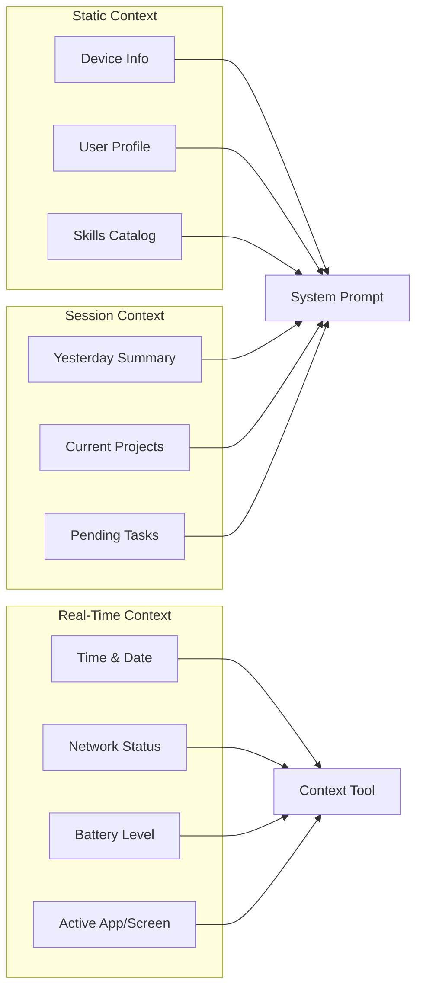

# Neox Agent Context Awareness Design

## Problem

The agent doesn't know enough about its environment to act smartly. It doesn't know:
- What device it's running on (iPhone model, screen size)
- What apps are installed
- Current time, location, timezone
- What the user is doing (foreground/background)
- Network status (WiFi, cellular, offline)
- Battery level
- Which projects exist and their status

## Design: Context Injection Layers



### Layer 1: Static Context (injected into system prompt)

Loaded once at session start, rarely changes:

```markdown
## device
- Model: iPhone 12 mini
- OS: iOS 18.2
- Screen: 375x812pt
- Storage: 12GB free / 64GB total

## user
- Name: {from user-profile.md}
- Language: {detected}
- Timezone: Asia/Shanghai

## skills
- 15 skills available (list names)
```

**Implementation**: Extend `AgentCoordinator` to gather `UIDevice` info and inject into preamble.

### Layer 2: Session Context (injected at session start)

Changes daily:

```markdown
## yesterday
{daily summary}

## active projects
- timer-app (PR #3 pending)
- fitness-tracker (coding in progress)

## pending tasks
- Follow up on freelance inquiry
- Post to 小红书 about new app
```

**Implementation**: Read from `.neo/reports/daily/`, `.neo/memory/projects/`, and pending items from JSONL.

### Layer 3: Real-Time Context (available via tool)

Changes frequently, accessible on-demand:

| Signal | Source | Use Case |
|--------|--------|----------|
| Current time | `Date()` | Time-appropriate greetings, scheduling |
| Network type | `NWPathMonitor` | Skip web tasks if offline |
| Battery level | `UIDevice.current.batteryLevel` | Warn before heavy tasks |
| Foreground/background | `UIApplication.shared.applicationState` | Adjust notification behavior |
| Location (if permitted) | `CLLocationManager` | Local recommendations |

**Implementation**: Add a `get_context` tool that returns current device state.

## Smart Behaviors from Context

### Time-Aware
- Morning (6-10am) → Suggest morning planning
- Work hours (10am-6pm) → Focus on projects and tasks
- Evening (6-10pm) → Social media, content review
- Late night (10pm-6am) → Light tasks, reading, tomorrow's plan

### Network-Aware
- WiFi → Allow web browsing, downloads, media processing
- Cellular → Warn about data usage for heavy tasks
- Offline → File-only operations, local memory, drafting

### Project-Aware
- Know which projects exist and their current state
- Suggest next actions based on project status
- "Your timer app PR was merged yesterday — want to start the next feature?"

### Mood-Aware (inferred)
- Short messages → user is busy, be concise
- Detailed messages → user has time, go deep
- Repeated topics → user is stuck, offer alternative approaches
- No messages for a while → don't spam notifications

## Implementation Priority

1. **Device info in system prompt** — `UIDevice` basics (model, OS, screen)
2. **Time injection** — Current date/time in preamble
3. **Yesterday context** — Daily summary (from memory design)
4. **get_context tool** — On-demand battery, network, time
5. **Project status** — List active projects with current state
6. **Smart suggestions** — Time-based skill recommendations

## Tool Definition

```json
{
  "name": "get_context",
  "description": "Get current device context — time, battery, network, location",
  "parameters": {
    "type": "object",
    "properties": {
      "include": {
        "type": "array",
        "items": { "type": "string", "enum": ["time", "battery", "network", "location", "projects"] },
        "description": "Which context signals to include"
      }
    }
  }
}
```

Response:
```json
{
  "time": "2026-07-15T14:30:00+0800",
  "dayOfWeek": "Tuesday",
  "timeOfDay": "afternoon",
  "battery": { "level": 0.72, "charging": false },
  "network": { "type": "wifi", "connected": true },
  "projects": [
    { "name": "timer-app", "status": "PR pending", "lastActivity": "2h ago" }
  ]
}
```
