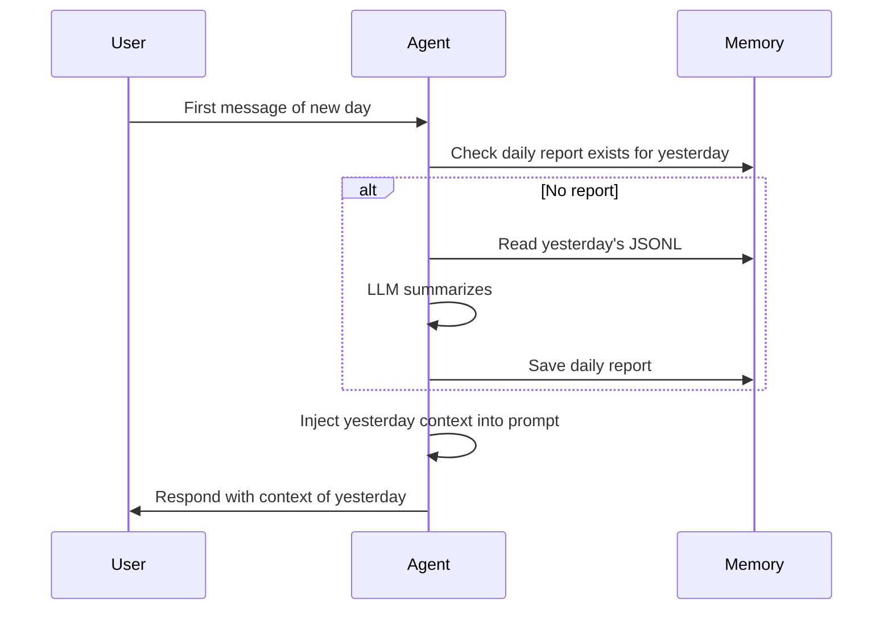

# Neox Auto-Reports Design

## Overview

Automatic report generation at daily, weekly, and monthly intervals. Reports are generated from session JSONL logs and stored in `.neo/reports/`.

## Report Types

### Daily Report
- **Trigger**: First message of a new day (or morning-planning skill)
- **Source**: Previous day's `.neo/reports/sessions/YYYY-MM-DD.jsonl`
- **Output**: `.neo/reports/daily/YYYY-MM-DD.md`
- **Content**:
  - Tasks worked on
  - Projects created/updated
  - Key decisions made
  - Social media activity
  - Open items / follow-ups

### Weekly Report
- **Trigger**: Monday morning (or first message of new week)
- **Source**: Last 7 daily reports
- **Output**: `.neo/reports/weekly/YYYY-WXX.md`
- **Content**:
  - Top accomplishments
  - Projects progress
  - Patterns observed (productive days, common topics)
  - Goals for next week

### Monthly Report
- **Trigger**: 1st of month (or first message of new month)
- **Source**: Weekly reports from the month
- **Output**: `.neo/reports/monthly/YYYY-MM.md`
- **Content**:
  - Month highlights
  - Revenue/growth metrics (if tracked)
  - Skill usage stats
  - Goals review

## Generation Flow



## Implementation

### Step 1: Daily Summary Generator

In `AgentCoordinator` or a new `ReportGenerator` class:

```
func generateDailySummary(for date: Date) -> String?
  1. Find JSONL file for date
  2. Read all entries
  3. Filter: user + assistant messages only
  4. Send to LLM: "Summarize this conversation day"
  5. Write to .neo/reports/daily/YYYY-MM-DD.md
  6. Return summary text
```

### Step 2: Yesterday Context Injection

In `AgentCoordinator.createChatViewModel()`:

```
let yesterday = Calendar.current.date(byAdding: .day, value: -1, to: Date())
if let summary = loadDailySummary(for: yesterday) {
    preamble += "\n## Yesterday's Context\n\(summary)"
}
```

### Step 3: Weekly/Monthly Aggregation

Same pattern but aggregating from daily/weekly reports.

## Cost Consideration

Each auto-summary costs one LLM call. For a typical day with 50 JSONL entries (~5KB), the summarization call is cheap (~$0.01). Weekly/monthly are even cheaper (summarizing summaries).

## No Code in Agent Instructions

Reports should be **system-level** — generated by the app, not by the agent. The agent should have access to read them but shouldn't need to remember to generate them.
