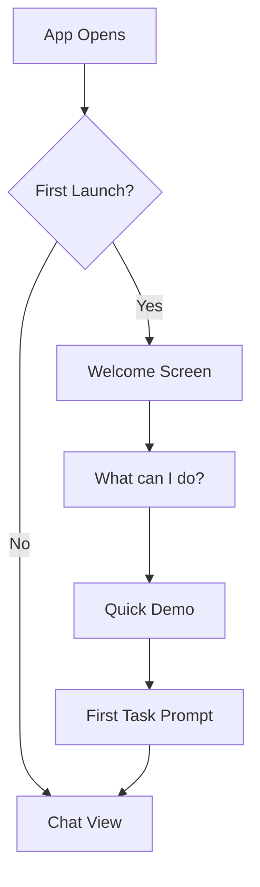

# Neox Bootstrap Flow Design

## Current State

Neox currently has a developer-first experience: no onboarding, no tutorial, no welcome screen. The app assumes the user understands relay servers, GitHub integration, and agent concepts.

## Problem

New users open the app and see a blank chat. They don't know:
- What Neox can do
- How to start
- What skills are available
- How to create their first app

## Design: Guided First Launch

### Phase 1: Welcome & Orientation



**Welcome Screen** (shown once on first launch):
- "Hi, I'm Neo" — brief identity
- 3 cards showing top capabilities:
  1. "Build an app" — tap to start guided app creation
  2. "Browse the web" — tap to demo web_agent
  3. "Plan my day" — tap to start morning planning
- "Or just chat" — dismiss to free chat

**Implementation**: `UserDefaults.hasCompletedOnboarding` flag. Show a SwiftUI sheet on first `ContentView` appear.

### Phase 2: Smart First Message

When the user first enters chat, the agent should proactively introduce itself:

```
Welcome! I'm Neo — your AI companion that lives on your phone.

Here's what I can help with:
• 🏗️ Build apps — describe an idea, I'll create it
• 🌐 Browse the web — I can search, read, and interact with websites
• 📱 Manage social media — post, monitor, reply automatically
• 📋 Plan your day — morning planning with priorities
• 💬 Chat about anything — I'm a general assistant

What would you like to try first?
```

**Implementation**: In `main.agent.md`, add a first-message instruction that triggers when chat history is empty.

### Phase 3: Guided App Creation

The most impactful demo is "build an app from your phone." The agent should walk through the 5-step create_task workflow conversationally:

1. "What kind of app do you want?" → user describes
2. "Here's what I'll build..." → agent confirms MVP spec
3. "Creating your project..." → `create_task` runs
4. "Your app is being built..." → agent monitors via push notifications
5. "Your app is ready!" → BullX installs to phone

### Phase 4: Skill Discovery

After the first experience, help users discover more capabilities:
- "Try asking me to search the web for something"
- "I can create presentations too — want to try?"
- Periodic skill suggestions based on time of day (morning → planning, evening → social media)

## Configuration Bootstrap

### Minimal Config (works out of box):
- APNs: auto-registered on first launch
- Relay: defaults to `relay.ai.qili2.com`
- Model: defaults to `gpt-4.1`
- Skills: embedded in workspace

### Optional Config (Settings):
- Relay endpoint (cloud vs local)
- Model selection
- Notification preferences
- BullX pairing (for local builds)

## Memory Bootstrap

### First Session Memory
After the first conversation, save key user info:
- Name and preferences mentioned
- Language preference (auto-detect from conversation)
- Interest areas (topics discussed)

### Daily Memory
- Morning planning creates daily context
- Conversation summaries stored in `.neo/reports/sessions/`
- Key decisions and outcomes tracked

## Implementation Priority

1. **Smart first message** in `main.agent.md` (no code change needed)
2. **Welcome sheet** in ContentView (SwiftUI, minimal)
3. **Skill suggestions** in agent instructions (prompt engineering)
4. **Memory bootstrap** (save user preferences after first conversation)
