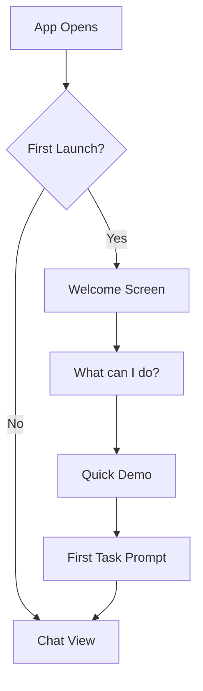
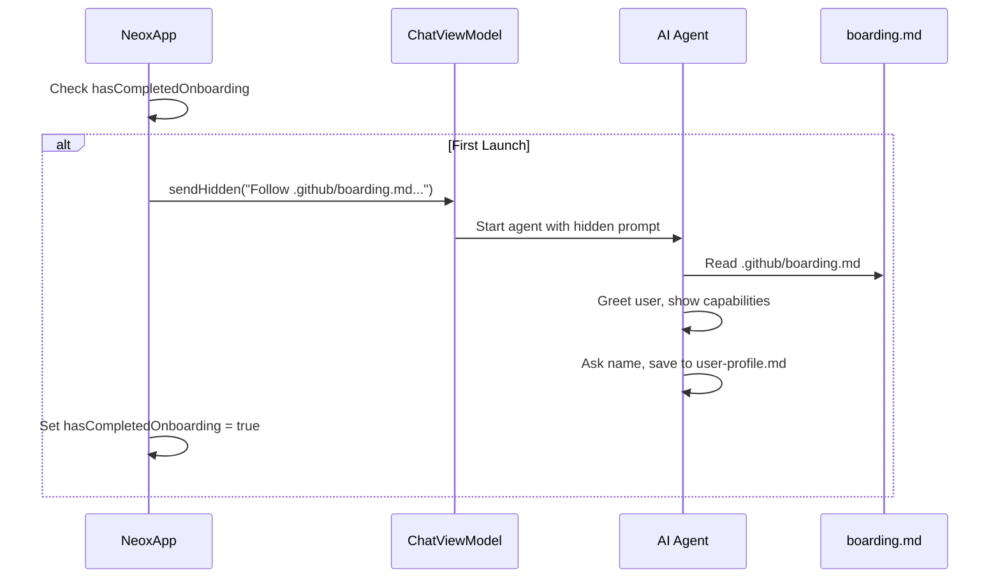

# Neox Bootstrap Flow Design

## Current State

Neox currently has a developer-first experience: no onboarding, no tutorial, no welcome screen. The app assumes the user understands relay servers, GitHub integration, and agent concepts.

## Problem

New users open the app and see a blank chat. They don't know:
- What Neox can do
- How to start
- What skills are available
- How to create their first app

## Design: Guided First Launch

### Phase 1: Welcome & Orientation

## Implementation (Shipped)

### Approach: Hidden Message + boarding.md

Instead of a SwiftUI welcome screen, onboarding is entirely agent-driven:

1. On first launch, app sends a **hidden user message** (not visible in chat)
2. The message tells the agent to follow `.github/boarding.md`
3. `boarding.md` contains onboarding instructions (greet, show capabilities, ask name, save to profile)
4. `UserDefaults.hasCompletedOnboarding` flag ensures it only runs once

**Files:**
- `workspace/.github/boarding.md` — onboarding instructions for the agent
- `CopilotChat/ChatViewModel.swift` — `sendHidden()` method
- `Neox/App/NeoxApp.swift` — first-launch check + hidden message trigger

### Phase 3: Guided App Creation

The most impactful demo is "build an app from your phone." The agent should walk through the 5-step create_task workflow conversationally:

1. "What kind of app do you want?" → user describes
2. "Here's what I'll build..." → agent confirms MVP spec
3. "Creating your project..." → `create_task` runs
4. "Your app is being built..." → agent monitors via push notifications
5. "Your app is ready!" → BullX installs to phone

### Phase 4: Skill Discovery

After the first experience, help users discover more capabilities:
- "Try asking me to search the web for something"
- "I can create presentations too — want to try?"
- Periodic skill suggestions based on time of day (morning → planning, evening → social media)

## Configuration Bootstrap

### Minimal Config (works out of box):
- APNs: auto-registered on first launch
- Relay: defaults to `relay.ai.qili2.com`
- Model: defaults to `gpt-4.1`
- Skills: embedded in workspace

### Optional Config (Settings):
- Relay endpoint (cloud vs local)
- Model selection
- Notification preferences
- BullX pairing (for local builds)

## Memory Bootstrap

### First Session Memory
After the first conversation, save key user info:
- Name and preferences mentioned
- Language preference (auto-detect from conversation)
- Interest areas (topics discussed)

### Daily Memory
- Morning planning creates daily context
- Conversation summaries stored in `.neo/reports/sessions/`
- Key decisions and outcomes tracked

## Implementation Priority

1. ~~**Hidden message + boarding.md**~~ ✅ Shipped
2. **Skill suggestions** in agent instructions (prompt engineering)
3. **Memory bootstrap** (save user preferences after first conversation)
