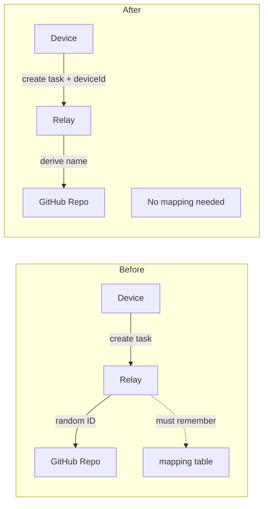
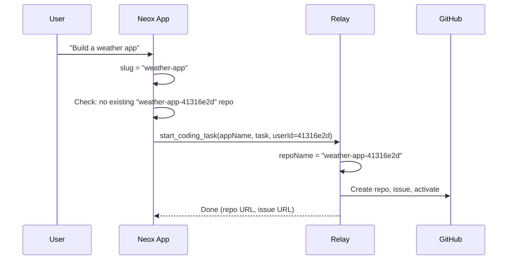

# Design: Deterministic Repo Names via Device ID

## Problem

When creating a coding task, repo names are generated as `${slug}-${randomId}` (e.g., `weather-app-a3f1b2`). This makes repos unrecoverable after relay restart — you can't derive which repos belong to which device without a mapping table.

## Solution

Replace the random suffix with the neox device ID (`neoxUserId`, 8-char UUID prefix stored in UserDefaults).

```
Before: weather-app-a3f1b2    (random 6-char hex)
After:  weather-app-41316e2d  (device ID, stable)
```

## How It Helps Statelessness



Given `(appName, deviceId)`, anyone can deterministically compute the repo name:
- `slugify(appName)` + `-` + `deviceId` → `weather-app-41316e2d`

This means:
- **Relay needs no project registry** — repo names are a convention, not stored state
- **buildQueue can move to GitHub labels** — query repos by naming pattern `*-{deviceId}`
- **On restart**, relay derives all repos for a device: `GET /orgs/{org}/repos?q={deviceId}`

## Uniqueness Constraint

Same device + same app name = same repo name → second create would fail (GitHub 422).

**Solution**: Neox enforces unique project names in the UI before calling `start_coding_task`. This is desirable — prevents accidental duplicates.

## Changes

### 1. Relay: `copilot-relay/lib/project-tasks.js`

`handleCreateTask()` — replace `shortId()` with `userId` from args:

```javascript
// Before
const slug = slugify(appName);
const id = shortId();
const repoName = `${slug}-${id}`;

// After
const userId = args.userId || ws?._userId || 'default';
const slug = slugify(appName);
const repoName = `${slug}-${userId}`;
```

### 2. iOS: `CopilotSDK/Sources/ProjectTaskHandler.swift`

`createProject()` — accept and use `userId` parameter:

```swift
// Before
let id = Self.shortId()
let repoName = "\(slug)-\(id)"

// After  
let repoName = "\(slug)-\(userId)"
```

### 3. iOS: `CopilotChat/Sources/ViewModels/ChatViewModel.swift`

Pass `neoxUserId` through to `ProjectTaskHandler.createProject()`.

### 4. iOS: Enforce unique project names

Before calling `start_coding_task`, check that no existing project in the current device's repos has the same slug. Show an error if duplicate detected.

## Flow



## Files Modified

| File | Change |
|------|--------|
| `copilot-relay/lib/project-tasks.js` | `handleCreateTask`: use `args.userId` instead of `shortId()` |
| `copilot-relay/lib/github-api.js` | Remove `shortId()` export (unused after change) |
| `copilot-ios/CopilotSDK/Sources/ProjectTaskHandler.swift` | `createProject(userId:)` parameter, remove `shortId()` |
| `copilot-ios/CopilotChat/Sources/ViewModels/ChatViewModel.swift` | Pass `neoxUserId` to handler |
| `neox/Neox/Agent/AgentCoordinator.swift` | Expose `neoxUserId` for tool handler |
