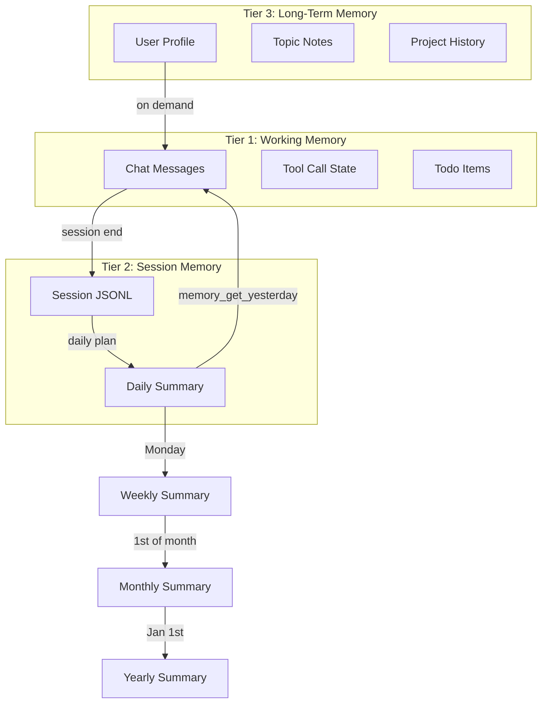
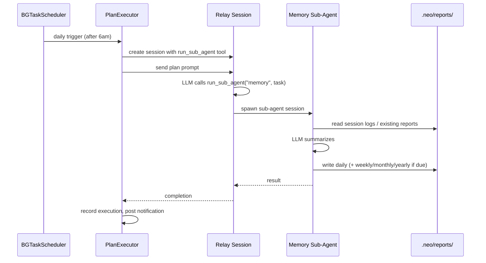

# Neox Memory & Reports Design

## Overview

Neox uses a file-based memory system with three tiers: working memory (in-session), session memory (auto-logged), and long-term memory (structured files). Reports are auto-generated via a single scheduled Plan that delegates to the memory sub-agent.

## Memory Architecture



### Tier 1: Working Memory (in-memory)

Lives in ChatViewModel. Current chat messages, active tool calls, todo state. Already implemented.

### Tier 2: Session Memory (auto-generated)

- **Session JSONL** — auto-logged, one file per day
- **Daily Summary** — generated by Plan → memory sub-agent
- **Weekly/Monthly/Yearly** — aggregated from lower-level reports

### Tier 3: Long-Term Memory (structured files)

- **User Profile** — name, preferences, timezone, language
- **Topic Notes** — one file per topic (fitness, work, etc.)
- **Project History** — one file per project with key decisions

## File Layout

```
.neo/
├── memory.md              # general notes
├── memory/
│   ├── user-profile.md    # name, prefs, timezone, language
│   ├── topics/            # one file per topic
│   └── projects/          # one file per project
├── reports/
│   ├── sessions/          # JSONL logs + session .md reports
│   ├── subagents/         # sub-agent task reports (async mode)
│   ├── daily/             # YYYY-MM-DD.md
│   ├── weekly/            # YYYY-WXX.md
│   ├── monthly/           # YYYY-MM.md
│   └── yearly/            # YYYY.md
└── knowledge/             # reference material
```

## Auto-Report Generation

Reports are generated by a single **"Memory Reports" Plan** that runs daily via PlanExecutor (BGTask). The plan uses `run_sub_agent` to invoke the memory agent, which checks the date and generates the appropriate reports.



### Report Cadences

| Report | Trigger | Source | Output |
|--------|---------|--------|--------|
| Daily | Every day | `sessions/YYYY-MM-DD.jsonl` | `daily/YYYY-MM-DD.md` |
| Weekly | Monday | Last 7 daily reports | `weekly/YYYY-WXX.md` |
| Monthly | 1st of month | Weekly reports | `monthly/YYYY-MM.md` |
| Yearly | January 1st | Monthly reports | `yearly/YYYY.md` |

### Plan Definition

Seeded automatically on first launch (id: `memory-reports`):
- Schedule: daily interval (86400s)
- Model: gpt-4.1-mini
- Tool: `run_sub_agent` (invokes the memory agent)
- The prompt instructs the LLM to check the current day and generate all applicable reports

### Cost

Each daily run costs one LLM call for the plan + one for the sub-agent. ~$0.02/day using gpt-4.1-mini. Weekly/monthly add minimal extra cost.

## Yesterday Context

The agent retrieves yesterday's context on demand via `memory_get_yesterday`. No auto-injection — the agent calls the tool when it needs prior context.

## Memory Tools

| Tool | Description | Status |
|------|-------------|--------|
| `memory_read` | Read file or section | ✅ |
| `memory_append` | Append timestamped entry | ✅ |
| `memory_write_section` | Write/replace markdown section | ✅ |
| `memory_log_session` | Log session report | ✅ |
| `memory_list` | List memory files | ✅ |
| `memory_search` | Search across memory files by keyword | ✅ |
| `memory_delete` | Delete file or section | ✅ |
| `memory_get_yesterday` | Get yesterday's daily summary or session log | ✅ |
| `run_sub_agent` | Delegate to memory agent for reports | ✅ |

## Memory Sub-Agent

Defined at `.github/agents/memory.agent.md`:

```yaml
---
name: Memory Reporter
description: Generates daily, weekly, and monthly memory reports
model: gpt-4.1-mini
tools:
  - memory_read
  - memory_append
  - memory_write_section
  - memory_list
  - memory_search
  - memory_get_yesterday
---
```

Handles all report cadences: daily, weekly, monthly, yearly.

## Implementation Status

1. ~~Yesterday context~~ — `memory_get_yesterday` tool (on-demand)
2. ~~Structured directories~~ — `ensureNeoDirectories()` creates full layout
3. ~~Memory search & delete~~ — `memory_search`, `memory_delete` tools
4. ~~Auto-reports~~ — single Plan ("Memory Reports") runs daily via PlanExecutor + memory sub-agent
5. **User profile** — create and maintain `user-profile.md`
