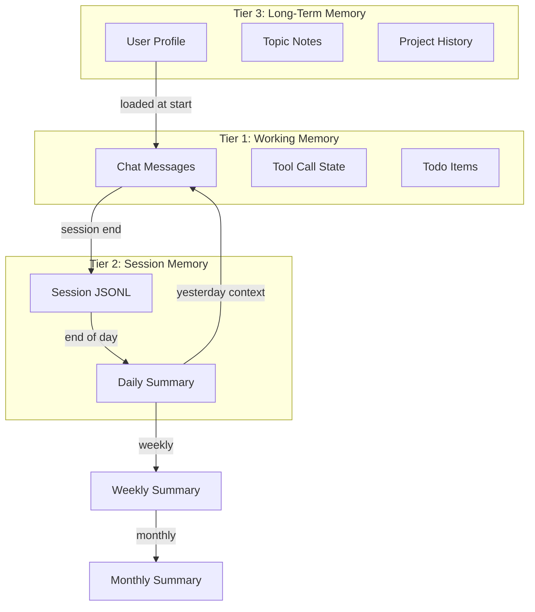
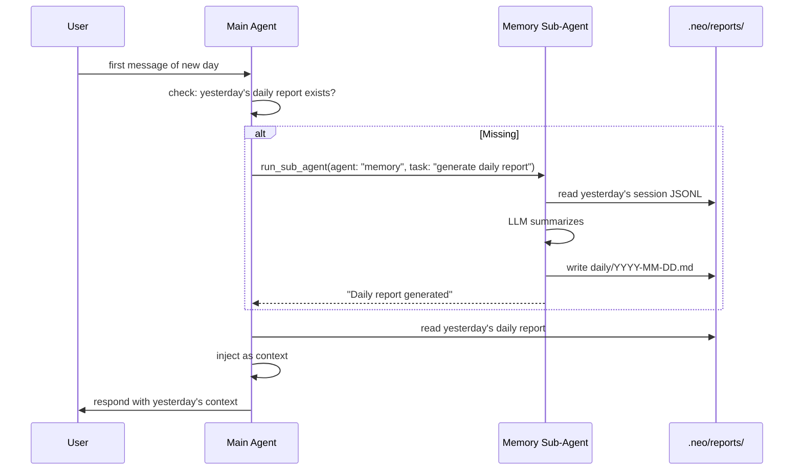

# Neox Memory & Reports Design

## Overview

Neox uses a file-based memory system with three tiers: working memory (in-session), session memory (auto-logged), and long-term memory (structured files). Reports are auto-generated summaries that roll up from session logs to daily, weekly, and monthly cadences.

## Memory Architecture



### Tier 1: Working Memory (in-memory)

Lives in ChatViewModel. Current chat messages, active tool calls, todo state. Already implemented.

### Tier 2: Session Memory (auto-generated)

- **Session JSONL** — auto-logged, one file per day
- **Daily Summary** — auto-generated at end of day or next morning
- **Weekly/Monthly** — aggregate from daily summaries

### Tier 3: Long-Term Memory (structured files)

- **User Profile** — name, preferences, timezone, language
- **Topic Notes** — one file per topic (fitness, work, etc.)
- **Project History** — one file per project with key decisions

## File Layout

```
.neo/
├── memory.md              # general notes (existing)
├── memory/
│   ├── user-profile.md    # name, prefs, timezone, language
│   ├── topics/            # one file per topic
│   └── projects/          # one file per project
├── reports/
│   ├── sessions/          # JSONL logs + session .md reports
│   ├── subagents/         # sub-agent task reports (async mode)
│   ├── daily/             # YYYY-MM-DD.md
│   ├── weekly/            # YYYY-WXX.md
│   └── monthly/           # YYYY-MM.md
└── knowledge/             # reference material
```

## Auto-Report Generation

Reports are generated by the **memory sub-agent** via `run_sub_agent`, triggered by the main agent on date boundaries.



### Daily Report

- **Trigger**: First message of a new day
- **Source**: Previous day's `.neo/reports/sessions/YYYY-MM-DD.jsonl`
- **Output**: `.neo/reports/daily/YYYY-MM-DD.md`
- **Content**: tasks worked on, projects created/updated, key decisions, open items

### Weekly Report

- **Trigger**: Monday morning (first message of new week)
- **Source**: Last 7 daily reports
- **Output**: `.neo/reports/weekly/YYYY-WXX.md`
- **Content**: top accomplishments, project progress, patterns, goals for next week

### Monthly Report

- **Trigger**: 1st of month
- **Source**: Weekly reports from the month
- **Output**: `.neo/reports/monthly/YYYY-MM.md`
- **Content**: month highlights, skill usage stats, goals review

### Cost

Each auto-summary costs one LLM call. A typical day (~5KB JSONL) costs ~$0.01 using gpt-4.1-mini. Weekly/monthly are cheaper (summarizing summaries).

## Yesterday Context

The key missing piece: the agent should know what happened yesterday without the user re-explaining.

On session start, `AgentCoordinator` checks for yesterday's daily summary. If it exists, it's injected into the system prompt. If missing, the memory sub-agent generates one first.

## Memory Tools

| Tool | Description | Status |
|------|-------------|--------|
| `memory_read` | Read file or section | implemented |
| `memory_append` | Append timestamped entry | implemented |
| `memory_write_section` | Write/replace markdown section | implemented |
| `memory_log_session` | Log session report | implemented |
| `memory_list` | List memory files | implemented |
| `run_sub_agent` | Delegate to memory agent for reports | implemented |

## Memory Sub-Agent

Defined at `.github/agents/memory.agent.md`:

```yaml
---
name: Memory Reporter
model: gpt-4.1-mini
tools:
  - memory_read
  - memory_append
  - memory_write_section
  - memory_list
---
```

The memory agent handles:
- Daily/weekly/monthly report generation
- Memory organization and cleanup
- Topic note extraction from conversations

## Implementation Priority

1. **Yesterday context injection** — read daily summary, inject into system prompt
2. **Daily auto-summary** — memory sub-agent generates on first message of new day
3. **Structured memory directories** — create `memory/topics/`, `memory/projects/`
4. **User profile** — create and maintain `user-profile.md`
5. **Weekly/monthly summaries** — aggregate from daily summaries
