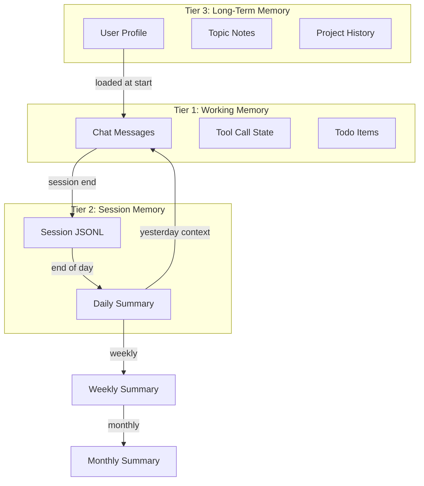

# Neox Memory System Design

## Current State

Neox has a lightweight, file-based memory system:
- **Long-term**: `.neo/memory.md` (single markdown file, read/written by tools)
- **Short-term**: In-memory `ChatViewModel` (lost on app close)
- **Chat history**: `.neo/reports/sessions/*.jsonl` (auto-restores last 50 entries)
- **Session reports**: `.neo/reports/sessions/*.md` (manual, via `memory_log_session`)
- **Daily/weekly/monthly reports**: Empty directories, not implemented

## Problem

1. **No structured memory** — single `memory.md` becomes messy over time
2. **No yesterday context** — agent doesn't know what happened yesterday unless it reads JSONL
3. **No auto-summaries** — user must ask agent to generate session reports
4. **No temporal recall** — "what did I work on last week?" requires manual search
5. **Reports directories exist but are empty** — daily/weekly/monthly never generated

## Design: Three-Tier Memory



### Tier 1: Working Memory (in-memory)
- Current chat messages
- Active tool calls and results
- Todo list state
- **Already implemented** — lives in ChatViewModel

### Tier 2: Session Memory (auto-generated)
- **Session JSONL** — already works (auto-logs all messages)
- **Daily Summary** — NEW: auto-generated at end of day
- **Format**: `.neo/reports/daily/YYYY-MM-DD.md`

### Tier 3: Long-Term Memory (structured)
- **User Profile** — `.neo/memory/user-profile.md`: name, preferences, language, timezone
- **Topic Notes** — `.neo/memory/topics/`: one file per topic (e.g., `fitness.md`, `work.md`)
- **Project History** — `.neo/memory/projects/`: one file per project with key decisions

## Auto-Summary Generation

### Daily Summary (end of day or next morning)
Trigger: When morning-planning skill runs, or when first message of a new day arrives.

```markdown
# Daily Summary: 2026-07-15

## What I Worked On
- Built a timer app (created repo timer-app-a1b2c3)
- Researched fitness tracking APIs
- Posted to 小红书 (engagement: 15 likes)

## Key Decisions
- Chose React Native over Flutter for timer app
- Decided to focus on one social media platform

## Open Items
- Timer app PR #3 pending review
- Need to follow up on freelance inquiry

## Mood/Context
- User seemed focused, productive day
```

**Implementation**: 
1. On first message of new day, check if yesterday's summary exists
2. If not, read yesterday's JSONL, ask the LLM to summarize
3. Save to `.neo/reports/daily/YYYY-MM-DD.md`
4. Include summary in today's system prompt as context

### Weekly Summary (auto-generated Sunday night or Monday morning)
- Aggregate daily summaries
- Highlight trends, achievements, patterns
- Save to `.neo/reports/weekly/YYYY-WXX.md`

### Monthly Summary (auto-generated 1st of month)
- Aggregate weekly summaries
- Save to `.neo/reports/monthly/YYYY-MM.md`

## Yesterday Context

The key missing piece: the agent should know what happened yesterday.

**Implementation**:
1. On session start, `AgentCoordinator` checks for yesterday's daily summary
2. If it exists, inject into system prompt:
   ```
   ## Yesterday's Context
   {contents of yesterday's daily summary}
   ```
3. If no summary exists, read last N entries from yesterday's JSONL and generate one

**Code location**: Add to `AgentCoordinator.createChatViewModel()` where preamble is assembled.

## Structured Memory Layout

```
.neo/
├── memory.md              # legacy (migrate to structured)
├── memory/
│   ├── user-profile.md    # name, prefs, timezone, language
│   ├── topics/            # one file per topic
│   │   ├── fitness.md
│   │   ├── work.md
│   │   └── social-media.md
│   └── projects/          # one file per project
│       ├── timer-app.md
│       └── fitness-tracker.md
└── reports/
    ├── sessions/          # existing JSONL + session reports
    ├── daily/             # auto-generated daily summaries
    ├── weekly/            # auto-generated weekly summaries
    └── monthly/           # auto-generated monthly summaries
```

## Memory Tools Updates

Update `MemoryToolProvider` with:

| Tool | Description |
|------|-------------|
| `memory_read` | Read file or section (existing) |
| `memory_append` | Append entry (existing) |
| `memory_write_section` | Write/replace section (existing) |
| `memory_list` | List files (existing) |
| `memory_log_session` | Log session report (existing) |
| `memory_get_yesterday` | NEW: Get yesterday's summary |
| `memory_get_profile` | NEW: Get user profile |
| `memory_update_profile` | NEW: Update user profile field |

## Agent Instructions Update

Add to `main.agent.md`:

```markdown
## memory management
- At session start, read `.neo/memory/user-profile.md` for user context
- Before responding to a topic, check `.neo/memory/topics/` for relevant notes
- After significant decisions, update relevant topic or project notes
- When user shares personal info (name, preferences), update user-profile.md
- Don't duplicate info across files — keep each file focused
```

## Implementation Priority

1. **Yesterday context injection** — read last JSONL on new day, inject summary into prompt
2. **Structured memory directories** — create `memory/`, `memory/topics/`, `memory/projects/`
3. **User profile** — create and maintain `user-profile.md`
4. **Daily auto-summary** — generate on first message of new day
5. **Weekly/monthly summaries** — aggregate from daily summaries
6. **Memory tools update** — add new convenience tools
