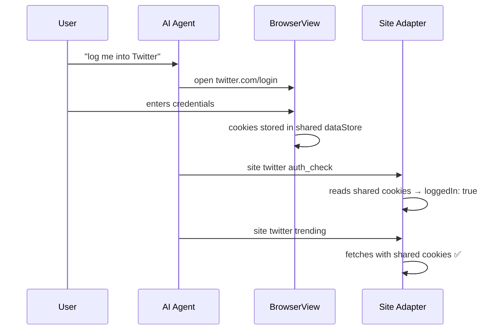
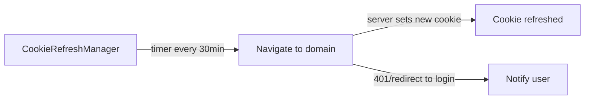

# Design: Shared Cookie Architecture for WebKit

## Problem

Three independent WKWebView instances exist in neox, each with isolated cookie storage:

```mermaid
graph TD
    subgraph Current — Isolated
        A[WebViewManager<br/>site adapters + web-agent] -->|own cookies| D1[DataStore 1]
        B[WeChatChannel<br/>WeChat Web] -->|own cookies| D2[DataStore 2]
        C[BrowserView<br/>user browsing] -->|own cookies| D3[DataStore 3]
    end
```

If a user logs into Twitter via BrowserView, the `site twitter` adapter can't use those cookies.

## Solution

Shared `WKProcessPool` + `WKWebsiteDataStore.default()` across all WebView instances.

```mermaid
graph TD
    subgraph Proposed — Shared
        E[SharedWebKitEnvironment]
        E -->|shared processPool + dataStore| A2[WebViewManager]
        E -->|shared processPool + dataStore| B2[WeChatChannel]
        E -->|shared processPool + dataStore| C2[BrowserView]
    end
    D[WKWebsiteDataStore.default<br/>on-disk persistence] --> E
```

## SharedWebKitEnvironment

Singleton that provides a shared `WKWebViewConfiguration`:

- **Shared `WKProcessPool`** — enables cookie sharing between WKWebView instances
- **`WKWebsiteDataStore.default()`** — persists cookies to disk across app launches
- Every WebView uses `SharedWebKitEnvironment.shared.createConfiguration()`

## Sign-In Flow



## Cookie Auto-Refresh

Approach: periodic background navigation to keep session cookies alive.

- Track domains with active sessions (based on `auth_check` results)
- Every N minutes, navigate a hidden WebView to each tracked domain
- The server refreshes the cookie expiry on page load
- If a cookie expires (auth_check fails), notify the user to re-login



## Implementation

### Files to Change

| File | Change |
|------|--------|
| `WebKitAgent/Sources/SharedWebKitEnvironment.swift` | **New** — singleton with shared processPool + dataStore |
| `WebKitAgent/Sources/WebViewManager.swift` | Use `SharedWebKitEnvironment.shared.createConfiguration()` |
| `WebKitAgent/Sources/WeChat/WeChatChannel.swift` | Use shared configuration |
| `Neox/Views/BrowserView.swift` | Use shared WebViewManager or shared config |

### Optional (Phase 2)

| File | Change |
|------|--------|
| `WebKitAgent/Sources/CookieRefreshManager.swift` | **New** — periodic cookie refresh |
| `WebKitAgent/Sources/WebAgentToolProvider.swift` | Track authenticated domains for refresh |

## Edge Cases

- **WeChat isolation**: WeChat cookies should still be clearable independently via domain filter (qq.com). Shared dataStore supports per-domain removal.
- **Conflicting logins**: Multiple accounts on same domain — not supported. Last login wins.
- **Privacy**: All cookies in one store means clearing one site doesn't affect others. Use domain-specific `removeData()`.
