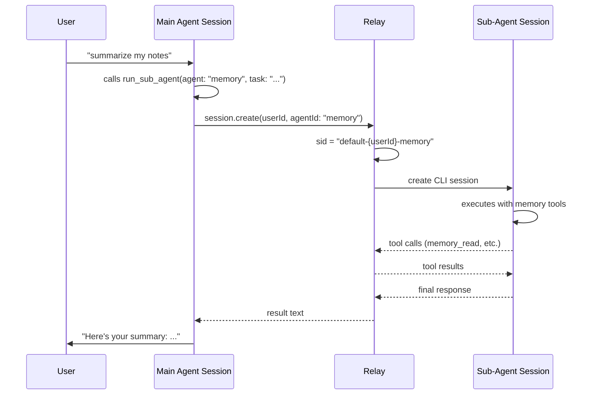
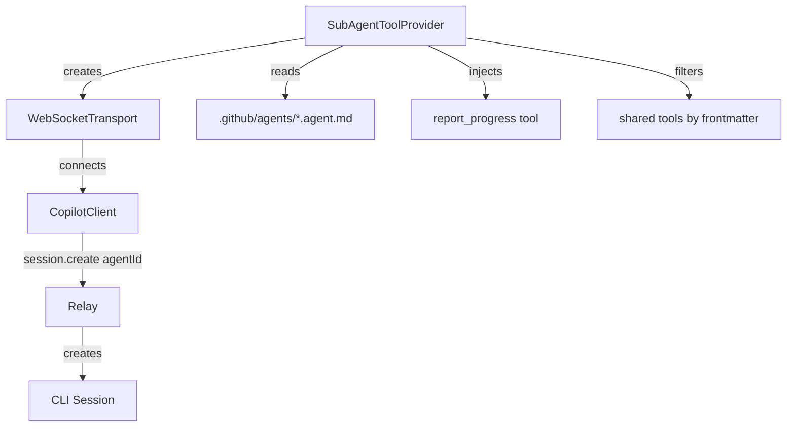

# Sub-Agent Design

Sub-agents are independent AI sessions spawned by the main agent to handle specialized tasks. Each sub-agent gets its own relay session, conversation context, and tool set.

## Architecture



## Session ID Format

| Mode | Session ID |
|------|-----------|
| Main session | `{appId}-{userId}` |
| Sub-agent | `{appId}-{userId}-{agentId}` |

Sub-agent sessions are deterministic — calling the same agent again resumes the existing session.

## Agent Definition

Agents are defined as `.github/agents/{name}.agent.md` files with optional YAML frontmatter:

```yaml
---
name: Memory Reporter
description: Summarizes and organizes memory notes
model: gpt-4.1-mini
tools:
  - memory_read
  - memory_append
  - memory_write_section
  - memory_list
skills:
  - daily-report
---

# Memory Reporter

You are a memory management sub-agent. Your job is to...
```

### Frontmatter Fields

| Field | Description | Default |
|-------|-------------|---------|
| `name` | Display name | filename |
| `description` | What this agent does | — |
| `model` | LLM model to use | gpt-4.1-mini |
| `tools` | Allowed tool names (whitelist) | all shared tools |
| `skills` | Skill directories to load | — |

## Execution Modes

### Sync (default)

Blocks the main agent's turn until the sub-agent completes. Returns the result directly.

```
run_sub_agent(agent: "memory", task: "summarize today's notes")
→ "Here's your summary: ..."
```

### Async

Returns immediately with a task ID. The sub-agent runs in the background and writes progress/results to `.neo/reports/subagents/{taskId}.md`.

```
run_sub_agent(agent: "memory", task: "...", async: true)
→ "Sub-agent 'memory' started. Task ID: memory-1712451200"
```

The report file format:

```markdown
# Sub-agent: memory

Task: summarize today's notes
Started: 2026-04-07T00:00:00Z
Status: completed

## Progress

- [2026-04-07T00:00:05Z] Reading memory files...
- [2026-04-07T00:00:10Z] Found 3 files, summarizing...

## Result

Here's your summary: ...

Completed: 2026-04-07T00:00:15Z
Status: completed
```

## Tools

### run_sub_agent (main agent tool)

| Param | Type | Required | Description |
|-------|------|----------|-------------|
| agent | string | yes | Agent name (matches filename) |
| task | string | yes | Prompt to send |
| model | string | no | Model override |
| async | boolean | no | Background execution |

### report_progress (injected into sub-agents)

| Param | Type | Required | Description |
|-------|------|----------|-------------|
| status | string | yes | Progress description |

In async mode, progress entries are appended to the report file. The `onProgress` callback on `SubAgentToolProvider` is always called.

## Implementation

### Components



- **SubAgentToolProvider** (CopilotSDK): Provides `run_sub_agent` tool. Creates new WS connections per sub-agent.
- **SessionConfig.agentId** (CopilotSDK): New field, sent in `session.create` params.
- **session-pool.js** (relay): Uses `agentId` to create separate session IDs.
- **AgentCoordinator** (Neox): Registers the provider with relay host/port and shared tools.

### Tool Isolation

Sub-agents receive:
- Shared tools filtered by frontmatter `tools` list (or all if unspecified)
- `report_progress` tool (always injected)
- NO `run_sub_agent` tool (prevents recursive spawning)

### Session Lifecycle

1. Sub-agent creates new WebSocket connection to relay
2. Sends `session.create` with `agentId` → relay creates `{appId}-{userId}-{agentId}` session
3. Sends task via `sendAndWait` (sync) or fire-and-forget Task (async)
4. On completion, disconnects the WebSocket
5. Session goes on-hold on relay — resumable if same agent is called again
