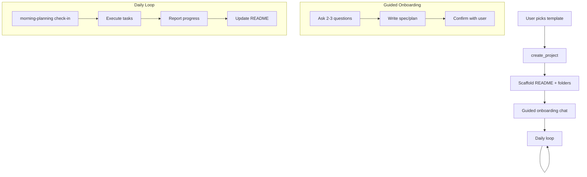
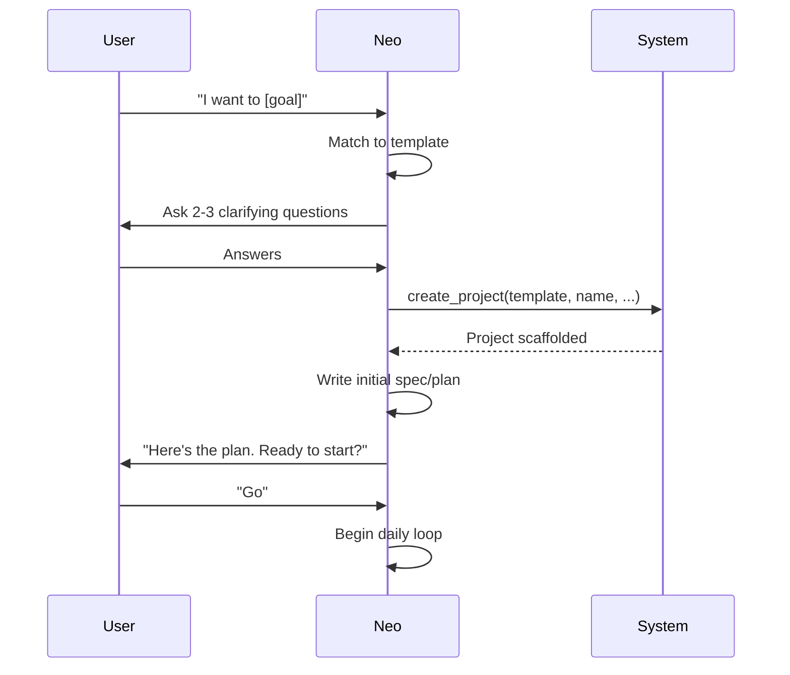

# Template Project Workflows

Each Neox template has a workflow designed around 5 principles:
1. Easy start for any user
2. Maximum autonomy with Neox's capabilities
3. Clear human-must list (what needs the user, when to remind)
4. Daily assistance patterns
5. Tutorial starter project

## Architecture

---

## Template Workflows

### 1. app / expo-app / game

**Easy Start**: "I want to make a todo app" → Neo asks 3 questions (what, who, special features) → creates project → writes spec → sends to coding agent. User waits for push notifications.

**Autonomy**: Neo handles project creation, spec writing, coding agent delegation, build, install. After first build, Neo can iterate: read user feedback → create new issue → coding agent fixes → rebuild.

**Human-Must List**:
| When | What | Reminder |
|------|------|----------|
| Step 1 | Describe the app idea | Onboarding |
| Step 4 | Confirm spec before coding | Before start_coding_task |
| Post-build | Test on phone, report bugs | After install notification |
| App Store | Apple ID login, review screenshots | When submitting |

**Daily Assistance**: Check if coding agent has PRs/issues open. Summarize progress. Ask "want to add a feature or fix something?"

**Tutorial**: "Make a simple counter app" → 1 screen, 1 button, 1 number. Teaches the full cycle: idea → spec → coding agent → build → install.

---

### 2. social-media

**Easy Start**: "Help me manage my 小红书" → Neo asks: which platforms? what topic/niche? how often to post? → creates project → sets up content calendar.

**Autonomy**: Neo can autonomously:
- Draft posts based on content calendar
- Navigate to platform via web-agent, fill form, upload media, publish
- Check engagement metrics (views, likes, comments) on schedule
- Reply to comments
- Analyze which posts performed well
- Adjust future content strategy

**Human-Must List**:
| When | What | Reminder |
|------|------|----------|
| Setup | Log in to each platform in web-agent | First session |
| Weekly | Review and approve weekly content plan | Monday morning |
| Per post | Approve post content before publishing (optional — can be turned off) | Before each post |
| Monthly | Review strategy report | End of month |

**Daily Assistance**: Morning: "3 posts scheduled today, 12 new comments to review." Auto-reply to comments. Evening: "Today's post got 230 views, 15 likes."

**Tutorial**: "Post one 小红书 article about your favorite coffee shop" → write text → add stock photo → publish → check metrics next day.

---

### 3. vlog / movie-maker

**Easy Start**: "I want to make a weekly vlog" → Neo asks: what topic? where to publish? any footage yet? → creates project → sets up production pipeline.

**Autonomy**: Neo can:
- Write scripts and storyboards
- Find free BGM via free-bgm skill
- Generate video via Remotion (if template available) or guide user to shoot
- Add captions, transitions
- Publish to YouTube/TikTok/小红书 via social-media-auto

**Human-Must List**:
| When | What | Reminder |
|------|------|----------|
| Setup | Describe video style/topic | Onboarding |
| Per video | Shoot raw footage (if not AI-generated) | When script is ready |
| Per video | Approve final cut before publishing | After edit complete |
| Per video | Record voiceover (if needed) | After script finalized |

**Daily Assistance**: Track production pipeline: script → shoot → edit → publish. "Your script for Episode 3 is ready. Time to shoot!"

**Tutorial**: "Make a 30-second intro video for your channel" → write 3-sentence script → find BGM → create simple title card → publish.

---

### 4. book-author

**Easy Start**: "I want to write a book about productivity" → Neo asks: fiction or non-fiction? target audience? how many chapters? → creates project → generates chapter outline.

**Autonomy**: Neo can:
- Research topics via web-search
- Generate chapter outlines and drafts
- Track word count progress
- Suggest edits and restructuring
- Export to Markdown/PDF
- Generate cover concepts (via web-search for inspiration)

**Human-Must List**:
| When | What | Reminder |
|------|------|----------|
| Setup | Book topic, audience, tone | Onboarding |
| Per chapter | Approve outline before drafting | Before writing each chapter |
| Weekly | Review and edit AI-drafted sections | Weekly writing session |
| Final | Full manuscript review | After all chapters drafted |
| Publish | Choose platform (Amazon KDP, etc.) | After manuscript finalized |

**Daily Assistance**: "Chapter 3 outline ready for review. You've written 12,400 of target 50,000 words (25%)." Track writing streaks.

**Tutorial**: "Write a 3-chapter mini-guide about morning routines" → outline → draft → review → export PDF.

---

### 5. stock-trading

**Easy Start**: "帮我跟踪股票" → Neo asks: 关注哪些股票/ETF？投资风格（长线/短线）？每天看几次？ → creates project → sets up watchlist.

**Autonomy**: Neo can:
- Fetch market data and news via web-search
- Monitor watchlist prices daily
- Generate research reports on specific stocks
- Track trades and calculate P&L
- Weekly performance review
- Alert on significant price movements

**Human-Must List**:
| When | What | Reminder |
|------|------|----------|
| Setup | Initial watchlist, investment style | Onboarding |
| Per trade | Confirm buy/sell decision | When signal triggers |
| Per trade | Execute trade on broker (Neo cannot trade) | After decision |
| Per trade | Record entry price and quantity | After execution |
| Weekly | Review portfolio performance | Weekend |

**Daily Assistance**: Morning: "市场概览：标普涨0.3%，你的关注列表中AAPL涨1.2%，TSLA跌0.8%。" Alert on big moves. Evening: "今日交易小结。"

**Tutorial**: "Track 3 stocks for one week" → add to watchlist → daily price check → end-of-week report.

---

### 6. bounty

**Easy Start**: "I want to earn money from bug bounties" → Neo asks: what skills (web, mobile, crypto)? which platforms? how much time per week? → creates project → finds first bounties.

**Autonomy**: Neo can:
- Search bounty platforms via web-search (GitHub, HackerOne, Gitcoin)
- Evaluate effort/reward for each opportunity
- Research the target codebase
- Track submissions and earnings
- Build a portfolio of completed work

**Human-Must List**:
| When | What | Reminder |
|------|------|----------|
| Setup | Skills, target platforms, time budget | Onboarding |
| Per bounty | Review finding before submission | Before submit |
| Per bounty | Write the actual exploit/fix/PR | When opportunity identified |
| Per bounty | Submit on platform (may need auth) | After work complete |
| Monthly | Review earnings and adjust strategy | End of month |

**Daily Assistance**: "Found 3 new bounties matching your skills. Top pick: $500 for a React component fix in open-source-project."

**Tutorial**: "Find and complete one good-first-issue bounty on GitHub" → search → evaluate → fork → fix → PR → track.

---

### 7. wechat-assistant

**Easy Start**: "帮我管理微信" → Neo asks: 自动回复哪些群？关注什么关键词？ → creates project → guides WeChat Web login.

**Autonomy**: Neo can:
- Monitor WeChat conversations for keywords
- Auto-reply with templates or AI-generated responses
- Extract and organize contact information
- Summarize missed conversations
- Forward important messages to user's attention

**Human-Must List**:
| When | What | Reminder |
|------|------|----------|
| Setup | Scan QR code to log in | First launch + every re-login |
| Setup | Define auto-reply rules | Onboarding |
| Daily | Review auto-reply log | Morning check-in |
| As needed | Handle complex conversations personally | When Neo can't auto-reply |

**Daily Assistance**: Morning: "昨晚5条新消息。2条自动回复。3条需要你回复。" Summarize unread.

**Tutorial**: "Set up auto-reply for one group chat" → login → define keywords → test with a message → verify auto-reply works.

---

### 8. e-commerce

**Easy Start**: "I want to sell handmade candles online" → Neo asks: which platform? how many products? do you have photos? → creates project → sets up product catalog.

**Autonomy**: Neo can:
- Generate product descriptions via AI
- Create listing content for platforms
- Track orders and inventory counts
- Draft marketing copy and social posts
- Analyze sales trends

**Human-Must List**:
| When | What | Reminder |
|------|------|----------|
| Setup | Product details, photos, pricing | Onboarding |
| Setup | Log in to selling platform | First session |
| Per listing | Approve listing before publishing | Before publish |
| Daily | Confirm orders shipped | When orders come in |
| Weekly | Restock decisions | When inventory low |

**Daily Assistance**: "2 new orders today. 你的蜡烛A库存还剩5个。This week's top seller: 薰衣草蜡烛 (8 sold)."

**Tutorial**: "List one product on 小红书 shop" → write description → upload photos → set price → publish.

---

### 9. library

**Easy Start**: "I want to build a knowledge base about AI" → Neo asks: what topics? what sources? how do you want to organize? → creates project → sets up topic folders.

**Autonomy**: Neo can:
- Search and save articles via web-search
- Summarize and annotate saved content
- Organize by topic tags
- Create cross-references between notes
- Generate periodic synthesis reports

**Human-Must List**:
| When | What | Reminder |
|------|------|----------|
| Setup | Topic areas, preferred sources | Onboarding |
| Weekly | Review inbox of new saves | Weekend |
| As needed | Mark importance/relevance | When reviewing |

**Daily Assistance**: "Found 3 new articles on AI safety. Added to inbox. Your library has 47 articles across 6 topics."

**Tutorial**: "Save and summarize 3 articles about a topic you're curious about" → search → save → annotate → review.

---

### 10. general

**Easy Start**: "I have a project idea" → Neo asks: what's the goal? what does success look like? → creates project with generic structure.

**Autonomy**: Inherits all base skills. Neo adapts workflow based on what the project turns out to need.

**Human-Must List**:
| When | What | Reminder |
|------|------|----------|
| Setup | Define goal clearly | Onboarding |
| Per milestone | Review progress | When milestone reached |

**Daily Assistance**: Check README for stalled tasks. Suggest next steps.

**Tutorial**: Not applicable — general is the fallback template.

---

## Cross-Template Patterns

### Onboarding Flow (all templates)

### Daily Check-in (all templates)

Every morning (via morning-planning skill):
1. Read yesterday's session memory
2. Check project README for stalled items
3. Present 3 priorities for today
4. Ask user to confirm or adjust

### Human-Must Reminders

Neo tracks a `human-must` checklist per project. When an item becomes relevant:
1. Send a concise reminder: "I need your [X] to continue with [Y]"
2. If user doesn't respond within reasonable time, move to other tasks
3. Re-remind next session

### Progress Tracking

All templates update README.md with:
- Current status (what phase we're in)
- Completed items with dates
- Blocked items (waiting on human)
- Next actions

---

## Tutorial Starter: "My First App"

A guided tutorial that teaches the full Neox workflow.

### Goal
Build a simple "Daily Quote" app that shows a random motivational quote each day.

### Steps

1. **Start**: Tell Neo "I want to make a daily quote app"
2. **Discover**: Neo picks the `app` template, asks about features
3. **Define**: User says "just show a quote and let me save favorites"
4. **Design**: Neo writes spec — 2 screens (home with quote, favorites list)
5. **Confirm**: User reviews and says "go"
6. **Build**: Coding agent creates the app, user gets progress notifications
7. **Install**: App appears on phone
8. **Iterate**: User says "add a share button" → new issue → agent builds → reinstall

### What User Learns
- How to describe an idea to Neo
- The 5-step project creation flow
- How push notifications work during coding
- How to request changes after first build
- The edit → build → install cycle

### Time: ~15 minutes of user time (coding agent works autonomously for ~30 min)
