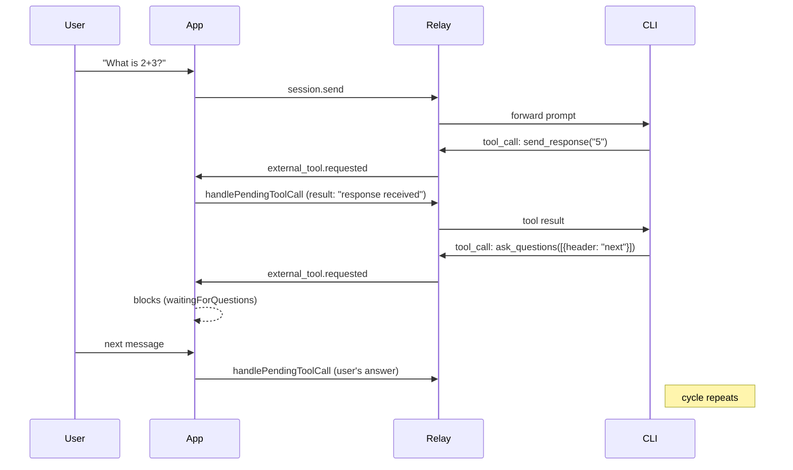
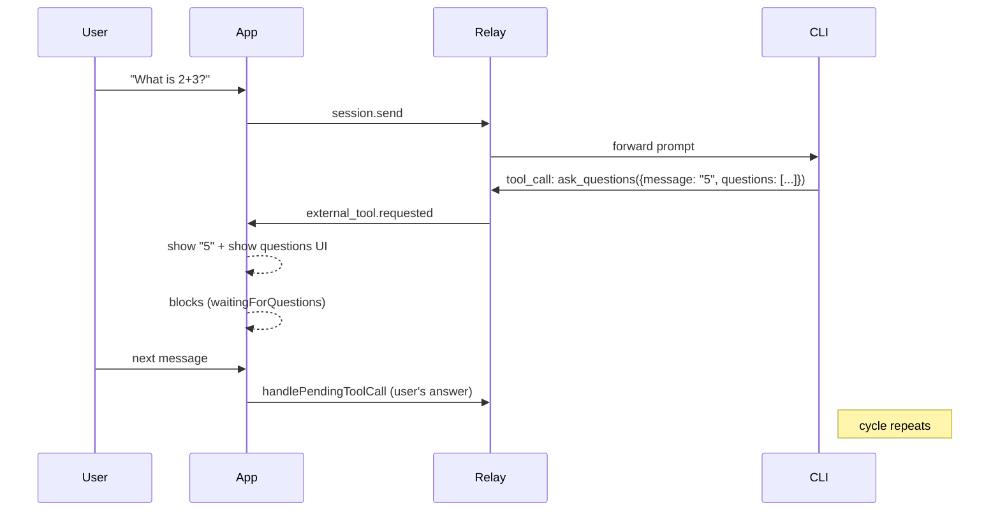
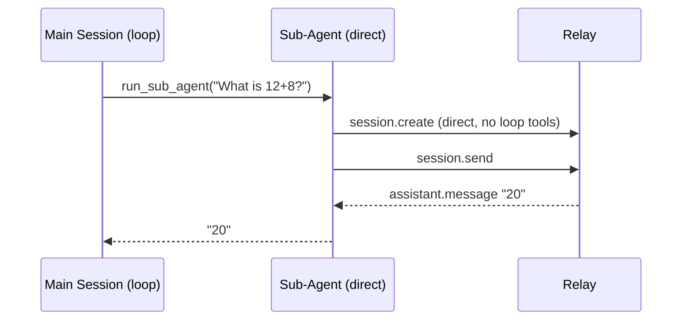

# Design: Unified ask_questions (Drop send_response)

## Problem

The current loop mode uses two tools — `send_response` and `ask_questions` — with every turn requiring both calls in sequence:



This is 2 tool round-trips per turn and causes the `sendToRelay` deadlock (fixed in `8ac7580`).

## Proposal

Drop `send_response`. Add a `message` field to `ask_questions`. One tool call per turn.



## New ask_questions Schema

```json
{
  "name": "ask_questions",
  "parameters": {
    "type": "object",
    "properties": {
      "message": {
        "type": "string",
        "description": "Response message to show the user before the questions."
      },
      "questions": {
        "type": "array",
        "items": {
          "type": "object",
          "properties": {
            "header": { "type": "string" },
            "question": { "type": "string" },
            "options": { "type": "array", "items": { ... } },
            "multiSelect": { "type": "boolean" },
            "allowFreeformInput": { "type": "boolean" }
          },
          "required": ["header", "question"]
        }
      }
    },
    "required": ["questions"]
  }
}
```

`message` is optional. When present, the UI shows it as a response bubble above the questions card. When absent, only the questions card shows.

## Sub-agents: Always Direct

Sub-agents don't need loop mode. They have no user interaction:

- Prompt → execute → return result
- Use direct session (no `send_response`, no `ask_questions`)
- `session.sendAndWait()` captures the assistant's response directly
- No tool interception, no `SubAgentResultCapture`, no auto-answer handlers



## Changes Required

### Relay (`copilot-relay`)

| File | Change |
|------|--------|
| `lib/agent-config.js` | Remove `SEND_RESPONSE_TOOL`. Add `message` field to `ask_questions` schema. Remove `LOOP_TOOLS` (use `SHARED_TOOLS` everywhere). Update `LOOP_SESSION_CONTENT` instructions. |
| `lib/agent-config.js` | Update loop instructions: "Use `ask_questions` to respond to the user and ask for next steps. Put your response in the `message` field." |
| `lib/session-pool.js` | `createSession()`: use `SHARED_TOOLS` for all models. Loop vs direct difference is only in system message injection. |
| `lib/session-pool.js` | `routeFromCli`: remove `send_response` auto-complete. Only auto-complete `ask_questions` when no client. |

### iOS SDK (`copilot-ios/CopilotSDK`)

| File | Change |
|------|--------|
| `Sources/Client.swift` | `CopilotAgent.buildTools()`: remove `send_response` registration. Update `ask_questions` handler to extract `message` from args and call `onResponse`. |
| `Sources/Client.swift` | `CopilotAgent.buildSessionConfig()`: update `agentLoopSuffix` — remove send_response instruction, update ask_questions instruction. |
| `Sources/SubAgentToolProvider.swift` | Remove `SubAgentResultCapture` actor. Remove `send_response` handler registration. Remove `ask_questions` handler registration. Sub-agents use direct session only. Force direct model (e.g. gpt-4.1-mini) regardless of what agent frontmatter says. |

### iOS App (`copilot-ios/CopilotChat`)

| File | Change |
|------|--------|
| `ViewModels/ChatViewModel.swift` | Remove `makeSendResponseTool()`. Update `handleAgentAskQuestions()` to extract `message` field and append as assistant message before showing questions. |
| `ViewModels/ChatViewModel.swift` | `sendToRelay()` logic stays the same (already handles `waitingForQuestions`). |

## Loop Instructions (New)

```
You are an autonomous agent running in an infinite loop.
- Use the `ask_questions` tool to respond and ask for next steps.
- Put your response in the `message` parameter.
- Put follow-up questions in the `questions` array.
- Always call `ask_questions` before your turn ends.
- Do NOT end your turn without calling `ask_questions`.
```

## Migration Risk

| Risk | Mitigation |
|------|------------|
| Model doesn't use `message` field | `message` is optional. If model only uses `questions`, UI shows question text as the response. Relay instructions explicitly say to use `message`. |
| Model puts response in question text instead of `message` | Parse both: if `message` is empty but first question has long text, treat it as the response. |
| Direct models break | Direct models don't use loop tools. No change to direct path. |
| Existing loop sessions in-flight | Deploy relay first (backward compatible — still handles `send_response` from old clients). Then deploy iOS app. Old send_response tool calls will be ignored/auto-completed. |

## Test Matrix (Updated)

After refactor, only 3 scenarios needed:

| # | Scenario | Expected |
|---|----------|----------|
| 1 | Main Direct + simple msg | Reply directly, idle |
| 2 | Main Loop + simple msg | `ask_questions(message: "...", questions: [...])`, waitingForQuestions |
| 3 | Main Loop + sub-agent trigger | `ask_questions` answered, sub-agent runs direct, returns result |

Sub-agent loop (scenario 4 in old matrix) eliminated — sub-agents always direct.

## Backward Compatibility

Deploy in two phases:

1. **Relay**: Add `message` support to `ask_questions`, keep `send_response` in LOOP_TOOLS temporarily. Both tools work.
2. **iOS app**: Update to use `message` from `ask_questions`, remove `makeSendResponseTool()`.
3. **Relay cleanup**: Remove `send_response` from LOOP_TOOLS once all clients are updated.
