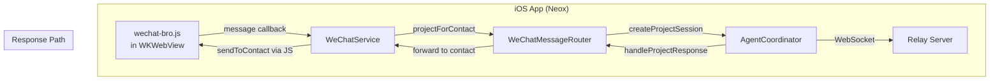
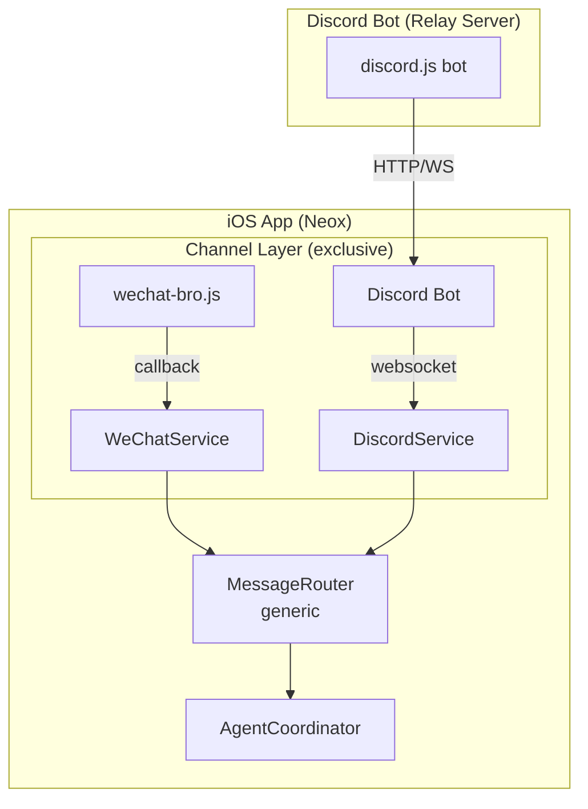
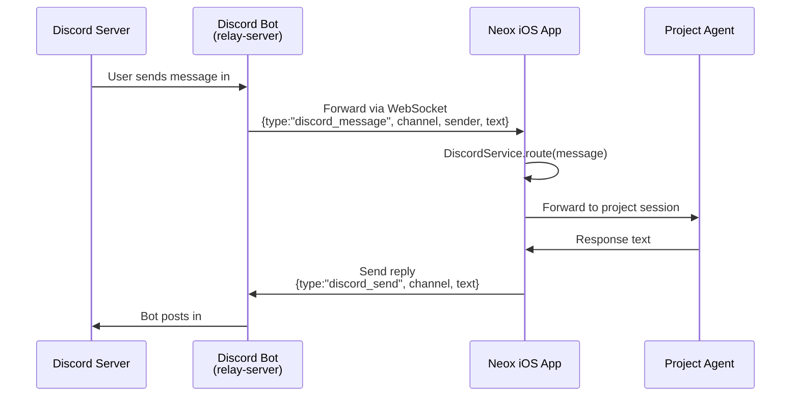
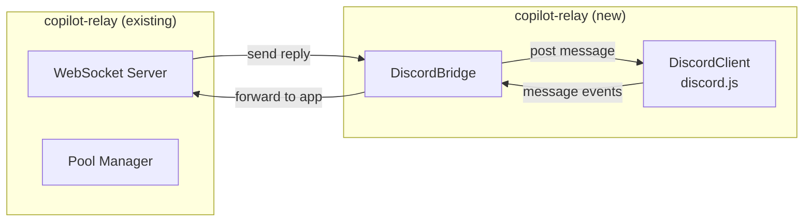

# Discord Channel Support — Design Doc

## Goal

Support Discord server/channel as an alternative to WeChat room for project-assistant bindings. **Exclusive mode**: a project uses either WeChat OR Discord, not both simultaneously.

## Current Architecture



Key abstractions:
- **WeChatService**: contact→project binding, send/receive, online state
- **WeChatMessageRouter**: classify + route messages to project sessions, manage conversation history
- **AgentCoordinator**: generic session manager, project context, tools

## Proposed Architecture



## How It Works

### User Flow

1. User creates a project (e.g. `my-dev-team`)
2. In project settings, chooses **channel type**: WeChat Room or Discord Channel
3. For Discord: inputs `server-name/channel-name` (or channel ID)
4. System binds that Discord channel → project, similar to WeChat contact binding

### Message Flow — Discord



### Do You Need an App Bot in Relay Server?

**Yes — a lightweight Discord bot in copilot-relay.**

Why:
- Discord requires a bot token to read/send messages in channels
- The bot runs server-side (not in iOS app) — it's always online
- The iOS app connects to relay-server via WebSocket (already exists)
- Relay server adds a Discord bot module that bridges messages to/from the iOS app

What the bot does:
- Connects to Discord using discord.js
- Listens for messages in bound channels
- Forwards them to the iOS app's WebSocket connection
- Receives reply messages from the app and posts them in Discord

What the bot does NOT do:
- No AI logic — just a message bridge
- No per-user sessions — it relays to the iOS app which handles routing
- No command parsing — raw message forwarding

### Relay Server Changes



New module: `lib/discord-bridge.js`
- Reads bot token from env (`DISCORD_BOT_TOKEN`)
- On startup: connects to Discord, joins configured guilds
- Maintains mapping: `channelId → appId` (which iOS app handles this channel)
- When message arrives in a bound channel → wraps as `discord_message` → sends to correct WebSocket client
- When iOS app sends `discord_send` → posts via Discord API

### iOS App Changes

New: `DiscordService.swift` (parallel to WeChatService)
- Receives `discord_message` events from relay WebSocket
- Maintains `channelId → projectId` bindings (same pattern as WeChat's `contactLookup`)
- Sends replies back through relay WebSocket
- Properties: `channelName`, `serverName`, `channelId`

Modify: `WeChatMessageRouter.swift` → rename to `MessageRouter.swift`
- Abstract the message source (WeChat vs Discord)
- Same routing logic: lookup project, classify, forward to agent
- Source-specific parsing (Discord messages have different metadata)

### Binding Model

```
// package.json for a Discord-bound project
{
  "name": "my-dev-team",
  "projectType": "project-assistant",
  "channelType": "discord",             // NEW: "wechat" | "discord"
  "discord": {                           // NEW
    "serverId": "123456789",
    "channelId": "987654321",
    "channelName": "general"
  }
}
```

WeChat binding stays the same — just add `"channelType": "wechat"` (default if omitted).

### Configuration

Relay server `config.json` or env vars:
- `DISCORD_BOT_TOKEN` — bot token from Discord Developer Portal
- `DISCORD_CHANNELS` — JSON map of `channelId → appId` for routing

iOS app project settings:
- Channel type picker (WeChat / Discord)
- For Discord: server name + channel name input
- Validation: checks bot has access to that channel

## Scope & Phases

### Phase 1: Discord Bot Bridge (relay-server)
- `lib/discord-bridge.js` — connect bot, listen for messages, relay to WebSocket
- Message format: `{type: "discord_message", channelId, serverId, senderId, senderName, text, timestamp}`
- Reply format: `{type: "discord_send", channelId, text}`

### Phase 2: iOS App Integration  
- `DiscordService.swift` — binding management, message handling
- Adapt MessageRouter to handle both sources
- Project settings UI for channel type selection

### Phase 3: Rich Media
- Image/file attachments from Discord → agent
- Embeds, reactions, threads (future)

## Key Decisions

| Decision | Choice | Rationale |
|----------|--------|-----------|
| Bot location | Relay server | Always online, iOS app may be backgrounded |
| Exclusive mode | One channel type per project | Simpler binding model, avoid duplicate responses |
| Bot library | discord.js | Most popular, well-maintained |
| Message relay | Via existing WebSocket | No new protocol needed |
| Channel discovery | User inputs channel name | No need for complex OAuth flow |
