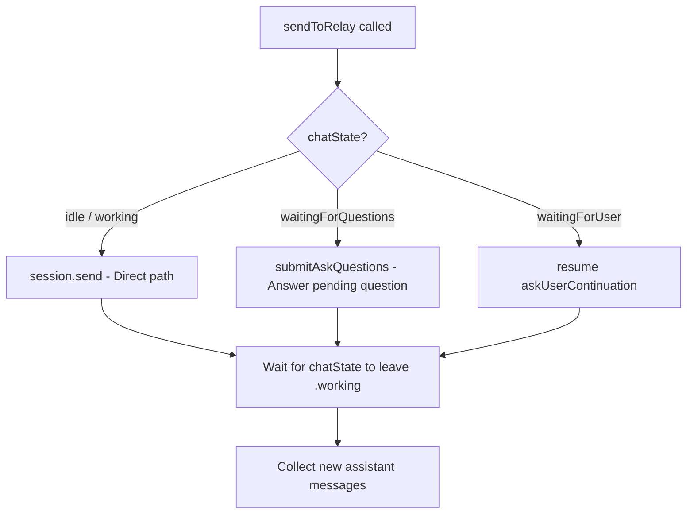

# E2E Test Matrix: Session Modes

Tests verify `sendToRelay` behavior across all combinations of main session mode (direct vs loop) and sub-agent usage.

## Session Modes



**Direct mode** (GPT-4.1, GPT-4.1-mini): relay sends prompt directly to CLI, returns response. `chatState` goes idle → working → idle.

**Loop mode** (GPT-4o → claude-sonnet on CLI): model runs in a tool-use loop with `send_response` + `ask_questions`. `chatState` goes idle → working → waitingForQuestions. Subsequent messages answer the pending `ask_questions` instead of calling `session.send()`.

## Test Cases

### 1. Main Direct — Simple Message

| Field | Value |
|-------|-------|
| Main model | GPT-4.1 |
| Input | "What is 5+3? Reply with just the number." |
| Expected | Reply "8", afterState: idle |
| Verifies | Basic direct mode round-trip |

### 2. Main Loop — Simple Message

| Field | Value |
|-------|-------|
| Main model | GPT-4o |
| Input | "What is 4+7? Reply with just the number." |
| Expected | Reply "11", afterState: waitingForQuestions |
| Verifies | Loop mode round-trip, send_response delivery, ask_questions blocking |

### 3. Sub-agent Direct (from main direct)

| Field | Value |
|-------|-------|
| Main model | GPT-4.1 |
| Sub-agent model | GPT-4.1-mini (default) |
| Input | "What is 2+2? Reply with just the number." (via run_sub_agent) |
| Expected | Reply "4", sub-agent session created and destroyed |
| Verifies | Sub-agent lifecycle, session isolation, send_response not injected for direct sub-agents |

### 4. Sub-agent Loop (sub-agent uses loop model)

| Field | Value |
|-------|-------|
| Main model | GPT-4.1 |
| Sub-agent model | GPT-4o (explicitly requested) |
| Input | "What is 7+3? Reply with just the number." (via run_sub_agent) |
| Expected | Reply "10", SubAgentResultCapture intercepts send_response |
| Verifies | Loop-mode sub-agent, send_response capture, ask_questions auto-answer ("User not available.") |

### 5. Main Direct + Sub-agent Trigger

| Field | Value |
|-------|-------|
| Main model | GPT-4.1 |
| Sub-agent model | GPT-4.1-mini |
| Input | "IMPORTANT: call run_sub_agent with agent='memory' and task='What is 15+25? Reply with just the number.'" |
| Expected | Reply "40", main session invokes run_sub_agent tool, sub-agent returns result |
| Verifies | Tool invocation from direct mode, sub-agent result passed back to main |

### 6. Main Loop + Sub-agent Trigger (deadlock fix)

| Field | Value |
|-------|-------|
| Main model | GPT-4o |
| Sub-agent model | GPT-4.1-mini |
| Precondition | Main session in `waitingForQuestions` state (after prior loop message) |
| Input | "IMPORTANT: call run_sub_agent with agent='memory' and task='What is 12+8? Reply with just the number.'" |
| Expected | Reply "20", afterState: waitingForQuestions |
| Verifies | sendToRelay answers pending ask_questions instead of deadlocking with session.send() |

**Before fix (commit 8ac7580):** `sendToRelay` always called `session.send()`, which abandoned the `askQuestionsContinuation`. The CLI model was blocked waiting for the `ask_questions` tool response — permanent deadlock.

**After fix:** `sendToRelay` checks `chatState`. When `waitingForQuestions`, calls `submitAskQuestions()` with the user's text as a freeText answer. The model receives its tool response, processes the message, and can invoke `run_sub_agent` normally.

## Running Tests

Tests are run via the MCP server on the iPhone (port 9223):

```bash
curl --max-time 120 -s -X POST http://<DEVICE_IP>:9223/mcp \
  -H "Content-Type: application/json" \
  -d '{"jsonrpc":"2.0","id":1,"method":"tools/call","params":{"name":"send_message","arguments":{"text":"What is 5+3? Reply with just the number."}}}'
```

The response includes diagnostics:
- `agent=true/false` — whether agent mode is active
- `chatState` — state before and after the message
- `msgs` / `afterMsgs` — message count before/after
- `assistantMsgs` — number of assistant messages in history

## Key Implementation Details

- **DIRECT_MODELS** on relay: `gpt-4.1`, `gpt-4o-mini`, `gpt-4.1-mini` (defined in `config.js`)
- Models not in DIRECT_MODELS get loop treatment: `send_response` + `ask_questions` tools injected, system message modified
- GPT-4o maps to `claude-sonnet-4.6` on the CLI side
- Sub-agent sessions use `sessionId: "subagent-{UUID}"` for isolation
- `SubAgentResultCapture` actor captures `send_response` content for loop-mode sub-agents
- Sub-agent registers `ask_questions` handler that auto-returns "User not available."
