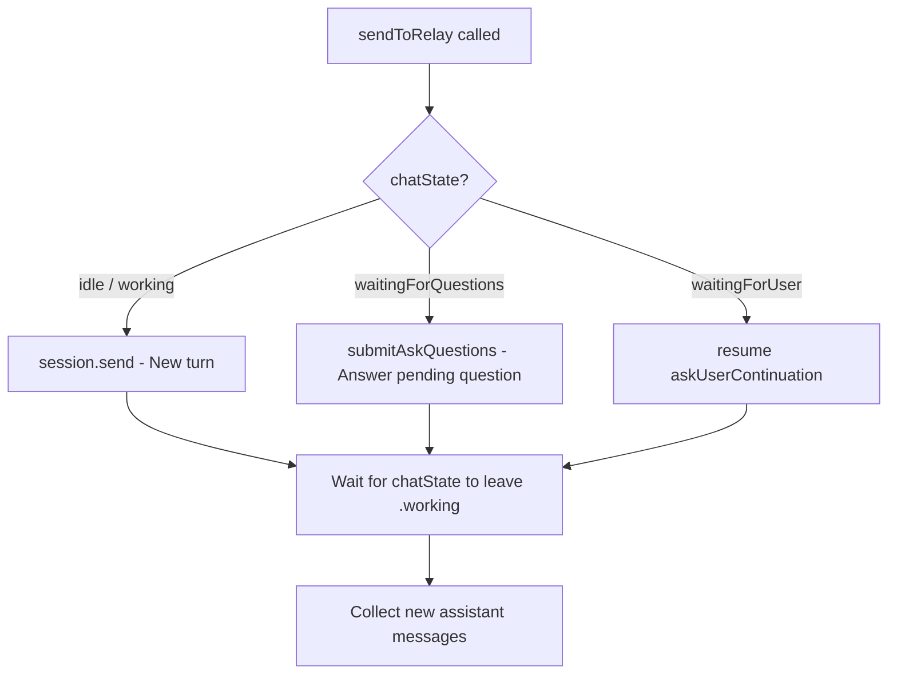

# E2E Test Matrix: Session Modes

Tests verify `sendToRelay` behavior across all combinations of main session mode (direct vs loop) and sub-agent usage.

> **Architecture (post unified ask_questions refactor, 2026-04-08):**  
> All models use the same `SHARED_TOOLS` containing only `ask_questions` (with `message` field).  
> `send_response` tool has been removed. See [design doc](design-unified-ask-questions.md).

## Session Modes



**Direct mode** (GPT-4.1, GPT-4.1-mini): relay sends prompt directly to CLI. Model responds via `ask_questions` with `message` field. `chatState` goes idle → working → waitingForQuestions.

**Loop mode** (GPT-4o → claude-sonnet on CLI): model runs in a tool-use loop. Uses `ask_questions` with `message` field for responses and follow-up questions. `chatState` goes idle → working → waitingForQuestions. Subsequent messages answer the pending `ask_questions`.

**Sub-agents**: Always use direct sessions via `sendAndWait`. No tool handlers registered. The `handleToolCall` method responds with "Tool not available" for any unrecognized tool calls, preventing CLI hangs.

## Test Cases

### 1. Main Direct — Simple Message

| Field | Value |
|-------|-------|
| Main model | GPT-4.1 |
| Input | "What is 5+3? Reply with just the number." |
| Expected | Reply "8", afterState: waitingForQuestions |
| Verifies | Direct mode round-trip via unified ask_questions |

### 2. Main Loop — Simple Message

| Field | Value |
|-------|-------|
| Main model | GPT-4o |
| Input | "What is 4+7? Reply with just the number." |
| Expected | Reply "11", afterState: waitingForQuestions |
| Verifies | Loop mode round-trip, ask_questions message delivery |

### 3. Sub-agent Direct (from main direct)

| Field | Value |
|-------|-------|
| Main model | GPT-4.1 |
| Sub-agent model | GPT-4.1-mini (default) |
| Input | "What is 2+2?" (via run_sub_agent) |
| Expected | Reply "4", sub-agent session created and destroyed |
| Verifies | Sub-agent lifecycle, session isolation, sendAndWait captures response |

### 4. Sub-agent with Unrecognized Tool Call

| Field | Value |
|-------|-------|
| Main model | GPT-4.1 |
| Sub-agent model | GPT-4.1-mini |
| Scenario | Sub-agent model calls `ask_questions` (injected by relay SHARED_TOOLS) |
| Expected | handleToolCall responds "Tool not available", model retries without it |
| Verifies | handleToolCall error response prevents CLI hang (was a timeout bug before fix) |

### 5. Main Direct + Sub-agent Trigger

| Field | Value |
|-------|-------|
| Main model | GPT-4.1 |
| Sub-agent model | GPT-4.1-mini |
| Input | "IMPORTANT: call run_sub_agent with agent='memory' and task='What is 15+25? Reply with just the number.'" |
| Expected | Reply "40", main session invokes run_sub_agent tool, sub-agent returns result |
| Verifies | Tool invocation from direct mode, sub-agent result passed back to main |

### 6. Main Loop + Sub-agent Trigger (deadlock fix)

| Field | Value |
|-------|-------|
| Main model | GPT-4o |
| Sub-agent model | GPT-4.1-mini |
| Precondition | Main session in `waitingForQuestions` state (after prior loop message) |
| Input | "IMPORTANT: call run_sub_agent with agent='memory' and task='What is 12+8? Reply with just the number.'" |
| Expected | Reply "20", afterState: waitingForQuestions |
| Verifies | sendToRelay answers pending ask_questions instead of deadlocking with session.send() |

**Before fix (commit 8ac7580):** `sendToRelay` always called `session.send()`, which abandoned the `askQuestionsContinuation`. The CLI model was blocked waiting for the `ask_questions` tool response — permanent deadlock.

**After fix:** `sendToRelay` checks `chatState`. When `waitingForQuestions`, calls `submitAskQuestions()` with the user's text as a freeText answer. The model receives its tool response, processes the message, and can invoke `run_sub_agent` normally.

## Running Tests

Tests are run via the MCP server on the iPhone (port 9223):

```bash
curl --max-time 120 -s -X POST http://<DEVICE_IP>:9223/mcp \
  -H "Content-Type: application/json" \
  -d '{"jsonrpc":"2.0","id":1,"method":"tools/call","params":{"name":"send_message","arguments":{"text":"What is 5+3? Reply with just the number."}}}'
```

The response includes diagnostics:
- `agent=true/false` — whether agent mode is active
- `chatState` — state before and after the message
- `msgs` / `afterMsgs` — message count before/after
- `assistantMsgs` — number of assistant messages in history

## Key Implementation Details

- **DIRECT_MODELS** on relay: `gpt-4.1`, `gpt-4o-mini`, `gpt-4.1-mini` (defined in `config.js`)
- All models get `SHARED_TOOLS` (just `ask_questions`). Loop vs direct differs only in system message injection
- GPT-4o maps to `claude-sonnet-4.6` on the CLI side
- Sub-agent sessions use `sessionId: "subagent-{UUID}"` for isolation
- Sub-agents use `sendAndWait` directly — no tool handler registrations needed
- `handleToolCall` responds with "Tool not available" for any unregistered tool (prevents CLI hang)
