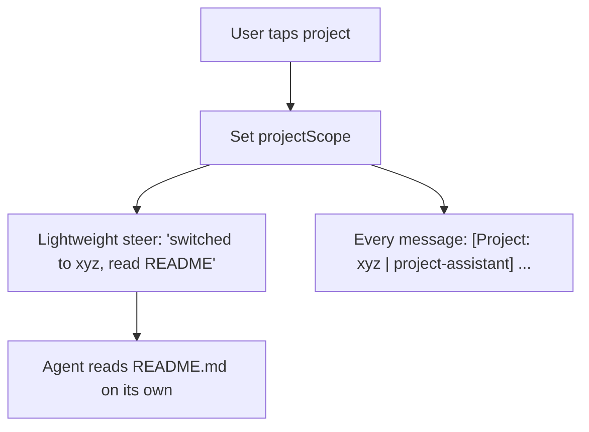

# Project Context Switch Design

**Scope: project-assistant mode only.**

wechat-assistant has its own dedicated background session (always-on, headless, full persona/emoji/guardrails). That's a separate concern.

This doc covers: when a user selects a **project-assistant** project in the UI, how does the LLM know the project context?

## Current Behavior

```
User taps project → projectScope = "xyz"
Every message prefixed: [Project: xyz] user's message
System prompt unchanged (generic agent instructions)
```

The LLM gets the project name but no project-specific context (README, context.md, project type).

## Options

### Option A: Enhanced Prefix

Enrich the `[Project:]` prefix with project metadata on every message.

**Where:** `ChatViewModel.sendPrompt()` — already has `[Project: \(project)]` prefix

```
Before: [Project: xyz] what files are in this project?
After:  [Project: xyz | project-assistant] what files are in this project?
```

**Pros:**
- Zero session disruption
- Context travels with every message (survives context compression)
- Minimal code change

**Cons:**
- Can't inject long context (README, project description) — too verbose for a prefix
- LLM still lacks awareness of project structure/purpose

**Effort:** Small

---

### Option B: System Message on Scope Change

When `projectScope` changes, inject a one-time context message via `steer()`.

**Where:** Add observer on `projectScope` change, or handle in ContentView's `onSelect`

```swift
// On project select
if let project = projectScope {
    let context = coordinator.buildProjectContext(project) 
    // Includes: project README, description, file tree
    Task { try? await chatVM.session?.steer(prompt: context) }
}
```

**What gets injected:**
- Project type and description
- README.md / context.md content
- Project file tree (already built by `buildWorkspaceTree()` scoped to project dir)

**Pros:**
- Rich context — full project docs delivered to LLM
- One-time cost, not per-message
- Uses existing `steer()` mechanism (mode: .immediate)

**Cons:**
- Gets lost on context compression (long conversations)
- Steer is a user-role message, not system-role

**Effort:** Medium

---

### Option C: Dynamic System Prompt (Reconnect)

Tear down and recreate ChatViewModel with project-specific system instructions.

**Pros:**
- System-level context — most authoritative
- Full project isolation

**Cons:**
- Loses conversation history
- Reconnection delay
- Bad UX for quick project browsing

**Effort:** Large

---

### Option D: Hybrid (A + B)

1. On project switch → `steer()` with full context (README, file tree, description)
2. On every message → enhanced prefix `[Project: xyz | project-assistant]`

**Pros:**
- Rich initial context + persistent type reminder
- Graceful degradation on context compression

**Effort:** Medium

---

## Chosen Approach: Lightweight Hybrid

**Prefix** `[Project: xyz | project-assistant]` on every message + **lightweight steer** on scope change.

The steer message is NOT a heavy context dump. It's a nudge:
```
User switched to project 'my-app' (project-assistant).
Description: A todo app built with React.
Wired to WeChat room 'devteam' (weight: 80).
Read the project's README.md for full context.
```

The agent should **self-discover** — read README.md, list files, understand the project on its own. We just give it enough to know where to look.

### Steer Message Content

- Project name + type
- Short description (from package.json/project.json)  
- Wired WeChat contact info if any (room/individual, weight, autoReply)
- Hint: "Read README.md for full context"

### Prefix Content

Every message gets: `[Project: xyz | project-assistant]`

## Data Flow



## Implementation Notes

- `AgentCoordinator.readProjectType(projectId:)` already exists
- WeChat bindings available via `weChatService?.getBindings(for: projectId)`
- Description from `ProjectItem.scan()` or package.json
- `steer()` uses `mode: .immediate`
- Agent already has `read_file` and `list_files` tools to self-discover
