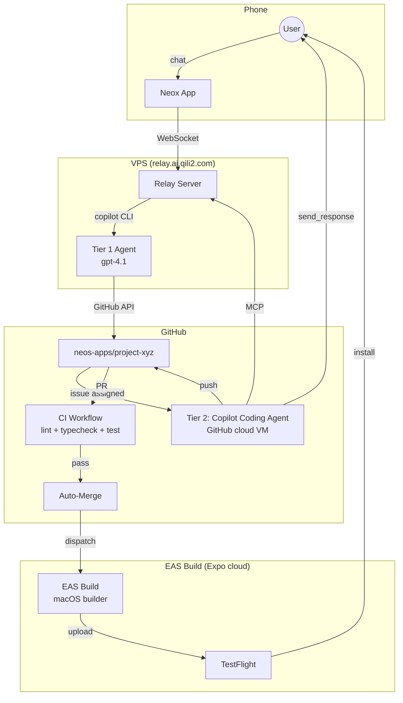
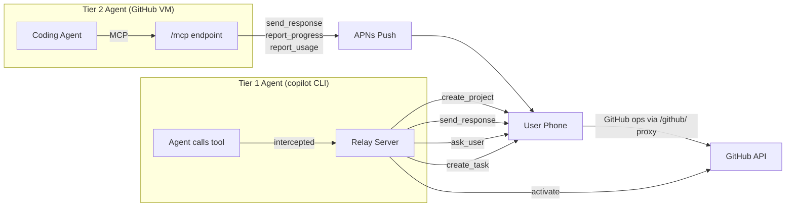
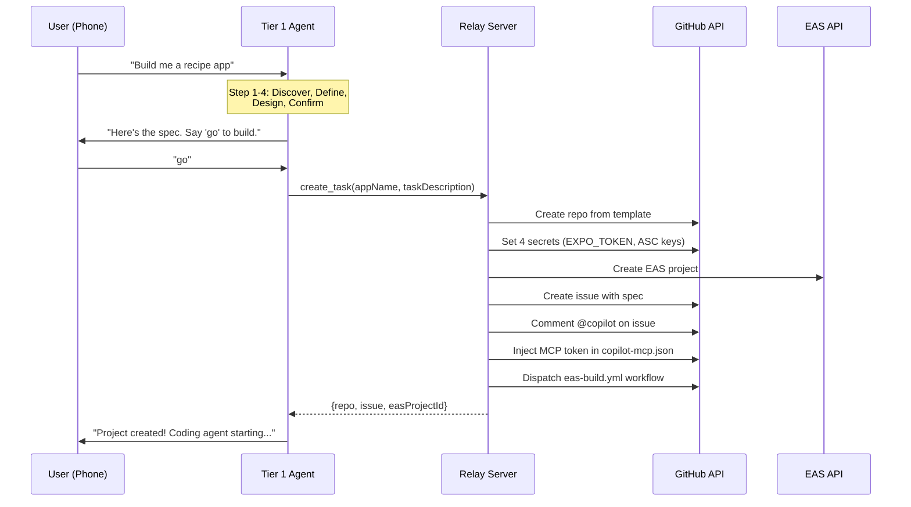
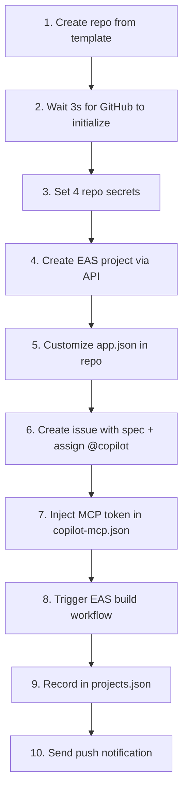
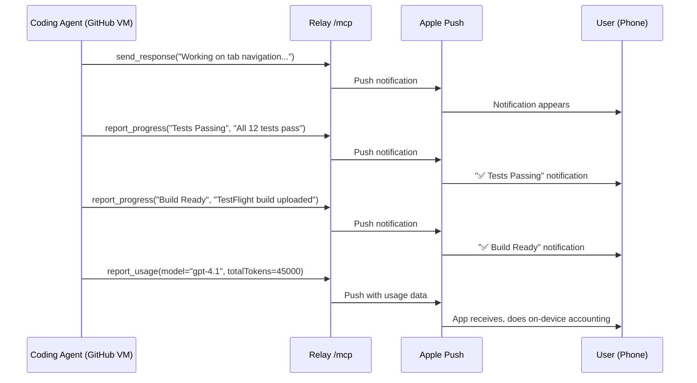

# Remote Project Development — Full Design

> Phone → Agent → GitHub → TestFlight. One conversation delivers an app.

## 1. Problem

A user opens Neox on their iPhone and says "I want a recipe sharing app." From that single conversation, the system should:
- Guide them through requirements & design
- Create a GitHub repo with CI/CD
- Dispatch a coding agent to implement the spec
- Build and ship to TestFlight
- Accept feedback and iterate

No terminal, no Xcode, no GitHub account needed.

---

## 2. Architecture



### Two-Tier Agent System

| | Tier 1 (Phone Agent) | Tier 2 (Coding Agent) |
|---|---|---|
| **Where** | Relay server, copilot CLI session | GitHub cloud VM |
| **Triggered by** | User chat message | Issue assignment |
| **Role** | Discover requirements, design, dispatch | Implement code, create PRs, build |
| **Tools** | `create_project`, `create_task`, `send_response`, `ask_user` | `send_response`, `report_progress`, `report_usage` (via relay MCP) |
| **Lifetime** | Persistent (session pool) | Per-issue (disposable VM) |

---

## 3. Tool Design

### How tools work in the relay

The relay injects **agent tools** into the copilot CLI session. These are tool definitions the LLM can call during conversation. When the agent calls a tool, the relay **intercepts** the call and handles it server-side — the tool never actually runs inside copilot.

Separately, the relay exposes an **MCP endpoint** (`/mcp`) that the Tier 2 coding agent connects to from its GitHub cloud VM. This exposes `send_response`, `report_progress`, and `report_usage`.

**Important:** Tier 2 tools deliver messages via **APNs push notifications**, not direct WebSocket. The coding agent runs for minutes to hours — the user's phone is usually not online. APNs ensures delivery even when the app is backgrounded or closed. If the phone happens to be connected via WebSocket, it also receives a broadcast.



### Tool inventory

| Tool | Available to | Registration | Handler |
|------|-------------|-------------|---------|
| `create_project` | Tier 1 only | Agent tool (intercepted) | On-device scaffold from `.neo/templates/` ([design](create-project-tool.md)) |
| `send_response` | Tier 1 + Tier 2 | Agent tool + MCP | Delivers chat message to phone |
| `ask_user` | Tier 1 only | Agent tool | Asks question, holds session for answer |
| `create_task` | Tier 1 only | Agent tool (intercepted) | Relay-orchestrated: phone does GitHub, relay activates ([design](../../copilot-relay/docs/create-task-pipeline.md)) |
| `report_progress` | Tier 2 only | MCP only | Push notification for milestones |
| `report_usage` | Tier 2 only | MCP only | Token usage via APNs, on-device accounting |

**`create_project` is an on-device tool.** The relay intercepts the call and delegates to the phone via WebSocket. The phone scaffolds a project folder from `.neo/templates/`, creating README.md, docs/, and progress/. This runs early in the guided flow so that context files (specs, mockups) have a folder to live in.

**`create_task` is a relay-orchestrated tool.** The relay intercepts it, delegates GitHub work to the phone (repo creation, file upload, issue creation via `/github/` proxy), then activates the project server-side (secrets, MCP token, @copilot, build).

**`report_progress` and `report_usage` are MCP-only tools.** The Tier 1 agent doesn't need them — the user sees everything in real-time chat, and Tier 1 usage is tracked by the relay directly. The Tier 2 coding agent runs asynchronously and uses these to report milestones and token consumption.

### Why the agent calls `create_task` (not user/API directly)



The agent controls *when* to call it — only after the 5-step guided flow and explicit user confirmation. It composes a structured `taskDescription` from the conversation (not raw user text). And it continues working after `create_task` returns (monitoring progress, responding to updates).

---

## 4. Project Creation Pipeline

Two tools work together:
- **`create_project`** — on-device scaffold from templates ([design](create-project-tool.md))
- **`create_task`** — relay-orchestrated GitHub + activation ([design](../../copilot-relay/docs/create-task-pipeline.md))

### create_project (on-device)

The agent reads `.neo/templates/{name}/README.md` on the device (via intercepted `read_file`), follows it to gather info, then calls `create_project`. The phone scaffolds a project folder locally.

### create_task (relay-orchestrated)

When the Tier 1 agent calls `create_task`, the relay orchestrates:



**Secrets set on each repo:**
- `EXPO_TOKEN` — EAS authentication
- `EXPO_ASC_KEY_ID` — Apple App Store Connect key ID
- `EXPO_ASC_ISSUER_ID` — Apple ASC issuer ID
- `EXPO_ASC_API_KEY_BASE64` — Base64-encoded .p8 signing key

**Secret encryption:** libsodium `crypto_box_seal` with the repo's public key (GitHub API requirement).

---

## 5. Agent Guided Flow

The Tier 1 agent MUST follow this process before calling `create_task`:

### Step 1: Discover + Create Project
- What problem does the app solve?
- Who is the target user?
- Similar apps?
- Agent reads `.neo/templates/` to pick template
- Agent calls `create_project` to scaffold local folder

### Step 2: Define Features
- Narrow to 3-5 MVP features
- Get explicit confirmation on the list
- Agent writes docs/spec.md into project folder

### Step 3: Design
- Screen flow in plain language
- What's on each screen
- Navigation between screens
- Agent writes docs/screens.md into project folder

### Step 4: Confirm
Present a structured spec:
```
App: [Name]
Target: [Who]
Core Features: 1. ... 2. ... 3. ...
Screens: Home → Detail → Settings
```
Ask: "Say 'go' to start building."

### Step 5: Create Task
Only after explicit user approval → call `create_task`.
Phone uploads project files to GitHub, relay activates.

---

## 6. Template Repo

`neos-apps/expo-app-template` — every new project is created from this:

```
.github/
├── agents/builder.agent.md       # Coding agent persona
├── copilot-instructions.md       # Project-level Copilot instructions
├── copilot-mcp.json              # Relay MCP server config (token injected per project)
├── copilot-setup-steps.yml       # VM setup: Node 22 + EAS CLI
├── hooks/
│   ├── hooks.json                # GitHub Copilot hooks config
│   └── scripts/
│       ├── mcp-call.sh           # Helper: call MCP tool via JSON-RPC
│       ├── session-start.sh      # Report session start to phone
│       ├── session-end.sh        # Report session completion with duration
│       ├── pre-tool-use.sh       # Notify phone about bash/edit/create actions
│       └── error-occurred.sh     # Report errors to phone
├── workflows/
│   ├── ci.yml                    # Lint + typecheck + test on PR
│   ├── auto-review.yml           # Scope check + auto-merge
│   └── eas-build.yml             # EAS Build + optional TestFlight submit
app/                               # Expo Router scaffold
app.json                           # Expo config (customized per project)
eas.json                           # Build profiles
package.json
```

### Hooks

GitHub Copilot [hooks](https://docs.github.com/en/copilot/reference/hooks-configuration) run shell scripts at key agent lifecycle points. They call the relay MCP endpoint to push notifications to the user's phone:

| Hook | Trigger | Action |
|------|---------|--------|
| `sessionStart` | Agent session begins | Push "🚀 Session Started" |
| `preToolUse` | Before bash/edit/create | Push "🔧 Running: ..." or "✏️ Editing: ..." |
| `sessionEnd` | Agent session ends | Push "✅ Session Complete" with duration |
| `errorOccurred` | Agent error | Push "❌ Agent Error" with details |

Scripts authenticate via `$PROJECT_TOKEN` env var and call the relay's MCP endpoint (`tools/call` JSON-RPC).

### Template Sync

Templates are managed locally in `neox/workspace/.neo/templates/` and auto-synced to GitHub via `.github/workflows/sync-templates.yml` on push to main.

**On repo creation**, `create_task` customizes:
- `app.json`: name, slug, bundleIdentifier
- `copilot-mcp.json`: project-specific MCP token

---

## 7. Build & Delivery

### EAS Build

- **Platform:** Expo Application Services (cloud macOS builders)
- **Trigger:** `eas-build.yml` workflow dispatched after repo creation
- **Signing:** Automatic — EAS manages Apple certs and provisioning profiles
- **Profiles:** `preview` (internal/simulator) and `production` (TestFlight)

### Conditional App Store Connect

EAS uses ASC API key for automatic code signing only when secrets are present:

```yaml
env:
  HAS_ASC_KEY: ${{ secrets.EXPO_ASC_API_KEY_BASE64 != '' }}
steps:
  - if: env.HAS_ASC_KEY == 'true'
    run: echo "$ASC_KEY" | base64 -d > ~/asc-key.p8
```

### Cost

| Service | Free Tier |
|---------|-----------|
| EAS Build | 30 builds/month |
| GitHub Actions CI | 2,000 min/month (ubuntu) |
| Copilot coding agent | Included with Copilot |
| Apple Developer | $99/year |

---

## 8. Communication Bridge

The Tier 2 coding agent communicates with the user via relay MCP → **APNs push notifications**. Since the coding agent runs for minutes to hours, the user's phone is typically offline. All messages are delivered as push notifications and also broadcast to any connected WebSocket clients.



**Session routing:** Relay maps `projectToken → project → user`. Push notifications go to all registered device tokens.

---

## 9. Resilience

| Failure | Recovery |
|---------|----------|
| Phone disconnect during `ask_user` | Session held 10 min, reconnect via clientId |
| Hold timeout | Workspace snapshot saved, session recycled |
| CLI crash | Pool respawns, pre-warms sessions |
| Bad PR from coding agent | `@copilot fix: ...` comment |
| EAS build failure | Agent reports error, user iterates |

---

## 10. Security

| Concern | Mitigation |
|---------|------------|
| User code isolation | Separate repo per project, isolated VM per issue |
| Credentials | EXPO_TOKEN as repo secret, never in code. ASC key base64-encoded |
| Apple signing | EAS manages certs, never exposed |
| Repo access | Bot account manages repos; users have no GitHub access |
| Secret encryption | libsodium sealed box (NaCl crypto_box_seal) |

---

## 11. Iteration Loop

After the first build lands on TestFlight:

```
User tests app → "Tab icons are too small"
  → Agent creates new issue from feedback
  → Coding agent implements fix → PR → CI → merge → build
  → Updated build on TestFlight
  → Repeat
```

---

## 12. Current Status

| Component | Status |
|-----------|--------|
| Relay server + session pooling | ✅ Deployed |
| Agent loop (send_response + ask_user) | ✅ Working |
| create_task pipeline (delegation) | ✅ Working — phone creates repo/issue, relay activates |
| /github/* proxy | ✅ Working — transparent proxy, 6 tests pass |
| Secret injection (libsodium) | ✅ Working |
| Template repo | ✅ Created (neos-apps/expo-app-template) |
| EAS build workflow | ✅ Fixed (env.HAS_ASC_KEY pattern) |
| 5-step guided flow | ✅ Implemented (main.agent.md) |
| Phone delegation (simulator) | ✅ Tested — iPhone 17 Pro simulator E2E |
| Phone delegation (physical) | ✅ Tested — iPhone 12 mini via production relay (~9s) |
| MCP endpoint (/mcp) | ✅ Working — send_response, report_progress, report_usage |
| APNs notifications | ✅ Working — project_activated, coding agent messages |
| Debug endpoint (/debug/delegate) | ✅ Working — test delegation without UI |
| /api/projects/* REST endpoints | ⬜ Not implemented (projects.json exists but no REST API) |
| /api/projects/activate endpoint | ⬜ Not implemented (activation only inside handleCreateTask) |
| Full projects.json schema | ⬜ Minimal (repo + projectToken only; missing userId, displayName, etc.) |
| WebSocket auto-reconnect | ⬜ Not implemented (manual "Apply & Reconnect" required) |
| Coding agent picks up issue | ⬜ Untested |
| EAS build succeeds | ⬜ Untested |
| TestFlight delivery | ⬜ Untested |

---

## 13. Open Questions

1. **Cost model** — Per-build? Per-project? Subscription?
2. **EAS concurrency** — Free tier: 1 concurrent build. Multiple users queue.
3. **Native modules** — Some features (Bluetooth, ARKit) need native code. How to handle?
4. **Expo Updates** — OTA hotfixes without full rebuild (future phase)
5. **Android** — Just add `--platform android` to EAS build (future phase)
6. **ask_user for Tier 2** — Deferred. Blocking the GitHub VM while waiting for user input is expensive. Consider: async question queue, or agent makes best-judgment decisions instead of asking.

## 14. Shared Notification Handler (Implemented)

`CodingAgentNotificationHandler` in copilot-ios handles all coding agent notifications. Any app using copilot-ios gets coding agent support automatically.

- **Schema & data flow:** See [copilot-ios/CopilotSDK/docs/coding-agent-notification-schema.md](../../copilot-ios/CopilotSDK/docs/coding-agent-notification-schema.md)
- **Handler:** `CopilotChat/Sources/Services/CodingAgentNotificationHandler.swift` — parse/apply pattern
- **Integration:** `ChatViewModel.addNotification()` delegates to handler for `type=coding_agent`
- **App delegate:** Forwards all custom APNs fields (no hardcoded field names — future actions work automatically)
- **Token tracking:** `report_usage` → `UsageTracker.record()` with `CostCalculator` multipliers
