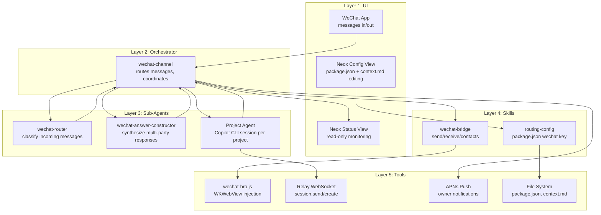

# WeChat Channel Architecture

> Bidirectional WeChat integration for Neox — project assistant + auto-reply

## 1. Topology



## 2. Layer 1: UI

**WeChat (primary input/output):**
- Users send text messages in rooms or 1:1 chats
- Scenario 1: Agent responds with 🤖 prefix (distinguishes from owner)
- Scenario 2: Agent responds with no prefix (seamless as owner)
- Invisible AI watermark applied in both scenarios

**Neox App (monitoring + config):**
- Status view: session state, message count, last activity per wired project
- Config: edit package.json wechat contacts + weights (rooms), edit context.md (auto-reply)
- History: read-only conversation log
- No chat UI for wired projects — WeChat is the only input channel

## 3. Sub-Agent Definitions

### wechat-router

| Field | Value |
|-------|-------|
| **Goal** | Classify each incoming message: resolve, new_input, or context_only |
| **Input** | `{ message, sender, weight, pendingQuestion, recentHistory, agentState }` |
| **Output** | `{ action: "resolve_tool_call" \| "new_input" \| "context_only" }` |
| **Sync** | Yes — orchestrator blocks (needs answer before routing) |
| **Skippable** | No |
| **Dependencies** | None |
| **Model** | gpt-4.1-mini (fast, cheap — runs on every incoming message) |

### wechat-answer-constructor

| Field | Value |
|-------|-------|
| **Goal** | Decide if enough responses collected, synthesize into single answer |
| **Input** | `{ question, responses[], timeout, memberWeights }` |
| **Output** | `{ ready: bool, answer?: string, reason?: string, confidence }` |
| **Sync** | Yes — orchestrator blocks until ready or timeout |
| **Skippable** | Yes — in 1:1 mode with only one responder, skip directly |
| **Dependencies** | Requires at least one `resolve_tool_call` from wechat-router |
| **Model** | gpt-4.1-mini |

### Project Agent (Copilot CLI)

| Field | Value |
|-------|-------|
| **Goal** | Execute project work: answer questions, run tasks, record decisions |
| **Input** | `session.send({ message, senderContext })` via relay |
| **Output** | Agent response text (streamed via relay events) |
| **Sync** | Async — agent may take time, orchestrator waits for response events |
| **Skippable** | No — this is the whole point |
| **Dependencies** | Needs routed message or constructed answer |
| **Note** | Not defined as .agent.md — it's a Copilot CLI process managed by the relay |

## 4. Skills Inventory

| Skill | wechat-channel | wechat-router | wechat-answer-constructor | Project Agent | Shared? |
|-------|:-:|:-:|:-:|:-:|:-:|
| wechat-bridge (send/receive/contacts) | ✓ | | | | No |
| routing-config (package.json read) | ✓ | | | | No |
| memory (conversation history) | ✓ | ✓ | ✓ | | Yes |
| report_progress (status updates) | ✓ | | | | No |

**Skill details:**

- **wechat-bridge**: send message, get contacts, get room members, listen for messages. Wraps wechat-bro.js. [Defined: `skills/wechat-bridge/SKILL.md`]
- **routing-config**: read/write `wechat` key from project's package.json. Build contactId→projectId lookup. [Needs building]
- **memory**: existing memory read/write for conversation history logging. [Exists]
- **report_progress**: existing tool for updating Neox UI. [Exists]

## 5. Tools Requiring Implementation

| Tool | What it does | Platform | Status | Complexity |
|------|-------------|----------|--------|------------|
| **WeChatRouter (Swift)** | Routes incoming bridge messages to orchestrator | iOS/Swift | Needs building | Moderate |
| **WeChatService update** | Manages bidirectional bridge lifecycle | iOS/Swift | Needs integration | Moderate |
| **Session key construction** | Client builds `appId-userId-projectId` keys | iOS/Swift | Needs building | Trivial |
| **wechat-bro.js onMessage** | Wire existing callback to bridge messages up | JS/WKWebView | Needs integration | Trivial |
| **Relay session.send** | Forward WeChat message with sender metadata | Relay (Node.js) | Exists — needs sender metadata field | Trivial |
| **RoomWiringView** | SwiftUI: room picker + weight slider per member | iOS/SwiftUI | Needs building | Moderate |
| **AssistantSetupView** | SwiftUI: contact picker + link to context.md edit | iOS/SwiftUI | Needs building | Simple |
| **Answer timeout timer** | Configurable timer for multi-response collection | iOS/Swift | Needs building | Trivial |
| **APNs escalation** | Push notification for owner approval (Scen2 guardrails) | iOS + relay | Exists — needs new notification type | Simple |

## 6. State Model

### Ephemeral (per-session, lost on restart)
- **Routing sub-agent context**: recent message history, current agent state
- **Answer constructor buffer**: responses collected for pending ask_questions
- **Timeout timer**: countdown for answer construction

### Persistent (survives restarts)
- **package.json `wechat` key**: contact bindings, weights, auto-reply flags
- **context.md**: Scenario 2 persona, behavior rules, per-contact instructions
- **Conversation history**: full log of all messages (stored in project workspace)
- **Session state**: relay manages CLI process state, on-hold/resume

### Shared Artifacts
- **package.json** — read by routing-config skill, written by Neox config UI
- **context.md** — read by project agent (as workspace context), edited by owner in Neox
- **Conversation history log** — written by orchestrator, read by routing sub-agent and answer constructor

## 7. Acceptance Criteria

- [ ] Incoming WeChat message in a wired room → routed to correct project session
- [ ] Incoming WeChat message from 1:1 contact → routed to correct project session
- [ ] Scenario 1 agent response → sent to WeChat with 🤖 prefix
- [ ] Scenario 2 agent response → sent to WeChat with no prefix (as owner)
- [ ] Pending `ask_questions` + WeChat response → tool call resolved
- [ ] Multiple responses to `ask_questions` → answer constructor synthesizes
- [ ] Answer constructor timeout → best answer from available responses
- [ ] Weight-0 sender → message ignored entirely
- [ ] Unbound contact message → ignored (not routed)
- [ ] Phone sleeps → sessions go on-hold, stash pending state
- [ ] Phone wakes → sessions resume, replay stashed messages
- [ ] Scenario 2: auto-reply matches persona rules → sent without approval
- [ ] Scenario 2: guardrail triggered → push notification to owner
- [ ] Scenario 2: owner approves/edits/rejects → correct action taken
- [ ] Multiple wired projects → each has own session, no context mixing
- [ ] New project wired → session created on first message
- [ ] context.md edited → agent picks up changes on next message

## Key Flows

### Flow 1: Happy Path — Room Message → Agent Response

```
1. John Zhang says "Let's use React for the frontend" in Marketing Room
2. wechat-bro.js captures → WeChatRouter → wechat-channel orchestrator
3. Orchestrator looks up @@abc123 → Project A (from package.json)
4. Spawns wechat-router: no pending question, message is new instruction → new_input
5. session.send to appId-userId-projA with { sender: "John Zhang", weight: 100, text: "Let's use React..." }
6. Project agent processes, responds: "Sounds good. I'll set up the React project structure..."
7. Orchestrator receives response → wechat_send_message(@@abc123, "🤖 Sounds good...")
8. Message appears in Marketing Room from owner's account
```

### Flow 2: Multi-Party `ask_questions` Resolution

```
1. Project agent asks: "Should we use PostgreSQL or MongoDB?"
2. Orchestrator sends to WeChat room: "🤖 Should we use PostgreSQL or MongoDB?"
3. Intern (weight 20) responds: "I've used MongoDB before"
4. wechat-router: pending question exists, message is related → resolve_tool_call
5. answer-constructor: ready? No — only weight-20 response, waiting for higher
6. Designer (weight 50) responds: "PostgreSQL for relational data"
7. answer-constructor: ready? Yes — weight-50 member + clear answer
8. Constructed answer: "PostgreSQL — recommended by Designer (weight 50). Intern has MongoDB experience but defers. No response from PM yet."
9. Tool call resolved → project agent continues with PostgreSQL
```

### Flow 3: Scenario 2 — Auto-Reply with Guardrail

```
1. Alice Wang sends "Hey, can we meet tomorrow at 2pm?"
2. wechat-router: no pending question → new_input
3. Project agent (WeChat Assistant) reads context.md: "Never schedule meetings on my behalf"
4. Guardrail triggered → agent returns: { needsApproval: true, draft: "Sure, 2pm works for me!" }
5. Orchestrator sends APNs push to owner: "Alice wants to meet tomorrow 2pm. Approve reply?"
6. Owner taps notification, edits to: "Let me check my calendar and get back to you"
7. Edited reply sent to Alice via WeChat
```
