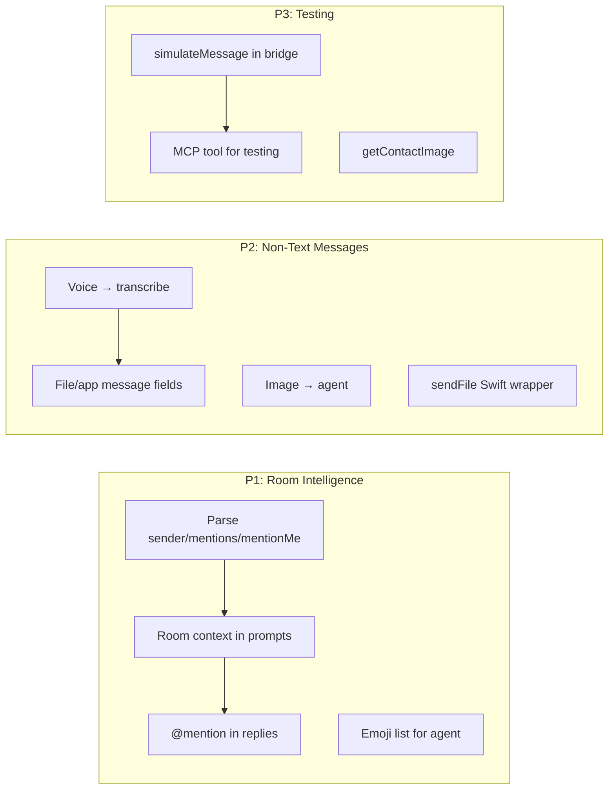

# WeChat Enhancement Plan

## Current State

The bidirectional WeChat integration is working end-to-end:
- Messages route from WeChat → project agent → reply back to WeChat
- Per-project sessions, routing sub-agent, answer constructor, guardrails all operational
- Cookie persistence via SharedWebKitEnvironment
- AI watermark on outgoing messages

## Enhancements

Three priorities: room intelligence, non-text messages, and testing infrastructure.



---

### P1: Room Intelligence

The agent makes all content decisions — @mentions, emoji, whether to reply, tone, format. Swift's job is only to parse the rich context from wechat-bro.js and pass it to the agent session.

#### P1.1 — Parse `sender`, `mentions`, `mentionMe`

wechat-bro.js already provides these fields on room messages. Swift ignores them and re-parses the sender from the content prefix.

**WeChatTypes.swift** (copilot-ios):
- Add to `WeChatMessage`: `senderContact: WeChatContact?`, `mentions: [String]`, `mentionMe: Bool`
- In `WeChatBridgeEvent.parse()` message case: parse `msgData["sender"]` → `WeChatContact`, `msgData["mentions"]` → `[String]`, `msgData["mentionMe"]` → `Bool`
- Delete `roomSenderUserName` computed property (replaced by `senderContact`)
- Delete `cleanContent` computed property (JS already strips sender prefix when `sender` is parsed)

**WeChatMessageRouter.swift** (neox):
- Replace manual sender resolution (~10 lines) with `message.senderContact?.name` / `.userName`

#### P1.2 — Rich room context in agent prompt

Pass all parsed fields to the agent as structured context. The agent decides what to do.

**WeChatMessageRouter.swift**:
- Format prompt with full room metadata:
  ```
  [WeChat message in <room name>]
  From: <sender name> (weight: <N>)
  @mentioned you: yes/no
  Also mentioned: <names>
  ---
  <message content>
  ```
- For 1:1 messages, simpler format (no room/mention fields)

#### P1.3 — @mention capability for agent responses

Provide the `at()` function so the agent's reply can @mention people. The agent decides when to use it — no auto-prepend in Swift.

**WeChatBridge.swift** (copilot-ios):
- Add: `func buildAtMention(userId: String, roomId: String) async -> String`
- Calls `WechatyBro.at(userId, roomId)` → returns `"@Name\u2005"`

The agent can call this to build @mention strings, or the agent can just write `@Name` and let it go through (less reliable but simpler for v1).

#### P1.4 — Emoji + capabilities in session context

Include available capabilities in the agent's session instructions.

**WeChatBridge.swift**:
- Add: `func getSupportedEmojis() async -> [String]` (cached)

**Session setup**:
- Include emoji list (or a subset) in the session's system prompt
- Include note: "You can use WeChat emoji codes like [微笑], [呲牙], etc. in your replies"
- Include note: "Use @Name to mention someone in room messages"

---

### P2: Non-Text Messages

#### P2.1 — Remove `guard isText`, handle voice + image

**WeChatMessageRouter.swift**:
- Remove `guard message.isText else { return }`
- Switch on `message.msgType`:
  - `1` (text): current path
  - `34` (voice): if `voiceBase64` present, transcribe to text, route as text
  - `3` (image): forward `[Image received from <sender>]` context to agent
  - Other: log and skip

Voice transcription approach TBD (OpenAI Whisper API vs on-device).

#### P2.2 — Parse file/app message fields

**WeChatTypes.swift**:
- Add optional fields: `fileName: String?`, `fileSize: Int?`, `appMsgType: Int?`
- Parse from `msgData` in `WeChatBridgeEvent.parse()`

**WeChatMessageRouter.swift**:
- For MsgType 49: format as `[File: report.pdf (2.3 MB)]` or `[Link: title]` and route to agent

#### P2.3 — Send files

**WeChatBridge.swift**:
- Add: `func sendFile(to: String, mediaId: String, filename: String, fileSize: Int) async -> Bool`
- Calls `WechatyBro.sendFileWithMediaId(to, mediaId, filename, fileSize)`

---

### P3: Testing Infrastructure

#### P3.1 — simulateMessage in bridge

**WeChatBridge.swift**:
- Add: `func simulateMessage(from: String, content: String, sender: String? = nil, msgType: Int = 1) async`
- Calls `WechatyBro.simulateMessage(from, content, sender, msgType)`
- Emits message event through normal pipeline — no real WeChat login needed

#### P3.2 — MCP tool for testing

**Neox MCP tools**:
- New tool: `wechat_simulate_message` with params `{ from, content, sender?, msgType? }`
- Enables automated testing of the full message→router→agent→reply pipeline from VS Code

#### P3.3 — getContactImage

**WeChatBridge.swift**:
- Add: `func getContactImage(id: String) async -> String?`
- Returns base64 data URI from `WechatyBro.getContactImage(id)`
- Better than `headImgUrl` AsyncImage — no network dependency, works offline
