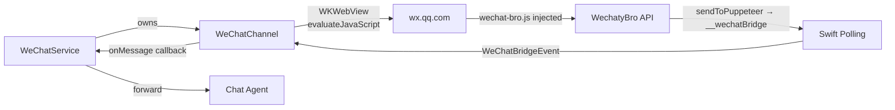

# WeChat Integration

## Overview

Neox integrates WeChat Web (`wx.qq.com`) via a hidden `WKWebView` on iOS. The [wechat-bro](../../wechat-bro/) library is injected to bridge WeChat's AngularJS internals with the Swift layer.

## Architecture



## Key Files

- `copilot-ios/WebKitAgent/Sources/WeChat/WeChatBridge.swift` — JS script loading and helper methods
- `copilot-ios/WebKitAgent/Sources/WeChat/WeChatChannel.swift` — WKWebView lifecycle, bridge injection, event polling
- `copilot-ios/WebKitAgent/Sources/WeChat/WeChatTypes.swift` — State machine, model types, event parsing
- `copilot-ios/WebKitAgent/Sources/WeChat/WeChatRouter.swift` — Message routing
- `Neox/Services/WeChatService.swift` — Service layer, contact bindings, persistence
- `Neox/Resources/wechat-bro.js` — Copy of `wechat-bro/wechat-bro.js` (bundled as app resource)

## wechat-bro.js Features

- **Event-driven** — Login/logout/QR via AngularJS watchers and `Object.defineProperty` traps
- **Markdown → Unicode** — `**bold**` → 𝗯𝗼𝗹𝗱, `*italic*` → 𝘪𝘵𝘢𝘭𝘪𝘤
- **AI watermark** — Invisible marker on AI messages, detectable via `isFromAI()`
- **Message dedup** — Suppresses replayed and self-sent messages
- **Contacts-ready** — Event fires when stable PYQuanPin-based IDs are available
- **@mention support** — Proper WeChat mention format
- **Media upload params** — Returns auth tokens for native `URLSession` upload

## iOS-Specific Notes

- `wechat-bro.js` is loaded from `Bundle.main` (added to Neox target via `project.yml`)
- Communication uses polling (`__wechatBridge` array) — not WKScriptMessageHandler
- WKWebView needs to be in a UIWindow hierarchy (hidden, alpha=0.01) for page loads to work
- `wx.qq.com` never fires `didFinish` (perpetual long-polling), so bridge injection uses timer-based retries
- QR codes are extracted from DOM/JS before the bridge is ready (fallback direct extraction)

## Events

| Event | Swift Enum | Description |
|-------|-----------|-------------|
| `scan` | `.scan(code:url:)` | QR code available |
| `login` | `.login(user:)` | User logged in |
| `logout` | `.logout` | User logged out |
| `message` | `.message(WeChatMessage)` | New message |
| `contacts-ready` | `.contactsReady` | Stable IDs built, contacts fetched |
| `heartbeat` | `.heartbeat` | Bridge liveness (15s) |

## Updating wechat-bro.js

```bash
cp ../wechat-bro/wechat-bro.js Neox/Resources/wechat-bro.js
```

Then rebuild and redeploy.
