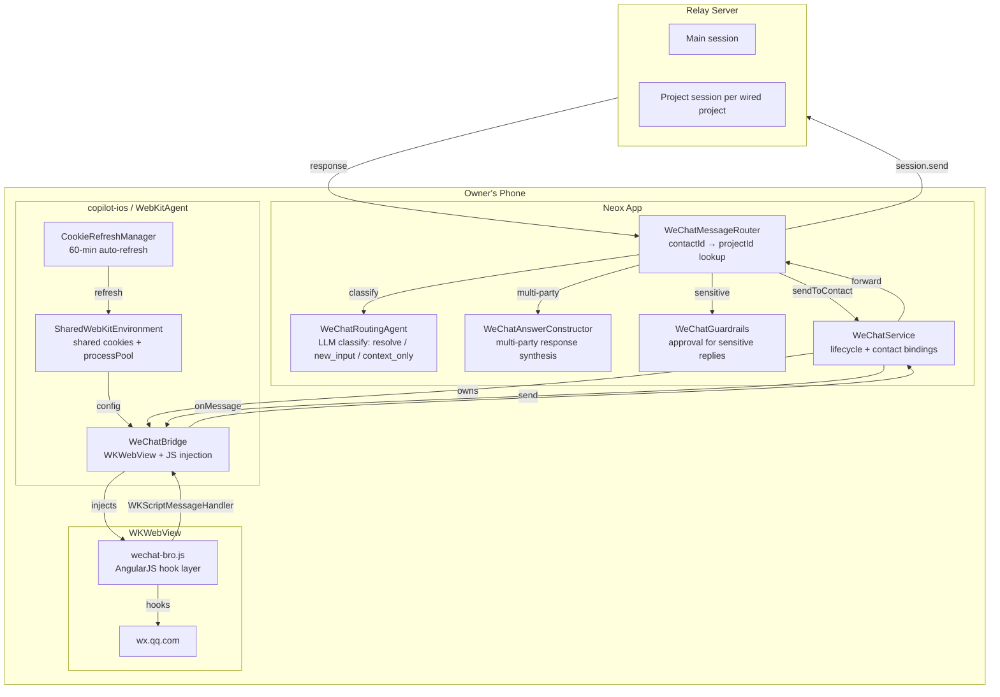
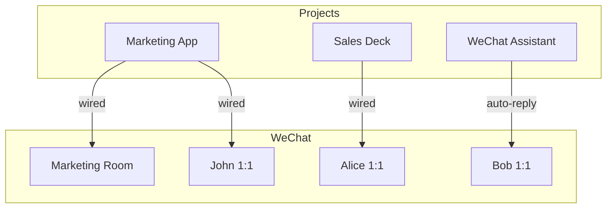
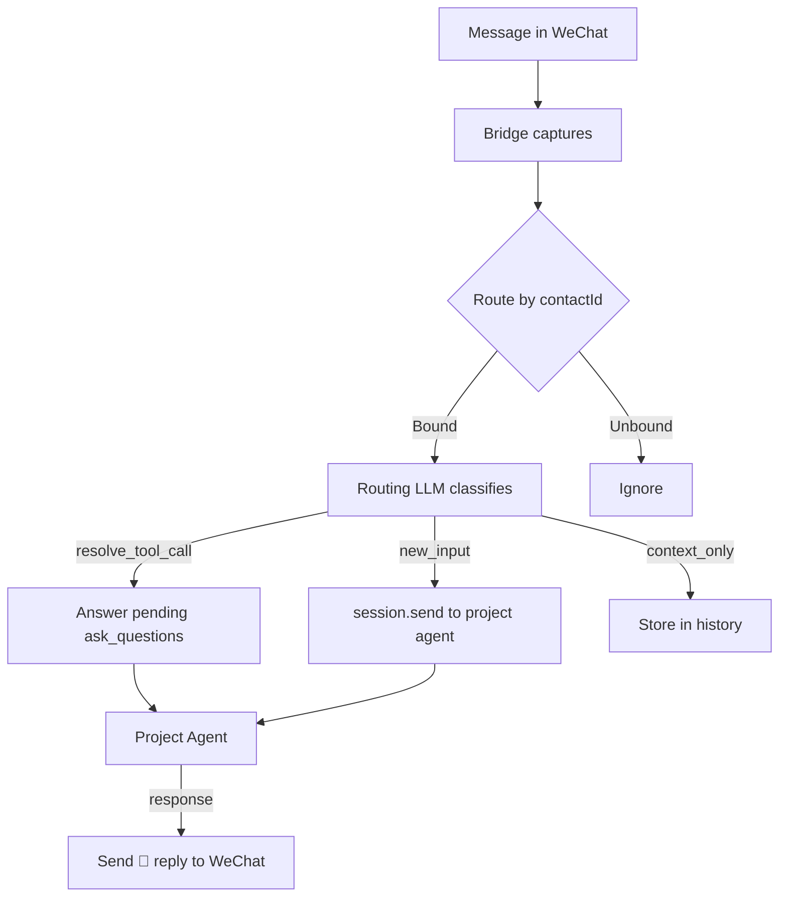
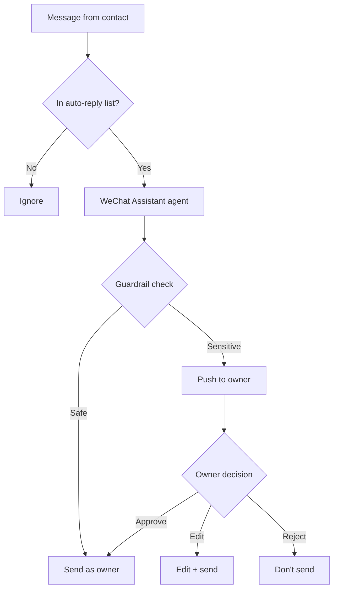
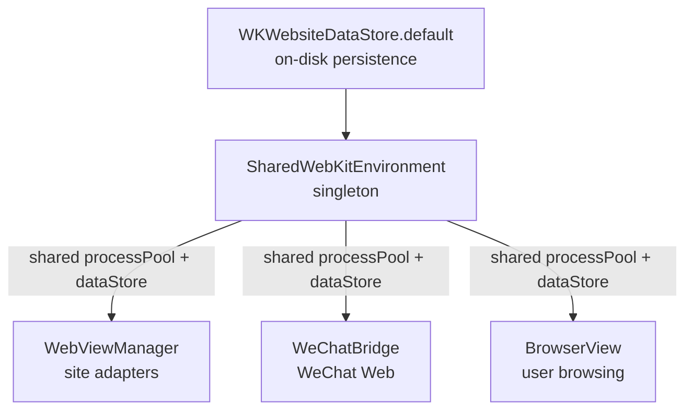

# WeChat Integration

## Architecture



## Key Files

| File | Role |
|------|------|
| `copilot-ios/WebKitAgent/Sources/WeChat/WeChatBridge.swift` | WKWebView lifecycle, JS injection, event handling |
| `copilot-ios/WebKitAgent/Sources/WeChat/WeChatTypes.swift` | WeChatMessage, WeChatContact, WeChatBridgeEvent |
| `copilot-ios/WebKitAgent/Sources/SharedWebKitEnvironment.swift` | Shared WKProcessPool + WKWebsiteDataStore.default() |
| `copilot-ios/WebKitAgent/Sources/CookieRefreshManager.swift` | 60-min cookie refresh for tracked domains |
| `neox/Neox/Services/WeChatService.swift` | Service layer, contact bindings, message forwarding |
| `neox/Neox/Agent/WeChatMessageRouter.swift` | Routes incoming messages to project agent sessions |
| `neox/Neox/Agent/WeChatRoutingAgent.swift` | LLM classifier (resolve / new_input / context_only) |
| `neox/Neox/Agent/WeChatAnswerConstructor.swift` | Synthesizes multi-party responses for ask_questions |
| `neox/Neox/Agent/WeChatGuardrails.swift` | Approval flow for sensitive agent responses |
| `neox/Neox/Resources/wechat-bro.js` | Copy of `wechat-bro/wechat-bro.js` (bundled resource) |

## wechat-bro.js Capabilities

The JS bridge hooks into WeChat Web's AngularJS internals. Full docs: `wechat-bro/README.md`.

### Currently Used in Swift

| API | Swift Method | Notes |
|-----|-------------|-------|
| `WechatyBro.init()` | `injectBridge()` | Called after injection |
| `WechatyBro.send(to, content, watermark)` | `sendMessage()` | AI watermark enabled |
| `WechatyBro.contactList()` | `getContacts()` | Stable PYQuanPin-based IDs |
| `WechatyBro.getRoomMembers(id)` | `getRoomMembers()` | DisplayName per member |
| `WechatyBro.getUploadParams(to)` | `getUploadParams()` | For iOS native upload |
| `WechatyBro.sendImageWithMediaId(to, mediaId)` | `sendImage()` | After native upload |

### Not Yet Used in Swift

| API | Purpose |
|-----|---------|
| `simulateMessage(from, content, sender?, msgType?)` | Inject fake messages for testing |
| `getContactImage(id)` | Base64 avatar data URI |
| `getContact(id)` | Single contact lookup |
| `at(userId, roomId)` | Build @mention string for room replies |
| `getSupportedEmojis()` | 209 emoji shortcodes |
| `sendFileWithMediaId(to, mediaId, name, size)` | Send file attachments |
| `isFromAI(msg)` | Double-check AI watermark in Swift |
| `downloadVoice(msgId)` | Voice as base64 (JS auto-attaches to event) |

### Events

| Event | Handled | Notes |
|-------|---------|-------|
| `scan` | Yes | QR code URL |
| `login` | Yes | User logged in |
| `logout` | Yes | User logged out |
| `message` | Yes | All message types (generic) |
| `contacts-ready` | Yes | Triggers contact refresh |
| `heartbeat` | Yes | No-op (JS self-manages) |
| `message:text` | No | Could use for typed dispatch |
| `message:image` | No | Dropped by `guard isText` |
| `message:voice` | No | voiceBase64 available but unused |
| `message:video` | No | |
| `message:emoticon` | No | |
| `message:location` | No | |
| `message:app` | No | Links, files, mini-programs |
| `message:card` | No | Contact cards |
| `message:system` | No | Group joins/leaves |
| `message:recalled` | No | Message recalls |

### Message Fields

| Field | Parsed in Swift | Notes |
|-------|----------------|-------|
| `MsgId`, `MsgType` | Yes | |
| `Content`, `FromUserName`, `ToUserName` | Yes | |
| `from`, `to` (contact objects) | Yes | Decoded to WeChatContact |
| `MMIsChatRoom` | Yes | → `isRoom` |
| `CreateTime` | Yes | |
| `voiceBase64`, `voiceLength` | Yes | But router drops voice messages |
| **`sender`** (room actual sender) | **No** | JS provides it, Swift re-parses from content prefix |
| **`mentions`** (array of user IDs) | **No** | Available for @mention filtering |
| **`mentionMe`** (bool) | **No** | Available for room filtering |
| **`isFromAI`** | **No** | JS suppresses; no Swift double-check |
| **`FileName`, `FileSize`** | **No** | For MsgType 49 (app messages) |
| **`AppMsgType`** | **No** | Sub-type for app messages |
| **`MMActualContent`** | **No** | Rich message content |

## How Projects Use WeChat

Any Neox project can wire one or more WeChat contacts (rooms or 1:1 chats). This delegates the project's communication channel to WeChat — the contact becomes a participant who provides requirements, gives feedback, receives progress updates, and answers the agent's questions.



### Wiring (any project)

Wire a WeChat contact to a project. The agent acts as project assistant, prefixing responses with 🤖 to distinguish from the owner's manual messages.

Use cases: discuss requirements, collect feedback, send notifications, answer questions — like delegating the project chat to WeChat.



### WeChat Assistant (special template)

A template project type where the agent auto-replies *as the account owner* (no 🤖 prefix). Persona and behavior rules defined in `context.md`. Guardrails escalate sensitive topics for owner approval.



## Decision Weight

Each room member has a weight (0–100) set by the project owner:

| Weight | Meaning |
|--------|---------|
| 100 | Authoritative — resolves questions, approves actions |
| 50–99 | Strong voice — worth acting on |
| 1–49 | Contributor — valuable context |
| 0 | Muted — ignored entirely |

Owner always has weight 100. In 1:1 mode, the other person defaults to weight 50.

## Cookie Architecture

All WebViews share cookies via `SharedWebKitEnvironment`:



`CookieRefreshManager` navigates a hidden WebView to tracked domains every 60 minutes to keep sessions alive.

## Contact Identification

wechat-bro.js uses stable PYQuanPin-based IDs that persist across login sessions (unlike `UserName` which changes every login). All APIs accept stable IDs, original UserName, or special names (`filehelper`, `weixin`).

## Special Behaviors

- **AI watermark**: Invisible Unicode marker on sent messages. `isFromAI()` detects it.
- **Message dedup**: Bridge tracks MsgIds (2h TTL, max 2000). Replayed messages after relogin are dropped.
- **Auto-reinject**: Bridge re-injects after page reloads (QR expiry, logout). Swift handles via `didStartProvisionalNavigation` + `didCommit` + 3s fallback.
- **Cookie login**: When cookies exist, WeChat shows "Log in" button instead of QR. Bridge auto-clicks it.
- **Markdown → Unicode**: `send()` auto-converts `**bold**` → 𝗯𝗼𝗹𝗱, `*italic*` → 𝘪𝘵𝘢𝘭𝘪𝘤, headers, bullets, code blocks.
- **IPv6 for uploads**: `file.wx.qq.com` hangs on IPv4. Upload uses IPv6.

## Updating wechat-bro.js

```bash
cp ../wechat-bro/wechat-bro.js neox/Neox/Resources/wechat-bro.js
```

Then rebuild and redeploy.
