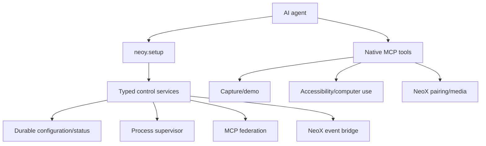

# NeoY v2 architecture

## Objective

NeoY is Neo's signed, always-on macOS runtime and control plane. It remains a menu-bar, headless-first application. Native services own high-trust Mac work; agent-facing setup configures, validates, diagnoses, and recovers the runtime without asking users to learn implementation paths.

## Product shape and identity

- `com.neox.neoy` is the stable application identity. Signing upgrades must preserve the bundle ID and a stable development identity so TCC grants can survive rebuilds after a one-time user approval.
- `LSUIElement` and `.accessory` activation keep the everyday product headless. A future Setup window is for trust, permission, pairing, and recovery—not the primary operational interface.
- launchd `RunAtLoad` plus `KeepAlive` remains the current startup mechanism. The v2 supervisor will replace ad-hoc installation knowledge with a durable service model while preserving automatic startup and crash recovery.

## Runtime layers



The control-plane edge adds durable configuration and typed status. Later edges are implementation boundaries, not invitations to expose more top-level tools.

## `neoy.setup`

NeoY deliberately uses one small control tool instead of adding one MCP tool per setup feature. The current schema version is intentionally small:

```text
neoy.setup(command: String?)

help
help overview | status | roadmap | configuration | diagnostics
status
config show
diagnostics enable | disable
diagnostics set level <info|warning|error>
diagnostics set retention-days <1...365>
```

- `help` is authoritative for the installed version.
- `status` returns compact JSON for overall state, app identity, MCP state, NeoX pairing selection, handoff state, startup mode, enabled capabilities, and control-plane health.
- `config show` returns validated configuration with persistence health without exposing storage paths as the primary interface.
- Diagnostics commands pass through a typed parser, validate enum/range constraints, atomically persist versioned JSON, and return deterministic structured results.
- Unknown commands and topics fail explicitly. Future capability is not advertised until its service exists.
- The parser and store are pure, focused-test seams. Typed service methods are ready for later milestones to consume without depending on MCP transport.

### Durable state

Control-plane state is JSON schema version 1 in the NeoY Application Support directory. Saves validate the document first and replace the destination atomically. A malformed file is copied to a timestamped invalid-state file before validated defaults are installed; runtime health reports the decode failure and recovery action. A newer schema version is likewise preserved and reported rather than silently downgraded. Future schema migrations must convert older supported versions explicitly and retain their incompatibility reporting path.

Future commands may cover permissions, startup services, MCP federation, diagnostics, pairing, and events, but only after each service can validate, persist, reconcile, and report health.

## Native permission boundary

Screen Recording, Accessibility, camera, microphone, and Local Network grants are attached to the native app and its service implementations. Child processes do not automatically receive these TCC grants. NeoY therefore keeps permission-sensitive capture, inspection, and UI automation native. Supervised startup processes are for ordinary CLI and process workloads, not a mechanism to delegate trusted Mac APIs.

## Startup and process supervision

The later supervisor must provide:

- named durable entries;
- executable, arguments, working directory, and environment;
- stdout/stderr capture and bounded diagnostics;
- restart policy and health state;
- lifecycle ownership and explicit enable/disable;
- a safe expert escape hatch without making files the primary UX.

The supervisor persists desired state through a typed configuration service and reconciles it at launch. It must not become a replacement for native Mac services.

## MCP federation

NeoY will host its own compact native tools and federate user-configured MCP servers rather than importing every predecessor capability. The federation service owns durable server configuration, process/transport lifecycle, tool discovery, health, namespacing/conflict handling, and safe enable/disable semantics. Exact transport and process conventions will be selected during that milestone against current MCP practice and macOS constraints.

## NeoX pairing and events

NeoX remains an independent iPhone runtime. NeoY preserves:

- `_neoy._tcp` discovery;
- `POST /agent` handoff;
- TCP port 8686;
- durable `~/.neoy/inbox` delivery;
- the existing first-party phone MCP client and media export behavior.

A future important-event bridge must use the same explicit pairing trust model, add durable local event storage, and remain observable without silently dropping events.

## Milestones

1. **Foundation (complete):** source audit, typed setup parser/status, stable help, and focused tests.
2. **Control persistence (current):** versioned durable configuration, diagnostics settings, persistence health, and safe mutation commands.
3. **Permissions:** native permission inventory, guided recovery, and no child permission assumptions.
4. **Startup supervisor:** managed service definitions and reconciliation.
5. **Federation:** user-added MCP hosting, health, and unified exposure.
6. **NeoX events:** pairing-aware important-event delivery.
7. **Migration retirement:** remove obsolete predecessor paths only after signed install, recovery, and cross-runtime workflows are verified.

## Unresolved decisions

- Scope of schema version 1. Diagnostics is the only implemented configuration section; permissions, startup, federation, and event sections must be added through explicit schema migrations and typed validation.
- Supported federation transports and process model.
- Supervisor restart/backoff policy and log retention.
- Event trust/pairing handshake and notification user controls.
