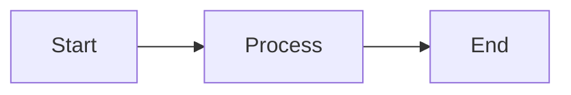
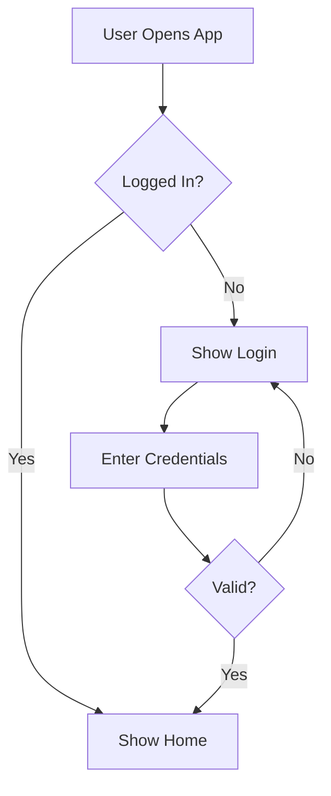
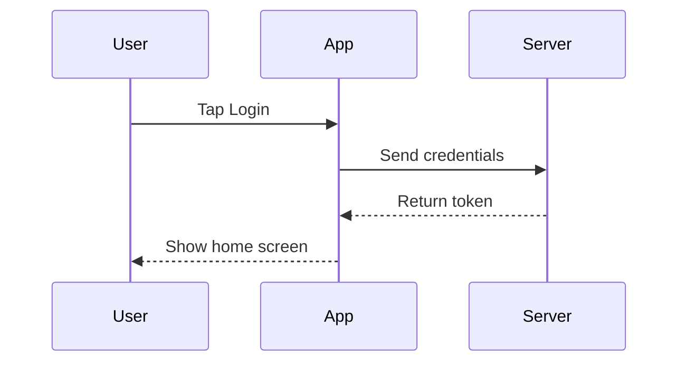
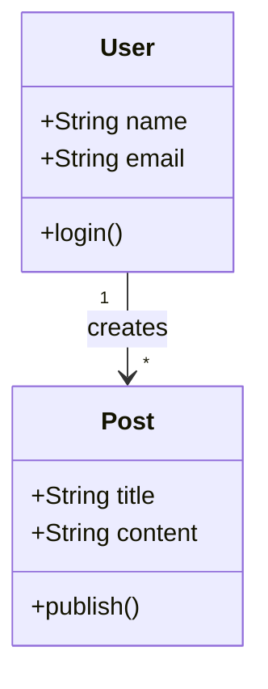
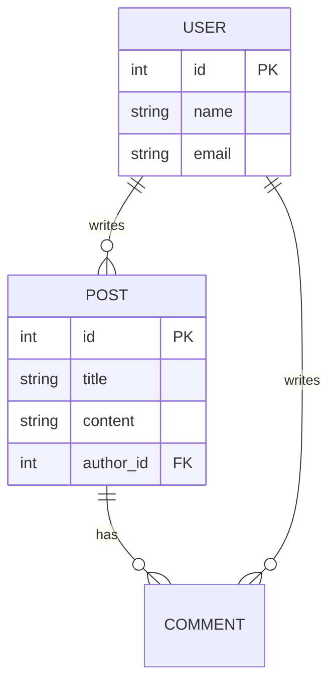
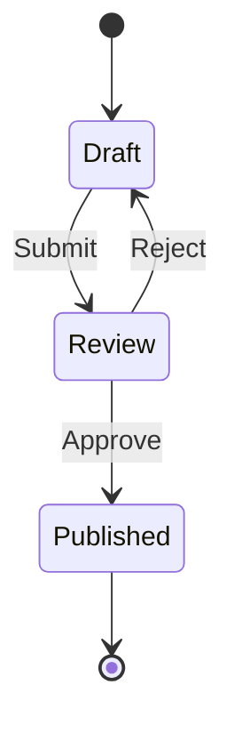
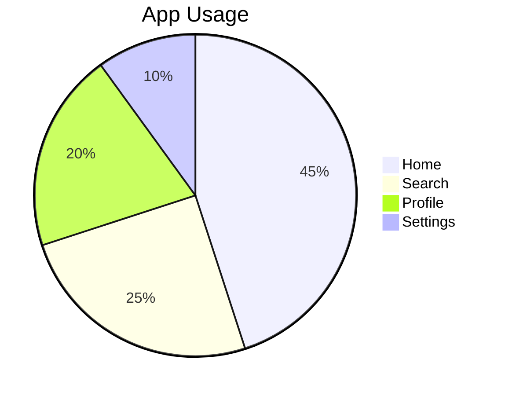

# Mermaid Diagrams

Create diagrams using simple text syntax. Mermaid code renders into visual diagrams.

## How to Use

Write Mermaid code inside a fenced code block:

````markdown

````

Save diagrams in markdown files in the project. Mermaid code blocks render as visual diagrams in the chat and in markdown preview.

**Live preview:** You can also render diagrams in the browser via web_agent:
```
web_navigate url=https://mermaid.live
```
Paste your Mermaid code in the editor to see it visually and export as PNG/SVG.

## Common Diagram Types

### Flowchart



Direction: `TD` (top-down), `LR` (left-right), `BT` (bottom-top), `RL` (right-left)

### Sequence Diagram



### Class Diagram



### Entity Relationship (Database)



### State Diagram



### Pie Chart



## Node Shapes

- `[Text]` — rectangle
- `(Text)` — rounded
- `{Text}` — diamond (decision)
- `([Text])` — stadium
- `[[Text]]` — subroutine
- `((Text))` — circle

## Arrow Types

- `-->` — solid arrow
- `-.->` — dotted arrow
- `==>` — thick arrow
- `-->>` — solid arrow with open head
- `-- text -->` — labeled arrow

## Tips

1. Keep diagrams simple — focus on key relationships
2. Use flowcharts for processes and user flows
3. Use sequence diagrams for API/interaction flows
4. Use ER diagrams for database design
5. Use class diagrams for object/data modeling
